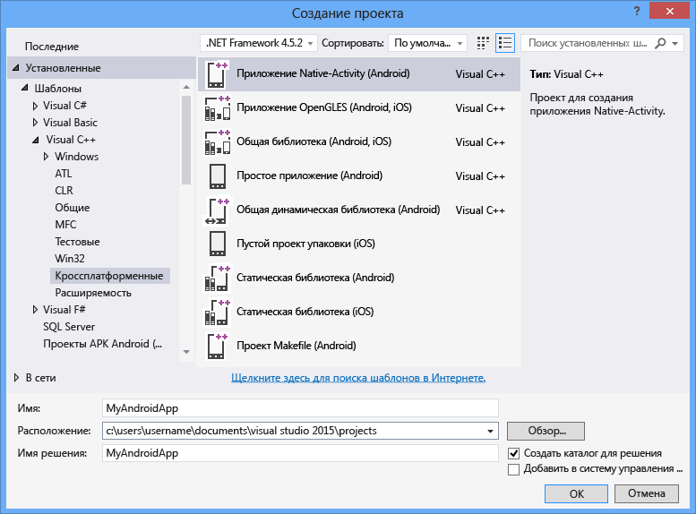
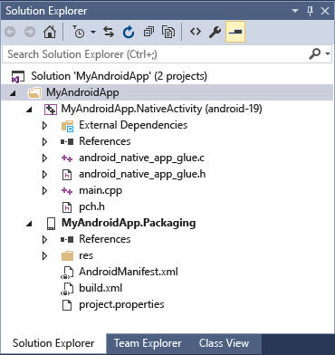

# Создание приложения Android Native Activity
Установив компонент Visual C++ для разработки кроссплатформенных мобильных приложений, можно использовать Visual Studio 2015 для создания полнофункциональных приложений Android Native Activity. Пакет Android Native Development Kit (NDK) — это набор средств, с помощью которых можно реализовывать большинство возможностей приложения Android, используя чистый код C или C++. Для обеспечения взаимодействия кода C или C++ с Android используется определенный код Java JNI, выступающий в роли связующего. В Android NDK появилась возможность создавать приложения Native Activity с помощью API Android уровня 9. Код Native Activity популярен для создания игровых приложений и приложений с интенсивным использованием графики на основе Unreal Engine или OpenGL. В этом пошаговом руководстве показано создание простого приложения Native Activity, в котором используется OpenGL. В дополнительных разделах последовательно рассматриваются такие этапы жизненного цикла разработки, как редактирование, сборка, отладка и развертывание кода Native Activity.  
  
 [Требования](#req)   
 [Создание проекта Native Activity](#Create)   
 [Создание и запуск приложения Android Native Activity по умолчанию](#BuildHello)  
  
##   Требования  
 Перед созданием приложения Android Native Activity убедитесь в том, что выполнены все требования к системе и в Visual Studio 2015 установлен компонент Visual C++ для разработки мобильных приложений. Для получения дополнительной информации см. [Install Visual C++ for Cross-Platform Mobile Development](../cross-platform/install-visual-cpp-for-cross-platform-mobile-development.md). Убедитесь в том, что в установку включены необходимые средства и пакеты SDK сторонних разработчиков и что установлен эмулятор Microsoft Visual Studio для Android.  
  
##   Создание проекта Native Activity  
 В этом учебном руководстве вы сначала создадите проект Android Native Activity, а затем выполните сборку и запуск приложения по умолчанию в эмуляторе Visual Studio для Android.  
  
#### Создание проекта  
  
1.  Запустите Visual Studio. В строке меню выберите **Файл**, **Создать**, **Проект**.  
  
2.  В диалоговом окне **Новый проект** в меню **Шаблоны**щелкните пункт **Visual C++**, **Кроссплатформенное приложение**, а затем выберите шаблон **Приложение Native-Activity (Android)** .  
  
3.  Назначьте приложению имя, например `MyAndroidApp`, а затем нажмите кнопку **ОК**.  
  
       
  
     Visual Studio создаст новое решение и откроет обозреватель решений.  
  
       
  
 В новое решение приложения Android Native Activity входят два проекта.  
  
-   **MyAndroidApp.NativeActivity** содержит ссылки и связующий код для запуска приложения как приложения Native Activity на Android. Реализация точек входа из связующего кода находится в файле main.cpp. Предварительно откомпилированные заголовки находятся в файле pch.h. Этот проект приложения Native Activity компилируется в общую библиотеку (SO-файл), которая передается в проект упаковки.  
  
-   **MyAndroidApp.Packaging** создает APK-файл для развертывания на устройстве или эмуляторе Android. Он содержит ресурсы и файл AndroidManifest.xml, в котором задаются свойства манифеста. В него также входит XML-файл, управляющий процессом сборки Ant. По умолчанию он задан как начальный проект, который можно развернуть и запустить непосредственно из Visual Studio.  
  
##   Создание и запуск приложения Android Native Activity по умолчанию  
 Разработайте и запустите приложение, созданное шаблоном, чтобы проверить установку и настройку. Для первоначального теста запустите приложение в одном из профилей устройств, установленных эмулятором Visual Studio для Android. Если вы предпочитаете тестировать приложение на другой платформе, загрузите целевой эмулятор или подключите устройство к компьютеру.  
  
#### Сборка и запуск приложения Native Activity по умолчанию  
  
1.  Выберите пункт **x86** из раскрывающегося списка **Платформы решения** , если он еще не выбран.  
  
       
  
     Если список **Платформы решения** не отображается, щелкните пункт **Платформы решения** из раскрывающегося списка **Добавить или удалить кнопки** и выберите свою платформу.  
  
2.  В строке меню последовательно выберите **Сборка**и **Собрать решение**.  
  
     В окне "Выходные данные" отобразятся выходные данные процесса сборки для двух проектов в решении.  
  
3.  Выберите один из профилей эмулятора Visual Studio для телефона Android (32-разрядный) в качестве цели развертывания.  
  
     Если вы установили другие эмуляторы или подключили устройство Android, то можете выбрать их в раскрывающемся списке платформы развертывания.  
  
4.  Нажмите клавишу F5 для запуска процесса отладки или Shift + F5 для запуска без отладки.  
  
     Вот как выглядит приложение по умолчанию в эмуляторе Visual Studio для Android.  
  
       
  
     Visual Studio запускает эмулятор, который за несколько секунд загружает и развертывает код. После запуска приложения можно задать точки останова и использовать отладчик для проверки кода, языковых стандартов и контрольных значений.  
  
5.  Для останова процесса отладки нажмите Shift + F5.  
  
     Эмулятор является отдельным процессом, который продолжает выполняться. Вы можете изменять, компилировать и развертывать код несколько раз в одном эмуляторе.