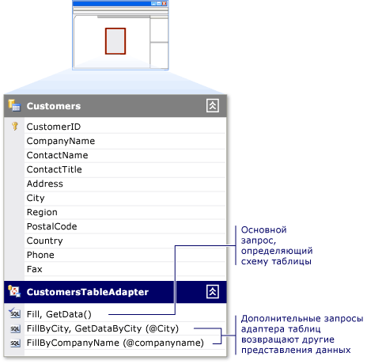

# Практическое руководство. Изменение запросов TableAdapter
Запросы TableAdapter редактируются с помощью матера [мастер настройки запроса TableAdapter](../data-tools/editing-tableadapters.md) в **Конструкторе наборов данных**.  Если запрос TableAdapter больше не соответствует требованиям приложения, его следует изменить.  \(Кроме того, можно создать дополнительные запросы в TableAdapter.  Подробнее о добавлении новых запросов читайте в [Практическое руководство. Создание запросов TableAdapter](../data-tools/how-to-create-tableadapter-queries.md).\)  
  
> [!NOTE]
>  Если вместо **Мастера настройки запросов TableAdapter** открывается [мастер настройки адаптера таблицы](../Topic/TableAdapter%20Configuration%20Wizard.md), то, возможно, выбран  основной запрос `Fill` TableAdapter, а не один из дополнительных запросов TableAdapter.  Сведения о редактировании основного запроса `Fill` TableAdapter содержатся в разделе [Практическое руководство. Изменение объектов TableAdapter](../Topic/How%20to:%20Edit%20TableAdapters.md).  
  
   
  
### Для редактирования запроса TableAdapter:  
  
1.  Откройте набор данных в **Конструкторе наборов данных**.  Дополнительные сведения см. в разделе [Практическое руководство. Открытие набора данных в конструкторе наборов данных](../Topic/How%20to:%20Open%20a%20Dataset%20in%20the%20Dataset%20Designer.md).  
  
2.  Выберите запрос TableAdapter, который требуется изменить.  
  
3.  Щелкните правой кнопкой мыши запрос TableAdapter и в открывшемся контекстном меню выберите **Настройка**.  
  
     Откроется **Мастер настройки запросов TableAdapter**, готовый для изменения запроса или хранимой процедуры этого запроса.  
  
4.  Выполните требуемые изменения в **Мастере настройки запросов TableAdapter**.  Дополнительные сведения см. в разделе [мастер настройки запроса TableAdapter](../data-tools/editing-tableadapters.md).  
  
## См. также  
 [адаптеры таблиц TableAdapter](../Topic/TableAdapters.md)   
 [Подключение к данным в Visual Studio](../data-tools/connecting-to-data-in-visual-studio.md)   
 [Подготовка приложения к получению данных](../Topic/Preparing%20Your%20Application%20to%20Receive%20Data.md)   
 [Выборка данных в приложение](../data-tools/fetching-data-into-your-application.md)   
 [Привязка элементов управления к данным в Visual Studio](../data-tools/bind-controls-to-data-in-visual-studio.md)   
 [Редактирование данных в приложении](../data-tools/editing-data-in-your-application.md)   
 [Проверка данных](../Topic/Validating%20Data.md)   
 [Сохранение данных](../data-tools/saving-data.md)   
 [Пошаговые руководства работы с данными](../Topic/Data%20Walkthroughs.md)