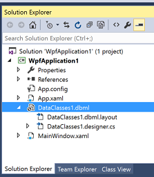

# Средства LINQ to SQL в Visual Studio
LINQ to SQL была первой технологии объектно реляционного сопоставления, выпускаемых корпорацией Майкрософт. Он хорошо работает в основных сценариях и продолжает поддерживаться в Visual Studio, но он больше не находится в активной разработке. Использование LINQ SQL при обслуживании с устаревшим приложением, оно уже используется, или в простых приложений, использующих SQL Server и не требуют сопоставление нескольких таблиц. Как правило новые приложения должны использовать Entity Framework, при необходимости к слою объектно реляционного сопоставления.  
  
В Visual Studio создать LINQ to SQL classes, представляющих таблиц SQL с помощью реляционный конструктор объектов (O/R-конструктор).  
  
[!INCLUDE[vs_ordesigner_short](../data-tools/includes/vs_ordesigner_short_md.md)] Имеет две различные области в области конструктора: область сущностей слева и область методов справа. Область сущностей является основной областью конструктора, отображающей классы сущностей, ассоциации и иерархии наследования. Область методов-это область конструктора, которая отображает <xref:System.Data.Linq.DataContext> методы, которые сопоставлены с хранимыми процедурами и функциями.  
  
[!INCLUDE[vs_ordesigner_short](../data-tools/includes/vs_ordesigner_short_md.md)] Предоставляет визуальную поверхность проектирования для создания [LINQ to SQL](/dotnet/framework/data/adonet/sql/linq/index) классов сущностей и ассоциаций (связей), основанных на объектах в базе данных. Другими словами, [!INCLUDE[vs_ordesigner_short](../data-tools/includes/vs_ordesigner_short_md.md)] используется для создания модели объекта в приложении, которая сопоставляется с объектами в базе данных. Модель также генерирует <xref:System.Data.Linq.DataContext> со строгим контролем ввода, который используется для отправки и получения данных между классами сущностей и базой данных. Реляционный конструктор объектов [!INCLUDE[vs_ordesigner_short](../data-tools/includes/vs_ordesigner_short_md.md)] обеспечивает также функциональные возможности сопоставления сохраненных процедур и функций методам <xref:System.Data.Linq.DataContext> для возврата данных и заполнения классов сущностей. Наконец, [!INCLUDE[vs_ordesigner_short](../data-tools/includes/vs_ordesigner_short_md.md)] обеспечивает способность проектировать отношения наследования между классами сущностей.  
  
## Открытие реляционного конструктора объектов  
 Чтобы добавить LINQ модели entity SQL в проект, выберите **проекта**, **Добавление нового элемента** и нажмите кнопку **классы LINQ to SQL** из списка элементов проекта:  
  
   
  
 Visual Studio создает DBML-файла и добавляет его в решение. Это XML-файл сопоставления и файлы связанного кода.  
  
   
  
 При выборе DBML-файла Visual Studio отображает область конструктора O/R, который позволяет визуально создавать модели. На следующем рисунке показан конструктор после перетащили таблицам Northwind Customers и Orders из обозревателя серверов. Обратите внимание, связи между таблицами.  
  
   
  
> [!IMPORTANT]
>  [!INCLUDE[vs_ordesigner_short](../data-tools/includes/vs_ordesigner_short_md.md)] Представляет простой объект реляционный модуль сопоставления, поскольку он поддерживает только сопоставляющие отношения 1:1. Другими словами, класс объекта может иметь сопоставляющее отношение только 1:1 с таблицей базы данных или представлением. Сложные сопоставления, например сопоставление класса сущностей с соединяемой таблицей, не поддерживается; Сложные сопоставления, использующие платформу Entity Framework. Кроме того, конструктор является односторонним генератором объектного кода. Это означает, что только изменения, которые вы осуществляете на области конструктора, отражаются в файле кода. Изменения, вносимые в файл кода вручную, не отражаются в [!INCLUDE[vs_ordesigner_short](../data-tools/includes/vs_ordesigner_short_md.md)]. Любые изменения, которые вы вручную осуществляете в файле кода принимаются, когда конструктор сохраняется и генерируется код. Сведения о том, как добавить пользовательский код и распространить классы, создаваемые [!INCLUDE[vs_ordesigner_short](../data-tools/includes/vs_ordesigner_short_md.md)], в разделе [как: расширить код, созданный конструктором O/R](../data-tools/how-to-extend-code-generated-by-the-o-r-designer.md).  
  
## Создание и конфигурирование DataContext  
 После добавления **LINQ to SQL Classes** элемент в проект и откройте [!INCLUDE[vs_ordesigner_short](../data-tools/includes/vs_ordesigner_short_md.md)], пустая область конструктора представляет пустой <xref:System.Data.Linq.DataContext> готовая к настройке. <xref:System.Data.Linq.DataContext> настроен со сведениями о подключении, предоставляемые первым перемещенного в область конструктора... Таким образом <xref:System.Data.Linq.DataContext> настраивается с использованием информации о подключении из первого элемента перетащить в область конструктора. Дополнительные сведения о <xref:System.Data.Linq.DataContext> см. класс, [методы DataContext (O/R-конструктор)](../data-tools/datacontext-methods-o-r-designer.md).  
  
## Создание классов сущностей, которые сопоставляются таблицам БД или представлениям  
 Можно создавать классы сущностей, сопоставленный с таблицами и представлениями, путем перетаскивания таблиц базы данных и представления из **обозревателя серверов**/**обозреватель баз данных** на [!INCLUDE[vs_ordesigner_short](../data-tools/includes/vs_ordesigner_short_md.md)]. Как указывалось в предыдущем разделе, <xref:System.Data.Linq.DataContext> конфигурируется с информацией о подключении, предоставленной первым элементом, который перемещен в область конструктора. Если в [!INCLUDE[vs_ordesigner_short](../data-tools/includes/vs_ordesigner_short_md.md)] добавляется элемент, который использует другое подключение, то можно изменить подключение для <xref:System.Data.Linq.DataContext>. Дополнительные сведения см. в разделе [как: создание классов LINQ to SQL сопоставлен с таблицами и представлениями (конструктор O/R)](../data-tools/how-to-create-linq-to-sql-classes-mapped-to-tables-and-views-o-r-designer.md).  
  
## Создание методов DataContext, которые вызывают сохраненные процедуры и функции  
 Можно создать <xref:System.Data.Linq.DataContext> методы, которые вызывают (сопоставляются) сохраненные процедуры и функции путем перетаскивания их из **обозревателя серверов**/**обозреватель баз данных** на [!INCLUDE[vs_ordesigner_short](../data-tools/includes/vs_ordesigner_short_md.md)]. Сохраненные процедуры добавляются в [!INCLUDE[vs_ordesigner_short](../data-tools/includes/vs_ordesigner_short_md.md)] как методы <xref:System.Data.Linq.DataContext>.  
  
> [!NOTE]
>  Когда хранимые процедуры и функции перетаскиваются из **обозревателя серверов**/**обозреватель баз данных** на [!INCLUDE[vs_ordesigner_short](../data-tools/includes/vs_ordesigner_short_md.md)], тип возвращаемого значения для создаваемого <xref:System.Data.Linq.DataContext> метод отличается в зависимости от того, куда вы сбросили элемент. Дополнительные сведения см. в разделе [методы DataContext (O/R-конструктор)](../data-tools/datacontext-methods-o-r-designer.md).  
  
## Конфигурирование DataContext, чтобы использовать сохраненные процедуры для сохранения данных между классами сущностей и базой данных  
 Как утверждалось ранее, можно создавать методы <xref:System.Data.Linq.DataContext>, которые вызывают сохраненные процедуры и функции. Кроме того, можно также назначать сохраненные процедуры, которые могут использоваться для поведения по умолчанию при [!INCLUDE[vbtecdlinq](../data-tools/includes/vbtecdlinq_md.md)] среды выполнения, которая выполняет Вставки, Обновления и удаления. Дополнительные сведения см. в разделе [как: назначение хранимых процедур для выполнения обновления, вставки и удаления (конструктор O/R)](../data-tools/how-to-assign-stored-procedures-to-perform-updates-inserts-and-deletes-o-r-designer.md).  
  
## Наследование и реляционный конструктор объектов  
 Подобно другим объектам, [!INCLUDE[vbtecdlinq](../data-tools/includes/vbtecdlinq_md.md)] классы могут использовать наследование и выводиться из других классов. В базе данных, отношения наследования создаются несколькими способами. [!INCLUDE[vs_ordesigner_short](../data-tools/includes/vs_ordesigner_short_md.md)] поддерживает концепцию наследования одиночных таблиц, так как именно она обычно осуществляется в реляционных системах. Дополнительные сведения см. в разделе [как: Настройка наследования с помощью реляционного конструктора объектов](../data-tools/how-to-configure-inheritance-by-using-the-o-r-designer.md).  
  
## Запросы LINQ to SQL  
 Классы сущностей, созданных [!INCLUDE[vs_ordesigner_short](../data-tools/includes/vs_ordesigner_short_md.md)] предназначен для работы с [LINQ (Language-Integrated Query)](http://msdn.microsoft.com/Library/a73c4aec-5d15-4e98-b962-1274021ea93d). Дополнительные сведения см. в разделе [как: запрашивать информацию](/dotnet/framework/data/adonet/sql/linq/how-to-query-for-information).  
  
## Отделение сгенерированного DataContext и кода класса сущностей в иные пространства имен Namespaces  
 [!INCLUDE[vs_ordesigner_short](../data-tools/includes/vs_ordesigner_short_md.md)] Предоставляет **контекстное пространство имен** и **пространство имен сущностей** свойства <xref:System.Data.Linq.DataContext>. Эти свойства определяют, какое пространство имен <xref:System.Data.Linq.DataContext> и кода классов сущностей генерируется в нем. По умолчанию эти свойства пустые и <xref:System.Data.Linq.DataContext> классы сущностей генерируются в пространстве имен приложения. Чтобы сгенерировать код в пространство имен, отличное от пространства имен приложения, введите значение в **контекстное пространство имен** и/или **пространство имен сущностей** свойства.
  
## Справочные материалы
<xref:System.Linq>  
<xref:System.Data.Linq>  
  
## См. также
[LINQ to SQL (.NET Framework)](/dotnet/framework/data/adonet/sql/linq/index)    
[Часто задаваемые вопросы (.NET Framework)](/dotnet/framework/data/adonet/sql/linq/frequently-asked-questions) 