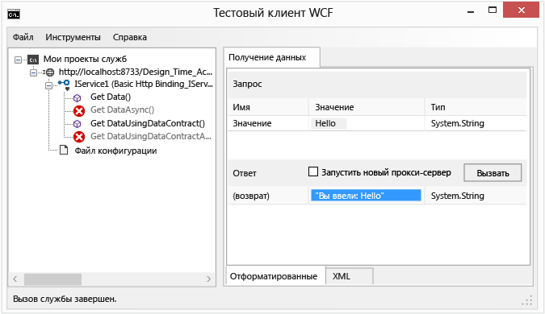

# Пошаговое руководство: Создание простой службы WCF в Windows Forms

В этом пошаговом руководстве показано, как создать простую службу Windows Communication Foundation (WCF), протестируйте его, а последующий доступ к ней из приложения Windows Forms.

[!INCLUDE[note_settings_general](../data-tools/includes/note_settings_general_md.md)]

## Создание службы

1. Запустите Visual Studio.

::: moniker range="vs-2017"

2. В меню **Файл** последовательно выберите пункты **Создать**и > **Проект**.

3. В **новый проект** диалогового окна разверните узел **Visual Basic** или **Visual C#**  узел и выберите **WCF**, а затем **Библиотеки служб WCF**.

4. Нажмите кнопку **ОК**, чтобы создать проект.

   

::: moniker-end

::: moniker range=">=vs-2019"

2. На начальном экране выберите **Создать проект**.

3. Тип **библиотека службы wcf** в поле поиска на **создайте новый проект** страницы. Выберите либо C# или шаблон Visual Basic для **библиотека службы WCF**, а затем нажмите кнопку **Далее**.

   

   > [!TIP]
   > Если вы не видите все шаблоны, может потребоваться установить **Windows Communication Foundation** компонент Visual Studio. Выберите **установить дополнительные средства и компоненты** открыть установщик Visual Studio. Выберите **отдельные компоненты** вкладке, прокрутите вниз до раздела **действия разработки**, а затем выберите **Windows Communication Foundation**. Нажмите кнопку **Изменить**.

4. На **настроить новый проект** щелкните **создать**.

::: moniker-end

   > [!NOTE]
   > Будет создана работающая служба, которую можно протестировать и использовать. Следующие два действия демонстрируют, как можно изменить метод по умолчанию для использования другого типа данных. В реальном приложении необходимо также добавить к службе ее специальные функции.

5. В **обозревателе решений**, дважды щелкните **IService1.vb** или **IService1.cs**.

   

   Найдите следующую строку:

   [!code-csharp[WCFWalkthrough#4](../data-tools/codesnippet/CSharp/walkthrough-creating-a-simple-wcf-service-in-windows-forms_1.cs)]
   [!code-vb[WCFWalkthrough#4](../data-tools/codesnippet/VisualBasic/walkthrough-creating-a-simple-wcf-service-in-windows-forms_1.vb)]

   Измените тип для `value` параметр в строку:

   [!code-csharp[WCFWalkthrough#1](../data-tools/codesnippet/CSharp/walkthrough-creating-a-simple-wcf-service-in-windows-forms_2.cs)]
   [!code-vb[WCFWalkthrough#1](../data-tools/codesnippet/VisualBasic/walkthrough-creating-a-simple-wcf-service-in-windows-forms_2.vb)]

   В приведенном выше коде обратите внимание на атрибуты `<OperationContract()>` или `[OperationContract]` . Эти атрибуты обязательны для любого метода, предоставляемого службой.

6. В **обозревателе решений**, дважды щелкните **Service1.vb** или **Service1.cs**.

   

   Найдите следующую строку:

   [!code-vb[WCFWalkthrough#5](../data-tools/codesnippet/VisualBasic/walkthrough-creating-a-simple-wcf-service-in-windows-forms_3.vb)]
   [!code-csharp[WCFWalkthrough#5](../data-tools/codesnippet/CSharp/walkthrough-creating-a-simple-wcf-service-in-windows-forms_3.cs)]

   Измените тип для `value` параметр в строку:

   [!code-csharp[WCFWalkthrough#2](../data-tools/codesnippet/CSharp/walkthrough-creating-a-simple-wcf-service-in-windows-forms_4.cs)]
   [!code-vb[WCFWalkthrough#2](../data-tools/codesnippet/VisualBasic/walkthrough-creating-a-simple-wcf-service-in-windows-forms_4.vb)]

## Проверка службы

1. Нажмите клавишу **F5**, чтобы запустить службу. Объект **тестовый клиент WCF** формы отображается, а сама служба.

2. В форме **Тестовый клиент WCF** дважды щелкните метод **GetData()** в разделе **IService1**. **GetData** появится вкладка.

     

3. В диалоговом окне **Запрос** выберите поле **Значение** и введите `Hello`.

     

4. Нажмите кнопку **Вызвать**. Если **предупреждение системы безопасности** появится диалоговое окно, нажмите кнопку **ОК**. Отображает результат в **ответа** поле.

     

5. В меню **Файл** щелкните **Выход**, чтобы закрыть тестовую форму.

## Доступ к службе

### Справочные материалы по службе WCF

1. В меню **Файл** выберите команду **Добавить**, а затем **Создать проект**.

2. В **новый проект** диалогового окна последовательно раскройте элементы **Visual Basic** или **Visual C#**  выберите **Windows**, а затем выберите  **Windows Forms Application**. Нажмите кнопку **ОК**, чтобы открыть проект.

     

3. Щелкните правой кнопкой мыши **WindowsApplication1** и выберите команду **Добавить ссылку на службу**. **Add Service Reference** откроется диалоговое окно.

4. В диалоговом окне **Добавление ссылки на службу** щелкните элемент **Найти**.

     

     **Service1** отображает в **служб** области.

5. Нажмите кнопку **ОК**, чтобы добавить ссылку на службу.

### Создайте клиентское приложение

1. В **Обозревателе решений** дважды щелкните **Form1.vb** или **Form1.cs**, чтобы открыть конструктор Windows Forms, если он еще не открыт.

2. Из **Панели элементов** перетащите на форму элемент управления `TextBox`, элемент управления`Label` и элемент управления `Button`.

     

3. Дважды щелкните `Button` и добавьте следующий код в обработчик событий `Click`:

     [!code-csharp[WCFWalkthrough#3](../data-tools/codesnippet/CSharp/walkthrough-creating-a-simple-wcf-service-in-windows-forms_5.cs)]
     [!code-vb[WCFWalkthrough#3](../data-tools/codesnippet/VisualBasic/walkthrough-creating-a-simple-wcf-service-in-windows-forms_5.vb)]

4. В **Обозревателе решений** щелкните правой кнопкой мыши **WindowsApplication1** и выберите команду **Назначить запускаемым проектом**.

5. Нажмите клавишу **F5**, чтобы запустить проект. Введите любой текст и нажмите кнопку. Метка отображает «введено:» и отображается текст, что вы ввели.

     

## См. также

- [Службы Windows Communication Foundation и службы данных WCF в Visual Studio](../data-tools/windows-communication-foundation-services-and-wcf-data-services-in-visual-studio.md)