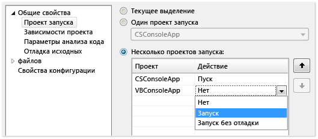
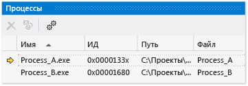

# Отладка одного или нескольких процессов в Visual Studio
[!INCLUDE[vs2017banner](../code-quality/includes/vs2017banner.md)]

Ниже описаны способы запуска отладки процессов, переключения между процессами, приостановки и возобновления выполнения, пошагового выполнения исходного кода, остановки отладки, а также отсоединения от процессов или прекращения их работы.  
  
##   Описание  
 [Настройка поведения выполнения нескольких процессов](#BKMK_Configure_the_execution_behavior_of_multiple_processes)  
  
 [Поиск исходных файлов и файлов символов (.pdb)](#BKMK_Find_the_source_and_symbol___pdb__files)  
  
 [Запуск нескольких процессов в решении VS, присоединение к процессу, автоматический запуск процесса в отладчике](#BKMK_Start_multiple_processes_in_a_VS_solution__attach_to_a_process__automatically_start_a_process_in_the_debugger)  
  
 [Переключение процессов, приостановка и продолжение выполнения, пошаговое выполнение исходного кода](#BKMK_Switch_processes__break_and_continue_execution__step_through_source)  
  
 [Остановка отладки, окончание или отсоединение от процессов](#BKMK_Stop_debugging__terminate_or_detach_from_processes)  
  
##   Настройка поведения выполнения нескольких процессов  
 Когда в отладчике запущено одновременно несколько процессов, команды приостановки выполнения и пошагового выполнения, а также остановка команд отладчика по умолчанию влияют на все процессы.  Например, когда один процесс приостанавливается в точке останова, выполнение всех остальных процессов также приостанавливается.  Можно изменить это принимаемое по умолчанию поведение, чтобы обрести больший контроль над целевыми объектами команд выполнения.  
  
1.  В меню **Отладка** выберите **Параметры и настройки**.  
  
2.  На странице **Отладка**, **Общие** снимите флажок **Прерывать все процессы при прерывании одного**.  
  
  [Описание](#BKMK_Contents)  
  
##   Поиск исходных файлов и файлов символов \(.pdb\)  
 Для отображения и пошагового выполнения исходного кода процесса отладчику требуется доступ к исходным файлам и файлам символов процесса.  Подробнее см. раздел [Указание файлов символов \(.pdb\) и файлов с исходным кодом](../debugger/specify-symbol-dot-pdb-and-source-files-in-the-visual-studio-debugger.md).  
  
 Если не удается получить доступ к файлам процесса, для перемещения по коду можно воспользоваться окном "Дизассемблирование".  См. раздел [Практическое руководство. Использование окна дизассемблирования](../debugger/how-to-use-the-disassembly-window.md).  
  
  [Описание](#BKMK_Contents)  
  
##   Запуск нескольких процессов в решении VS, присоединение к процессу, автоматический запуск процесса в отладчике  
  
-   [Запуск отладки нескольких процессов в решении Visual Studio](#BKMK_Start_debugging_multiple_processes_in_a_Visual_Studio_solution) • [Смена запускаемого проекта](#BKMK_Change_the_startup_project) • [Запуск конкретного проекта в решении](#BKMK_Start_a_specific_project_in_a_solution) • [Запуск нескольких проектов в решении](#BKMK_Start_multiple_projects_in_a_solution) • [Присоединение к процессу](#BKMK_Attach_to_a_process) • [Автоматический запуск процесса в отладчике](#BKMK_Automatically_start_an_process_in_the_debugger)  
  
> [!NOTE]
>  Отладчик не присоединяется автоматически к дочернему процессу, который запущен отлаживаемым процессом, даже если дочерний проект находится в том же решении.  Чтобы отладить дочерний процесс:  
>   
>  -   Присоединитесь к дочернему процессу после того, как он запущен.  
>   
>      \-или\-  
> -   Настройте параметры Windows таким образом, что дочерний процесс автоматически запускался в новом экземпляре отладчика.  
  
###   Запуск отладки нескольких процессов в решении Visual Studio  
 Если в решении Visual Studio имеется несколько проектов, которые могут выполняться независимо \(проекты, выполняемые в отдельных процессах\), можно выбрать, какие проекты запускаются отладчиком.  
  
   
  
####   Смена запускаемого проекта  
 Чтобы сменить запускаемый проект для решения, выберите проект в Обозревателе решений, затем выберите пункт **Назначить запускаемым проектом** в контекстном меню.  
  
####   Запуск конкретного проекта в решении  
 Чтобы запустить проект для решения, не сменяя запускаемый по умолчанию проект, выберите требуемый проект в Обозревателе решений и выберите команду **Отладка** в контекстном меню.  Затем можно выбрать команду **Запустить новый экземпляр** или **Шаг с заходом в новый экземпляр**.  
  
  [Запуск нескольких процессов в решении VS, присоединение к процессу, автоматический запуск процесса в отладчике](../debugger/debug-multiple-processes.md#BKMK_Start_multiple_processes_in_a_VS_solution__attach_to_a_process__automatically_start_a_process_in_the_debugger)  
  
  [Описание](#BKMK_Contents)  
  
####   Запуск нескольких проектов в решении  
  
1.  В Обозревателе решений выберите решение, затем в контекстном меню выберите **Свойства**.  
  
2.  Выберите **Общие свойства**, **Запускаемый проект** в диалоговом окне **Свойства**.  
  
3.  Для каждого проекта, который необходимо изменить, выберите **Запустить**, **Запуск без отладки** или **Нет**.  
  
  [Запуск нескольких процессов в решении VS, присоединение к процессу, автоматический запуск процесса в отладчике](../debugger/debug-multiple-processes.md#BKMK_Start_multiple_processes_in_a_VS_solution__attach_to_a_process__automatically_start_a_process_in_the_debugger)  
  
  [Описание](#BKMK_Contents)  
  
###   Присоединение к процессу  
 Отладчик может также *присоединяться* к программам, выполняемым в процессах вне Visual Studio, включая программы, которые работают на удаленном устройстве.  После присоединения к программе можно использовать команды отладчика, проверять состояние программы и выполнять другие действия.  Возможности проверки программы могут быть ограничены в зависимости от того, была ли программа собрана с отладочной информацией, имеется ли доступ к исходному коду программы, а также отслеживает ли JIT\-компилятор среды CLR отладочную информацию.  
  
 Дополнительные сведения см. в разделе [Присоединение к выполняемым процессам](../debugger/attach-to-running-processes-with-the-visual-studio-debugger.md).  
  
 **Присоединение к процессу, выполняющемуся на локальном компьютере**  
  
 Выберите **Отладка**, **Присоединиться к процессу**.  В диалоговом окне **Присоединение к процессу** выделите процесс в списке **Доступные процессы** и нажмите кнопку **Присоединиться**.  
  
   
  
  [Описание](#BKMK_Contents)  
  
###   Автоматический запуск процесса в отладчике  
 В некоторых случаях может потребоваться отладить код запуска для программы, которая запускается другим процессом.  К ним относятся службы и действия пользовательской настройки.  В этих случаях можно заставить отладчик запускаться и автоматически присоединяться при запуске приложения.  
  
1.  Запустите Редактор реестра \(**regedit.exe**\).  
  
2.  Перейдите к папке **HKEY\_LOCAL\_MACHINE\\Software\\Microsoft\\Windows NT\\CurrentVersion\\Image File Execution Options**.  
  
3.  Выберите папку приложения, которое требуется запустить в отладчике.  
  
     Если имя приложения не перечислено как дочерняя папка, выберите **Параметры выполнения файла изображения** и затем выберите **Создать**, **Раздел** в контекстном меню.  Выберите новый раздел, в контекстном меню выберите команду **Переименовать**, а затем введите имя приложения.  
  
4.  В контекстном меню папки приложения выберите **Создать**, **Строковый параметр**.  
  
5.  Поменяйте имя нового значения с **New Value** на `debugger`.  
  
6.  В контекстном меню записи "debugger" выберите **Изменить**.  
  
7.  В диалоговом окне изменения строкового параметра введите `vsjitdebugger.exe` в поле **Значение**.  
  
       
  
   
  
  [Описание](#BKMK_Contents)  
  
##   Переключение процессов, приостановка и продолжение выполнения, пошаговое выполнение исходного кода  
  
-   [Переключение между процессами](#BKMK_Switch_between_processes) • [Команды прерывания, пошагового выполнения и продолжения выполнения](#BKMK_Break__step__and_continue_commands)  
  
###   Переключение между процессами  
 Во время отладки можно подключиться к нескольким процессам, но в любой момент времени только один из них будет активным в отладчике.  Активный или *текущий* процесс можно выбрать с помощью панели инструментов "Место отладки" или в окне **Процессы**.  Для переключения между процессами оба процесса должны находиться в режиме приостановки выполнения.  
  
 **Установка текущего процесса**  
  
-   На панели инструментов "Место отладки" выберите **Процесс**, чтобы отобразить список **Процесс**.  Выберите процесс, который требуется установить в качестве текущего процесса.  
  
       
  
     Если панель инструментов **Место отладки** не отображается, выберите **Сервис**, **Настроить**.  На вкладке **Панели инструментов** выберите **Место отладки**.  
  
-   Откройте окно **Процессы** \(сочетание клавиш: **Ctrl\+Alt\+Z**\), чтобы найти процесс, который необходимо сделать текущим процессом, и дважды щелкните его.  
  
       
  
     Текущий процесс будет отмечен желтой стрелкой.  
  
 Переключение к проекту делает этот проект текущим процессом для отладки.  Статус текущего процесса отображается в любом используемом окне отладчика, и все команды пошагового выполнения влияют только на текущий процесс.  
  
  [Переключение процессов, приостановка и продолжение выполнения, пошаговое выполнение исходного кода](../debugger/debug-multiple-processes.md#BKMK_Switch_processes__break_and_continue_execution__step_through_source)  
  
  [Описание](#BKMK_Contents)  
  
###   Команды прерывания, пошагового выполнения и продолжения выполнения  
  
> [!NOTE]
>  По умолчанию предусмотренные в отладчике команды прерывания, продолжения и пошагового выполнения влияют на все отлаживаемые в данный момент процессы.  Чтобы изменить это поведение, см. подраздел [Настройка поведения выполнения нескольких процессов](#BKMK_Configure_the_execution_behavior_of_multiple_processes).  
  
||||  
|-|-|-|  
|**Команда**|**Прерывать все процессы при прерывании одного**   Флажок установлен \(по умолчанию\)|**Прерывать все процессы при прерывании одного**   Флажок снят|  
|Меню **Отладка**:   -   **Прервать все**|Все процессы приостанавливаются.|Все процессы приостанавливаются.|  
|Меню **Отладка**:   -   **Continue**|Все процессы возобновляются.|Все приостановленные процессы возобновляются.|  
|Меню **Отладка**:   -   **Шаг с заходом** -   **Шаг с обходом** -   **Шаг с выходом**|Во время выполнения шага текущего процесса все процессы выполняются.   Затем все процессы приостанавливаются.|Текущий процесс выполняется пошагово.   Приостановленные процессы возобновляются.   Выполняемые процессы продолжают выполняться.|  
|Меню **Отладка**:   -   **Шаг с заходом \(только текущий процесс\)** -   **Шаг с обходом \(только текущий процесс\)** -   **Шаг с выходом \(только текущий процесс\)**|Недоступно|Текущий процесс выполняется пошагово.   Остальные процессы сохраняют свое текущее состояние \(остаются приостановленными или продолжают выполняться\).|  
|Окна исходного кода.   -   **Точка останова**|Все процессы приостанавливаются.|Приостанавливается только процесс окна исходного кода.|  
|Контекстное меню окна исходного кода:   -   **Выполнить до текущей позиции**   Окно исходного кода должно находиться в текущем процессе.|Все процессы выполняются, а процесс в окне исходного кода выполняется до курсора и приостанавливается.   После этого приостанавливаются все остальные процессы.|Процесс в окне исходного кода выполняется до курсора.   Остальные процессы сохраняют свое текущее состояние \(остаются приостановленными или продолжают выполняться\).|  
|Контекстное меню окна **Процессы**:   -   **Остановить процесс**|Недоступно|Выбранный процесс приостанавливается.   Остальные процессы сохраняют свое текущее состояние \(остаются приостановленными или продолжают выполняться\).|  
|Контекстное меню окна **Процессы**:   -   **Продолжить процесс**|Недоступно|Выбранный процесс возобновляется.   Остальные процессы сохраняют свое текущее состояние \(остаются приостановленными или продолжают выполняться\).|  
  
  [Переключение процессов, приостановка и продолжение выполнения, пошаговое выполнение исходного кода](../debugger/debug-multiple-processes.md#BKMK_Switch_processes__break_and_continue_execution__step_through_source)  
  
  [Описание](#BKMK_Contents)  
  
##   Остановка отладки, окончание или отсоединение от процессов  
  
-   [Команды остановки, окончания и отсоединения](#BKMK_Stop__terminate__and_detach_commands)  
  
 Когда в отладчике одновременно открыто несколько процессов, команда **Отладка**, **Остановить отладку** по умолчанию приводит к остановке или отсоединению от всех процессов в зависимости от того, каким образом тот или иной процесс был открыт в отладчике.  
  
-   Если текущий процесс был запущен в отладчике, этот процесс завершается.  
  
-   Если отладчик был присоединен к текущему процессу, отладчик отсоединяется от процесса, не прекращая его выполнение.  
  
 Например, если запустить отладку некоторого процесса из решения Visual Studio, затем присоединить отладчик к другому процессу, который уже выполняется, после чего выбрать **Остановить отладку**, произойдет следующее: сеанс отладки завершится; процесс, который был запущен в Visual Studio, также завершится; присоединенный процесс продолжит выполняться.  Действие команды остановки отладки можно индивидуально задать для каждого процесса с помощью описанной ниже процедуры.  
  
> [!NOTE]
>  Параметр **Прерывать все процессы при прерывании одного** не влияет на поведение остановки отладки, завершения процессов и отсоединения от процессов.  
  
 **Изменение влияния команды "Остановить отладку" на отдельный процесс**  
  
-   Откройте окно **Процессы** \(сочетание клавиш: **Ctrl\+Alt\+Z**\).  Выберите процесс и установите либо снимите флажок **Отсоединиться при остановке отладки**.  
  
###   Команды остановки, окончания и отсоединения  
  
|||  
|-|-|  
|**Команда**|**Описание**|  
|Меню **Отладка**:   -   **Остановить отладку**|Если поведение не изменено параметром **Отсоединиться при остановке отладки** окна **Процессы**:   1.  Процессы, запущенные отладчиком, завершаются. 2.  Присоединенные процессы отсоединяются от отладчика.|  
|Меню **Отладка**:   -   **Завершить все**|Все процессы завершаются.|  
|Меню **Отладка**:   -   **Отсоединить все**|Отладчик отсоединяется от всех процессов.|  
|Контекстное меню окна **Процессы**:   -   **Отсоединить процесс**|Отладчик отсоединяется от выбранного процесса.   Остальные процессы сохраняют свое текущее состояние \(остаются приостановленными или продолжают выполняться\).|  
|Контекстное меню окна **Процессы**:   -   **Завершить процесс**|Выбранный процесс завершается.   Остальные процессы сохраняют свое текущее состояние \(остаются приостановленными или продолжают выполняться\).|  
|Контекстное меню окна **Процессы**:   -   **Отсоединиться при остановке отладки**|Переключает поведение команды **Отладка**, **Остановить отладку** для выбранного процесса:   -   Флажок установлен: отладчик отсоединяется от процесса. -   Флажок снят: процесс завершается.|  
  
  [Остановка отладки, окончание или отсоединение от процессов](../debugger/debug-multiple-processes.md#BKMK_Stop_debugging__terminate_or_detach_from_processes)  
  
  [Описание](#BKMK_Contents)  
  
## См. также  
 [Указание файлов символов \(.pdb\) и файлов с исходным кодом](../debugger/specify-symbol-dot-pdb-and-source-files-in-the-visual-studio-debugger.md)   
 [Присоединение к выполняемым процессам](../debugger/attach-to-running-processes-with-the-visual-studio-debugger.md)   
 [Навигация по коду с помощью отладчика](../debugger/navigating-through-code-with-the-debugger.md)   
 [JIT\-отладка](../debugger/just-in-time-debugging-in-visual-studio.md)   
 [Отладка многопоточных приложений](../debugger/debug-multithreaded-applications-in-visual-studio.md)