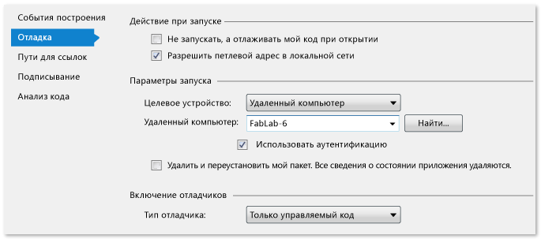

# Развертывание приложений для Магазина Windows из Visual Studio
[!INCLUDE[vs2017banner](../code-quality/includes/vs2017banner.md)]

  
  
 Функциональность развертывания Visual Studio выполняет сборку и регистрацию приложений Магазина Windows, созданных с помощью Visual Studio на целевом устройстве. Конкретный способ регистрации зависит от того, является ли целевое устройство локальным или удаленным:  
  
-   Когда целевое устройство является локальным компьютером Visual Studio, Visual Studio регистрирует приложение из папки сборки.  
  
-   Когда целевое устройство является удаленным, Visual Studio копирует требуемые файлы на удаленный компьютер и регистрирует приложение на этом устройстве.  
  
 Развертывание осуществляется автоматически при отладке приложения из Visual Studio с помощью параметра **Начать отладку** \(на клавиатуре нажмите F5\) или **Запуск без отладки** \(на клавиатуре нажмите CTRL\+F5\). Кроме того, приложение можно развернуть вручную. Это удобно в следующих сценариях:  
  
-   Специализированное тестирование на локальном или удаленном компьютере.  
  
-   Развертывание приложения, запускающего другое приложение, которое требует отладки.  
  
-   Развертывание приложения, для которого будет выполнена отладка, при его запуске другим приложением или методом.  
  
##   Содержание раздела  
 В этом разделе приведены следующие сведения:  
  
 [Развертывание приложения Магазина Windows](#BKMK_How_to_deploy_a_Windows_Store_app)  
  
 [Указание удаленного устройства](#BKMK_How_to_specify_a_remote_device)  
  
 [Параметры развертывания](#BKMK_Deployment_options)  
  
##   Развертывание приложения Магазина Windows  
 Ручное развертывание приложения не вызывает никаких сложностей:  
  
1.  Если вы выполняете развертывание на удаленное устройство, укажите имя или IP\-адрес устройства на странице свойств для запускаемого проекта приложения. \(Необходимые для этого действия перечислены ниже в этом разделе.\)  
  
2.  На панели инструментов отладчика Visual Studio выберите цель развертывания в раскрывающемся списке рядом с кнопкой **Начать отладку**.  
  
       
  
3.  В меню **Сборка** выберите пункт **Развернуть**.  
  
##   Указание удаленного устройства  
 **Предварительные требования**  
  
 Для развертывания приложения на удаленном устройстве выполните следующие действия:  
  
-   На удаленном устройстве должна быть установлена лицензия разработчика.  
  
-   На удаленном устройстве должны быть установлены инструменты удаленной отладки для Visual Studio, а также должен быть запущен монитор удаленной отладки.  
  
     Развертывание использует канал сети удаленного отладчика для отправки файлов приложения на удаленное устройство.  
  
#### Порядок указания удаленного устройства  
  
1.  На странице свойств "Отладка" запускаемого проекта укажите имя или IP\-адрес удаленной цели развертывания.  
  
2.  Чтобы открыть страницу свойств "Отладка", выберите проект в обозревателе решений и щелкните пункт **Свойства** в контекстном меню.  
  
3.  После этого выберите узел **Отладка** в окне страниц свойств.  
  
4.  Можно ввести сетевое имя или IP\-адрес удаленного устройства или выбрать его в диалоговом окне **Выбрать подключение к удаленному отладчику**.  
  
       
  
     В диалоговом окне **Выбрать подключение к удаленному отладчику** отображаются устройства в локальной подсети и устройства, непосредственно подключенные к компьютеру Visual Studio с помощью кабеля Ethernet.  
  
 **Указание удаленного устройства на странице проекта JavaScript или Visual C\+\+**  
  
   
  
1.  Выберите **Удаленный отладчик** из списка **Отладчик для запуска**.  
  
2.  Введите имя сети для удаленного устройства в поле **Имя компьютера**. Либо вы можете выбрать стрелку вниз в поле, чтобы выбрать устройство в диалоговом окне "Выбрать подключение к удаленному отладчику".  
  
 **Указание удаленного устройства на странице проекта Visual C\# или Visual Basic**  
  
   
  
1.  Выберите **Удаленный компьютер** из списка **Целевое устройство**.  
  
2.  Введите сетевое имя удаленного устройства в поле **Удаленный компьютер** или щелкните **Найти**, чтобы выбрать устройство в диалоговом окне **Выбрать подключение к удаленному отладчику**.  
  
##   Параметры развертывания  
 Вы можете задать следующие параметры развертывания на странице свойств "Отладка" запускаемого проекта.  
  
 **Разрешить замыкание на себя в локальной сети**  
 Из соображений безопасности приложению [!INCLUDE[win8_appname_long](../debugger/includes/win8_appname_long_md.md)], установленному стандартным образом, не разрешается выполнять сетевые вызовы к устройству, на котором оно установлено. По умолчанию Visual Studio создает для развертываемого приложения исключение из этого правила. Это исключение позволяет тестировать процедуры обмена данными на одном компьютере. Прежде чем отправлять приложение в [!INCLUDE[win8_appstore_long](../debugger/includes/win8_appstore_long_md.md)], необходимо протестировать приложение без этого исключения.  
  
 Чтобы удалить исключение сетевого замыкания на себя из приложения, выполните следующие действия:  
  
-   На странице свойств "Отладка" для C\# и VB снимите флажок **Разрешить замыкание на себя в локальной сети**.  
  
-   На странице свойств "Отладка" для JavaScript установите для параметра **Разрешить замыкание на себя в локальной сети** значение **Нет**.  
  
 **"Не запускать, а отлаживать мой код при открытии" \(C\# и VB\)\/"Запустить приложение" \(JavaScript и C\+\+\)**  
 Чтобы настроить развертывание на автоматический запуск сеанса отладки при запуске приложения, выполните следующие действия:  
  
-   На странице свойств "Отладка" для C\# и VB установите флажок **Не запускать, а отлаживать мой код при открытии**.  
  
-   На странице свойств "Отладка" для JavaScript установите для параметра **Запустить приложение** значение **Да**.  
  
## См. также  
 [Выполнение приложений в Visual Studio](../debugger/run-store-apps-from-visual-studio.md)