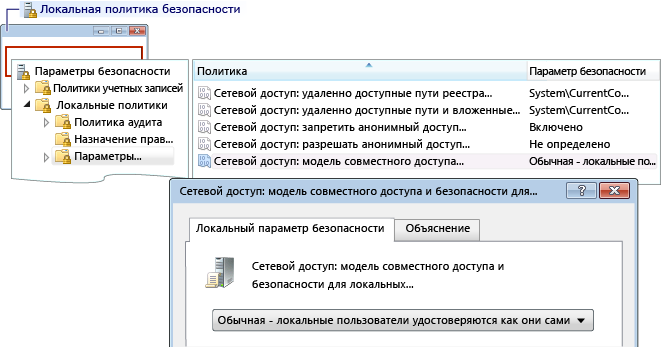

# Ошибка: сбой удаленного входа в систему рабочей группы
[!INCLUDE[vs2017banner](../code-quality/includes/vs2017banner.md)]

Текст сообщения об ошибке:  
  
 "Ошибка входа в систему: неизвестное имя пользователя или неверный пароль"  
  
 **Причина**  
  
 Эта ошибка может возникать, если в ходе отладки с компьютера рабочей группы произведена попытка подключиться к удаленному компьютеру.  Возможные причины:  
  
-   На удаленном компьютере нет учетной записи с соответствующими именем и паролем.  
  
-   Если компьютер с Visual Studio и удаленный компьютер оба принадлежат рабочим группам, эта ошибка может возникать из\-за установленного по умолчанию значения параметра **Локальной политики безопасности** на удаленном компьютере.  Значение по умолчанию для параметра **Локальная политика безопасности**: **Гостевая — локальные пользователи удостоверяются как гости**.  Чтобы отлаживать при таких настройках, необходимо установить параметр на удаленном компьютере в значение **Обычная — локальные пользователи удостоверяются как они сами**.  
  
> [!NOTE]
>  Для выполнения следующих задач необходимо иметь права администратора.  
  
### Открытие окна "Локальная политика безопасности"  
  
1.  Запустите оснастку консоли управления \(MMC\) **secpol.msc**.  Для этого введите secpol.msc в поле поиска файлов, в поле "Выполнить" или в командной строке.  
  
### Добавление назначений прав пользователя  
  
1.  Открытие локальной политики  
  
2.  Откройте окно **Локальная политика безопасности**.  
  
3.  Разверните папку **Локальные политики**.  
  
4.  Выберите **Назначение прав пользователя**.  
  
5.  В столбце **Политика** дважды щелкните **Отладка программ** для просмотра назначений текущей локальной групповой политики в диалоговом окне **Параметр локальной политики безопасности**.  
  
       
  
6.  Чтобы добавить новых пользователей, нажмите кнопку **Добавить пользователя или группу**.  
  
### Изменение модели безопасности и совместного использования  
  
1.  Откройте окно **Локальная политика безопасности**.  
  
2.  Разверните папку **Локальные политики**.  
  
3.  Нажмите **Параметры безопасности**.  
  
4.  В столбце **Политики** дважды щелкните **Сетевой доступ: модель совместного доступа и безопасности для локальных учетных записей**.  
  
5.  В диалоговом окне **Сетевой доступ: модель совместного доступа и безопасности для локальных учетных записей** измените значение на **Обычная — локальные пользователи удостоверяются как они сами** и нажмите кнопку **Применить**.  
  
       
  
## См. также  
 [Ошибки удаленной отладки и их устранение](../debugger/remote-debugging-errors-and-troubleshooting.md)   
 [Удаленная отладка](../debugger/remote-debugging.md)