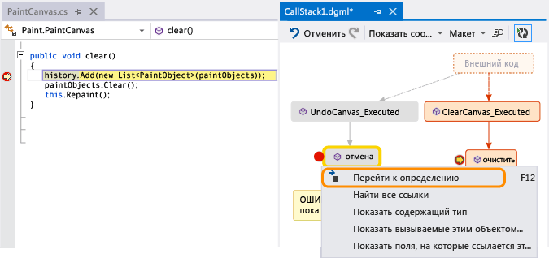
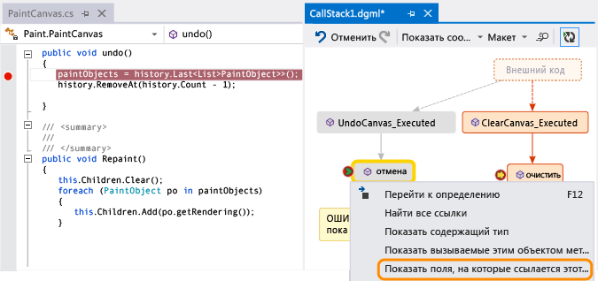
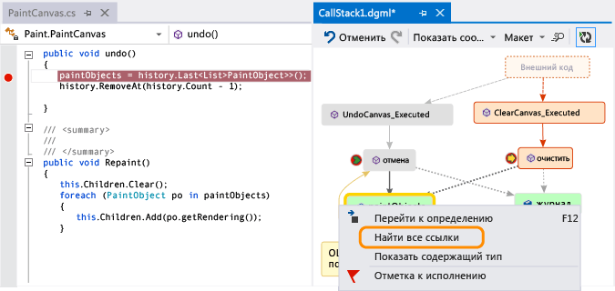
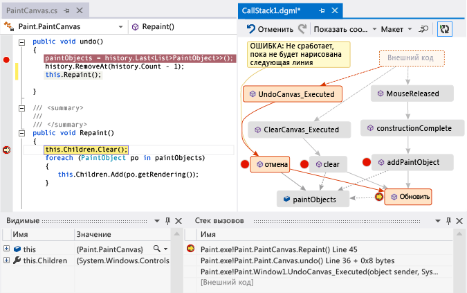

# Создание визуальной карты стека вызовов при отладке (C#, Visual Basic, C++, JavaScript)

Для визуального отслеживания стека вызовов при отладке можно создать карту кода. Вы можете вести заметки на карте, чтобы следить за деятельностью кода и сосредоточиться на поиске ошибок.

Пошаговое руководство просмотрите это видео: [Видео. Визуальная отладка с интеграцией отладчика сопоставления кода (канал 9)](http://go.microsoft.com/fwlink/?LinkId=293418)

Сведения о командах и действия, которые можно использовать с помощью карт кода, см. в разделе [Просмотр и реорганизация карт кода](../modeling/browse-and-rearrange-code-maps.md).

>[!IMPORTANT]
>Можно создать только в карты кода [Visual Studio Enterprise edition](https://visualstudio.microsoft.com/downloads/?utm_medium=microsoft&utm_source=docs.microsoft.com&utm_campaign=inline+link&utm_content=download+vs2017).

Ниже приведен краткий обзор карту кода.

 

##   Сопоставление стека вызова

1. В Visual Studio Enterprise C#, Visual Basic, C++ или JavaScript проекта, начать отладку, выбрав **Отладка** > **начать отладку** или нажав клавиши **F5**.
   
1. Когда ваше приложение переходит в режим приостановки выполнения или при входе в функцию, выберите **отладки** > **карта кода**, или нажмите клавишу **Ctrl**+**Shift** +**`**.

   Текущий стек вызовов выделен в новой карте кода оранжевым цветом:

   

Код сопоставления обновления автоматически в процессе продолжения отладки. Изменение элементов карты или макет не влияет на код любым способом. Можно свободно переименовать, изменить или удалить любой элемент в сопоставлении.

Чтобы получить дополнительные сведения об элементе, наведите на нее и просмотрите подсказку элемента. Можно также выбрать **условных обозначений** на панели инструментов, чтобы узнать, что означает каждый значок.

>[!NOTE]
>Сообщение **диаграмме могут основываться на более старой версии кода** в верхней части кода карты означает, что с момента последнего обновления сопоставления код мог измениться. Например, вызов в сопоставлении может уже не существовать в коде. Закройте сообщение, а затем попытайтесь повторить сборку решения, прежде чем повторно обновлять сопоставление.

## Сопоставить внешний код

По умолчанию в сопоставлении отображается только ваш код. Чтобы просмотреть внешний код на карте:
  
- Щелкните правой кнопкой мыши в **стек вызовов** и выберите **Показать внешний код**:
  
  
- Или отмените его выбор **включить только мой код** в Visual Studio **средства** (или **Отладка**) > **параметры**  >   **Отладка**:
  
  

## Управлять макетом сопоставления

Изменение макета карты не влияет на код любым способом. 

Чтобы управлять макетом сопоставления, выберите **макета** меню на панели инструментов карты. 

В **макета** меню, вы можете:

-   Измените макет по умолчанию.
-   Остановить автоматическую, перекомпоновку сопоставления, отменив выделение **автоматически формировать макет при отладке**.
-   Изменить расположение как можно реже карты при добавлении элементов, отменяя **последовательный макет**.

##   Добавление примечаний к коду

Можно добавить комментарии, чтобы отслеживать, что происходит в коде. 

Чтобы добавить комментарий, щелкните правой кнопкой мыши на карте кода и выберите **изменить** > **новый комментарий**, затем введите комментарий. 

Чтобы добавить новую строку в комментарий, нажмите клавишу **Shift**+**ввод**.

 

##   Обновление сопоставления путем добавления следующего стека вызовов

Как запустить приложение для следующей точки останова или шаг с заходом в функцию, карты автоматически добавляет новые стеки вызова.

Чтобы остановить сопоставление добавляло новые стеки вызова автоматически, выберите  на панели инструментов карты кода. Карты продолжает выделять существующие стеки вызовов. Чтобы вручную добавить текущий стек вызовов на карту, нажмите клавишу **Ctrl**+**Shift**+**`**. 

##   Добавление связанного кода в сопоставление

Теперь, когда у вас есть карты в C# или Visual Basic, вы можете добавить элементы, такие как поля, свойства и другие методы, чтобы отслеживать, что происходит в коде. 

Чтобы перейти к определению метода в коде, дважды щелкните метод в сопоставлении, или выберите его и нажмите клавишу **F12**, или щелкните его правой кнопкой мыши и выберите **перейти к определению**.

Чтобы добавить элементы, которые вы хотите отслеживать в сопоставление, щелкните правой кнопкой мыши метод и выберите элементы, которые требуется отслеживать. Последние добавленные элементы отображаются зеленым цветом.

>[!NOTE]
>По умолчанию при добавлении элементов в сопоставление также добавляются узлы родительской группы, соответствующие, например, классу, пространству имен или сборке. Эту функцию можно выключить и включить, выбрав **включить родительские элементы** кнопки на панели инструментов карты кода или нажав **Ctrl** при добавлении элементов.

Продолжайте формировать сопоставление, чтобы увидеть дополнительный код.

 

 

##   Поиск ошибок с помощью сопоставления
 Визуализация кода поможет вам быстрее находить ошибки. Например предположим, что вы ищите ошибку в приложении рисования. Когда вы создаете линию и пробуете отменить ее создание, ничего не происходит до тех пор, пока не будет нарисована следующая линия.

 Установив точки останова в методах `clear`, `undo` и `Repaint`, вы начинаете отладку и создаете сопоставление, аналогичное представленному ниже:

 

 Учтите, что все жесты пользователя в сопоставлении вызывают метод `Repaint`, за исключением `undo`. Возможно, именно поэтому функция `undo` срабатывает не сразу.

 После исправления ошибки и продолжения выполнения приложения, в сопоставление будет добавлен новый вызов из `undo` для `Repaint`:

 

## Использовать сопоставление совместно с другими пользователями

Можно экспортировать карту, отправить его другим пользователям с помощью Microsoft Outlook, сохраните его в решение и вернуть его в систему управления версиями.

Для совместного использования или сохранения карты используйте **совместно использовать** в панели инструментов карты кода. 

## См. также
[Сопоставление зависимостей во всех решениях](../modeling/map-dependencies-across-your-solutions.md)

[Использование карт кода для отладки приложений](../modeling/use-code-maps-to-debug-your-applications.md)

[Поиск потенциальных проблем с помощью анализаторов карт кода](../modeling/find-potential-problems-using-code-map-analyzers.md)

[Просмотр и реорганизация карт кода](../modeling/browse-and-rearrange-code-maps.md)
