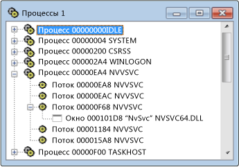

# Представление процессов
В представлении процессов дерево всех активных процессов в системе. Отображаются имя процесса идентификатор и модуль. В представлении процессов следует используйте, если вы хотите изучить процесс конкретной системе, который обычно соответствует исполняемой программой. Процессы идентифицируются по именам модулей, или они обозначены «системные процессы».  
  
 Microsoft Windows поддерживает несколько процессов. Каждый процесс может иметь один или несколько потоков и каждый поток может иметь одно или несколько окон верхнего уровня. Каждое окно верхнего уровня может принадлежать ряд windows. Объект "+" символа означает, что уровень свернут. Свернутое представление состоит из одной строке для каждого процесса. Щелкните знак ", чтобы повысить уровень" + ".  
  
 В представлении процессов следует используйте, если вы хотите изучить процесс конкретной системе, который обычно соответствует исполняемой программой. Процессы идентифицируются по именам модулей, или они обозначены «системные процессы». Чтобы найти процесс, Свернуть дерево и найдите в списке.  
  
## Процедуры  
  
#### Чтобы открыть в представлении процессов  
  
1. Из **Spy** меню, выберите **процессов**.  
  
     
   Представление процессов в Spy++  
  
   На рисунке выше показано представление процессов с развернутыми узлами потоков и процессов.  
  
### В этом разделе  
 [Поиск процесса в представлении процессов](../debugger/how-to-search-for-a-process-in-processes-view.md)  
 Объясняется, как найти конкретный процесс в представлении процессов.  
  
 [Отображение свойств процесса](../debugger/how-to-display-process-properties.md)  
 Объясняется, как просмотреть сведения о сообщении.  
  
### Связанные разделы  
 [Представления Spy++](../debugger/spy-increment-views.md)  
 Описание представления дерева Spy ++ окон, сообщений, процессов и потоков.  
  
 [Использование Spy++](../debugger/using-spy-increment.md)  
 Представлены средства Spy ++ и рассказывается, как он может использоваться.  
  
 [Диалоговое окно "Поиск процесса"](../debugger/process-search-dialog-box.md)  
 Используется для поиска узла для определенного процесса в представлении процессов.  
  
 [Диалоговое окно "Свойства процесса"](../debugger/process-properties-dialog-box.md)  
 Отображение свойств процесса, выбранного в представлении процессов.  
  
 [Справочник по Spy++](../debugger/spy-increment-reference.md)  
 Содержит разделы, описывающие каждый Spy ++ меню и диалоговое окно.