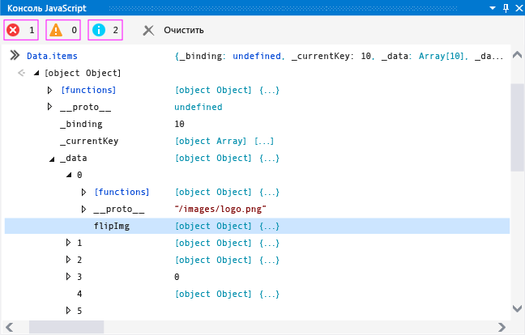
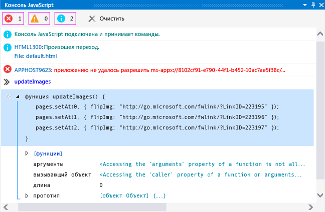

# <a name="debug-javascript-using-the-console-in-visual-studio"></a>Отладка JavaScript с помощью консоли в Visual Studio
  
 Окно консоли JavaScript можно использовать для взаимодействия и отладки приложений универсальной платформы Windows, построенных с помощью JavaScript. Эти функции поддерживаются для приложений универсальной платформы Windows и приложений, созданных с помощью Visual Studio Tools для Apache Cordova. Справочник по консольным командам см. в разделе [JavaScript Console commands](../debugger/javascript-console-commands.md).  
  
 Окно консоли JavaScript предоставляет вам следующие возможности:  
  
-   Отправка объектов, значений и сообщений из приложения в окно консоли.  
  
-   Просмотр и изменение значений локальных и глобальных переменных в запущенном приложении.  
  
-   Просмотр визуализаторов объектов.  
  
-   Запуск кода JavaScript, который выполняется в текущем контексте скрипта.  
  
-   Просмотр ошибок и исключений JavaScript в дополнение к исключениям модели DOM и среды выполнения Windows.  
  
-   Выполнение других задач, таких как очистка экрана. Полный список команд см. в разделе [JavaScript Console commands](../debugger/javascript-console-commands.md) .  
  
> [!TIP]
>  Если окно консоли JavaScript закрыто, выберите **Отладка**> **Windows** > **Консоль JavaScript** , чтобы снова открыть его. Окно отображается только во время сеанса отладки скрипта.  
  
 С помощью окна консоли JavaScript можно взаимодействовать с приложением, не останавливая и не перезапуская отладчик. Дополнительные сведения см. в разделе [обновление приложения (JavaScript)](../debugger/refresh-an-app-javascript.md). Сведения о других возможностях отладки JavaScript, например с использованием проводника DOM и задание точек останова, см. в разделе [краткое руководство: Отладка HTML и CSS](../debugger/quickstart-debug-html-and-css.md) и [отладка приложений в Visual Studio](/visualstudio/debugger/debugging-windows-store-and-windows-universal-apps).  
  
##  <a name="InteractiveConsole"></a> Отладка с использованием окна консоли JavaScript  
 Далее приведена процедура создания приложения `FlipView` и инструкции по интерактивной отладке ошибки кодирования JavaScript.  
  
> [!NOTE]
>  В примере приложения — это приложение универсальной платформы Windows. Однако описываемые здесь функции консоли также применимы к приложениям, созданным с помощью инструментов Visual Studio для Apache Cordova.  
  
#### <a name="to-debug-javascript-code-in-the-flipview-app"></a>Отладка кода JavaScript в приложении FlipView  
  
1. Создайте новое решение в Visual Studio, выбрав **Файл** > **Новый проект**.  
  
2. Выберите **JavaScript** > **универсальной Windows**, а затем выберите **приложение WinJS**.  
  
3. Введите имя проекта, например `FlipViewApp`, и нажмите кнопку **ОК** , чтобы создать приложение.  
  
4. В элементе BODY файла index.html замените существующий код HTML следующим кодом:  
  
   ```html  
   <div id="flipTemplate" data-win-control="WinJS.Binding.Template"  
            style="display:none">  
       <div class="fixedItem" >  
             
       </div>  
   </div>  
   <div id="fView" data-win-control="WinJS.UI.FlipView" data-win-options="{  
       itemDataSource: Data.items.dataSource, itemTemplate: flipTemplate }">  
   </div>  
   ```  
  
5. Откройте файл default.css и добавьте следующий код CSS для селектора `#fView` :  
  
   ```css  
   #fView {  
       background-color:#0094ff;  
       height: 500px;  
       margin: 25px;  
   }  
   ```  
  
6. Откройте файл default.js и замените код следующим кодом JavaScript:  
  
   ```javascript  
   (function () {  
       "use strict";  
  
       var app = WinJS.Application;  
       var activation = Windows.ApplicationModel.Activation;  
  
       var myData = [];  
       for (var x = 0; x < 4; x++) {  
           myData[x] = { flipImg: "/images/logo.png" }  
       };  
  
       var pages = new WinJS.Binding.List(myData, { proxy: true });  
  
       app.onactivated = function (args) {  
           if (args.detail.kind === activation.ActivationKind.launch) {  
               if (args.detail.previousExecutionState !==  
               activation.ApplicationExecutionState.terminated) {  
                   // TODO: . . .  
               } else {  
                   // TODO: . . .  
               }  
               args.setPromise(WinJS.UI.processAll());  
  
               updateImages();  
           }  
       };  
  
       function updateImages() {  
  
           pages.push(0, { flipImg: "http://public-domain-photos.com/free-stock-photos-1/flowers/cactus-76.jpg" });  
           pages.push(1, { flipImg: "http://public-domain-photos.com/free-stock-photos-1/flowers/cactus-77.jpg" });  
           pages.push(2, { flipImg: "http://public-domain-photos.com/free-stock-photos-1/flowers/cactus-78.jpg" });  
  
       };  
  
       app.oncheckpoint = function (args) {  
       };  
  
       app.start();  
  
       var publicMembers = {  
           items: pages  
       };  
  
       WinJS.Namespace.define("Data", publicMembers);  
  
   })();  
   ```  
  
7. Если цель отладки еще не выбрана, выберите **локального компьютера** из раскрывающегося списка рядом с полем **устройства** , нажмите кнопку **Отладка** инструментов:  
  
      
  
8. Нажмите клавишу F5, чтобы запустить отладчик.  
  
    Приложение выполняется, но изображения отсутствуют. Ошибки APPHOST в окне консоли JavaScript указывают на отсутствие изображений.  
  
9. С помощью `FlipView` приложение, работающее, тип `Data.items` в строке ввода окна консоли (рядом с полем «>>» символ) и нажмите клавишу ВВОД.  
  
     В окне консоли отображается визуализатор для объекта `items` . Это означает, что объект `items` создан и доступен в текущем контексте скрипта. В окне консоли можно щелкнуть узлы объекта, чтобы просмотреть значения свойств (или использовать клавиши со стрелками). Если щелкнуть объект `items._data` , как показано на рисунке, можно увидеть, что ссылки на источник изображений являются неправильными, как и ожидалось. Изображения по умолчанию (logo.png) все еще присутствуют в объекте, а отсутствующие изображения перемешаны с нужными.  
  
       
  
     Также обратите внимание на то, что в объекте `items._data` существует намного больше элементов, чем ожидалось.  
  
10. В командной строке введите `Data.items.push` и нажмите клавишу ВВОД. В окне консоли отображается визуализатор для функции `push` , которая реализована в файле проекта [!INCLUDE[winjs_long](../debugger/includes/winjs_long_md.md)] . В этом приложении мы используем `push` для добавления надлежащих элементов. Выполнив небольшой анализ с помощью IntelliSense, можно установить, что следует использовать `setAt` для замены изображений по умолчанию.  
  
11. Чтобы устранить эту проблему в интерактивном режиме без остановки сеанса отладки, откройте файл default.js и выберите этот код функции `updateImages` :  
  
    ```javascript  
    pages.push(0, { flipImg: "http://public-domain-photos.com/free-stock-photos-1/flowers/cactus-76.jpg" });  
    pages.push(1, { flipImg: "http://public-domain-photos.com/free-stock-photos-1/flowers/cactus-77.jpg" });  
    pages.push(2, { flipImg: "http://public-domain-photos.com/free-stock-photos-1/flowers/cactus-78.jpg" });  
    ```  
  
     Скопируйте и вставьте этот код в строку ввода консоли JavaScript.  
  
    > [!TIP]
    >  При вставке нескольких строк кода в строку ввода консоли JavaScript строка ввода консоли автоматически переключается в многострочный режим. Можно нажать сочетание клавиш Ctrl + Alt + M для включения и отключения многострочного режима. Чтобы выполнить скрипт в многострочном режиме, нажмите клавиши Ctrl + Ввод или выберите символ стрелки в правом нижнем углу окна. Дополнительные сведения см. в разделе [Однострочный и многострочный режим в окне консоли JavaScript](#SinglelineMultilineMode).  
  
12. Исправьте вызовы функции `push` в командной строке, заменив `pages.push` на `Data.items.setAt`. Исправленный код должен выглядеть следующим образом.  
  
    ```javascript  
    Data.items.setAt(0, { flipImg: "http://public-domain-photos.com/free-stock-photos-1/flowers/cactus-76.jpg" });  
    Data.items.setAt(1, { flipImg: "http://public-domain-photos.com/free-stock-photos-1/flowers/cactus-77.jpg" });  
    Data.items.setAt(2, { flipImg: "http://public-domain-photos.com/free-stock-photos-1/flowers/cactus-78.jpg" });  
    ```  
  
    > [!TIP]
    >  Если необходимо использовать объект `pages` вместо `Data.items`, следует задать точку останова в коде для сохранения объекта `pages` в области.  
  
13. Выберите символ зеленой стрелки, чтобы выполнить скрипт.  
  
14. Нажмите клавиши CTRL+ALT+M, чтобы переключить строку ввода консоли в однострочный режим, а затем выберите **Очистить входную строку** (красный значок "X") чтобы удалить код из строки ввода.  
  
15. Введите в командной строке `Data.items.length = 3` и нажмите клавишу ВВОД. Это позволяет удалить лишние элементы данных.  
  
16. Проверьте приложение еще раз, и вы увидите, что необходимые изображения теперь отображаются на соответствующих `FlipView` страниц.  
  
17. В обозревателе DOM отображается обновленный элемент DIV, и можно перейти в поддерево, чтобы найти нужные элементы IMG.  
  
18. Остановите отладку, выбрав **Отладка** > **Остановить отладку** или нажав клавиши SHIFT+F5, а затем исправьте исходный код.  
  
     Полную страницу default.html с исправленным примером кода см. в разделе [Отладка примера кода HTML, CSS и JavaScript](../debugger/debug-html-css-and-javascript-sample-code.md).  
  
##  <a name="InteractiveDebuggingBreakMode"></a> Интерактивная отладка и режим приостановки выполнения  
 Можно использовать точки останова и пошаговое выполнение кода при использовании таких средств отладки JavaScript, как окно консоли JavaScript. Если программа, которая выполняется в отладчике, оказывается в точке останова, отладчик временно приостанавливает выполнение программы. Если выполнение приостановлено, программа переключается из режима выполнения в режим приостановки выполнения. Выполнение можно возобновить в любой момент.  
  
 Если программа находится в режиме приостановки выполнения, можно использовать окно консоли JavaScript для выполнения скриптов и команд, которые являются допустимыми в текущем контексте выполнения скрипта. При выполнении этой процедуры вы будете использовать исправленную версию приложения `FlipView` , созданную ранее, чтобы продемонстрировать использование режима приостановки выполнения.  
  
#### <a name="to-set-a-breakpoint-and-debug-the-app"></a>Настройка точки останова и отладка приложения  
  
1.  В файле default.html приложения `FlipView` , созданного ранее, откройте контекстное меню функции `updateImages()` , а затем выберите **Точка останова** > **Вставить точку останова**.  
  
2.  Выберите **локального компьютера** в раскрывающемся списке рядом с полем **начать отладку** кнопку **Отладка** панели инструментов.  
  
3.  Выберите **Отладка** > **Начать отладку**или нажмите клавишу F5.  
  
     Приложение входит в режим приостановки выполнения, когда выполнение достигает функции `updateImages()` и текущая строка выполнения программы выделяется желтым.  
  
       
  
     Можно изменить значения переменных, чтобы немедленно изменить состояние программы, не завершая текущего сеанса отладки.  
  
4.  Введите в командной строке `updateImages` и нажмите клавишу ВВОД. В окне консоли отображается визуализатор для данной функции.  
  
5.  Выберите функцию в окне консоли, чтобы отобразить ее реализацию.  
  
     На следующем рисунке показано окно консоли на этом этапе.  
  
       
  
6.  Скопируйте одну строку функции из окна вывода в строку ввода и измените значение индекса на 3:  
  
    ```javascript  
    pages.setAt(3, { flipImg: "http://public-domain-photos.com/free-stock-photos-1/flowers/cactus-76.jpg" });  
    ```  
  
7.  Нажмите клавишу ВВОД, чтобы выполнить эту строку кода.  
  
     Если требуется пошаговое выполнение кода по одной строке, нажмите клавишу F11 или нажмите клавишу F5, чтобы продолжить выполнение программы.  
  
8.  Нажмите клавишу F5, чтобы продолжить выполнение программы. Появляется приложение `FlipView` , и теперь на всех четырех страницах отображается одно из изображений, не заданных по умолчанию.  
  
     Чтобы вернуться в Visual Studio, нажмите клавишу F12 или сочетание клавиш Alt + Tab.  
  
##  <a name="SinglelineMultilineMode"></a> Однострочный и многострочный режим в окне консоли JavaScript  
 Строка ввода в окне консоли JavaScript поддерживает однострочный и многострочный режим. Процедура интерактивной отладки в этом разделе включает примеры использования обоих режимов. Можно нажать сочетание клавиш Ctrl + Alt + M для переключения между режимами.  
  
 Однострочный режим позволяет просматривать историю ввода. Для перемещения по истории ввода можно использовать клавиши со стрелкой вверх и стрелкой вниз. В однострочном режиме строка ввода очищается при выполнении скриптов. Чтобы выполнить скрипт в однострочном режиме, нажмите клавишу ВВОД.  
  
 В многострочном режиме строка ввода при выполнении скриптов не очищается. При переключении из многострочного режима в однострочный можно очистить строку ввода, нажав клавишу **Очистить входную строку** (красный значок "X"). Чтобы выполнить скрипт в многострочном режиме, нажмите клавиши Ctrl + Ввод или выберите символ стрелки в правом нижнем углу окна.  
  
##  <a name="Switching"></a> Переключение контекста выполнения скрипта  
 Окно консоли JavaScript позволяет одновременно взаимодействовать с одним контекстом выполнения, который представляет один экземпляр узла веб-платформы (WWAHost.exe). В некоторых сценариях приложение может запускать другой экземпляр узла, например при использовании `iframe`, контракта совместного доступа, рабочего веб-процесса или элемента управления `WebView` . Если выполняется другой экземпляр узла, можно выбрать другой контекст выполнения во время запуска приложения, выбрав контекст выполнения в списке **Целевой объект** .  
  
 На следующем рисунке показан список "Цель" в окне консоли JavaScript.  
  
   
  
 Вы также можете переключить контекст выполнения с помощью команды `cd` , однако вы должны знать имя другого контекста выполнения, а используемая вами ссылка должна находиться в области. Список **Целевой объект** предоставляет более удобный доступ к другим контекстам выполнения.   
  
## <a name="see-also"></a>См. также раздел  
 [Debug apps in Visual Studio](/visualstudio/debugger/debugging-windows-store-and-windows-universal-apps)   
 [JavaScript Console commands](../debugger/javascript-console-commands.md)   
 [Обновление приложения (JavaScript)](../debugger/refresh-an-app-javascript.md)   
 [Сочетания клавиш](../debugger/keyboard-shortcuts-html-and-javascript.md)   
 [Отладка примера кода HTML, CSS и JavaScript](../debugger/debug-html-css-and-javascript-sample-code.md)   
 [Краткое руководство. Отладка HTML и CSS](../debugger/quickstart-debug-html-and-css.md)   
 [Отладка элемента управления WebView](../debugger/debug-a-webview-control.md)   
 [Поддержка и специальные возможности продукта](https://visualstudio.microsoft.com/vs/support/)