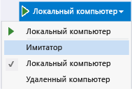

# Обновление приложения (JavaScript)
[!INCLUDE[vs2017banner](../code-quality/includes/vs2017banner.md)]

  
  
 Можно внести изменения в код в ходе отладки, а затем обновить приложение Магазина с использованием JavaScript, нажав кнопку **Обновить приложение Windows** на панели инструментов **Отладка**.  Нажатие этой кнопки перезапускает приложение без остановки и перезапуска отладчика.  Функция обновления позволяет вносить изменения в код HTML, CSS и JavaScript и сразу видеть результат.  Эта функция поддерживается как для приложений Магазина Windows, так и для приложений Магазина Windows Phone.  
  
 Обновление не сохраняет состояние приложения и не отражает следующие изменения в приложении:  
  
-   изменения в файле манифеста пакета, включая изменения изображений, указанных в манифесте пакета;  
  
-   изменения ссылок, такие как добавление или удаление ссылки на SDK, и изменения в компонентах среды выполнения Windows \(WINMD\-файлах\);  
  
-   изменения ресурсов, такие как изменения в строках в RESJSON\-файлах;  
  
-   изменения в файлах проекта, приводящие к изменению путей к файлам, появлению новых файлов проекта или удалению файлов;  
  
-   изменения свойств проекта и элементов, такие как изменения выбранного устройства отладки или изменения действия пакета для файла \(в окне "Свойства"\).  
  
> [!IMPORTANT]
>  При изменении ссылок, манифеста пакета или при внесении других изменений из списка выше необходимо остановить и перезапустить отладчик для обновления файлов с исходным кодом HTML, CSS и JavaScript.  
  
### Обновление приложения  
  
1.  Создайте в Visual Studio новый проект, используя шаблон проекта "Приложение навигации".  
  
     Это может быть приложение Магазина Windows, приложение Магазина Windows Phone или универсальное приложение.  
  
2.  Открыв шаблон в Visual Studio, выберите цель отладки.  
  
     Если вашим текущим запускаемым проектом является проект Windows Phone, выберите эмулятор Windows Phone для цели отладки.  В противном случае выберите **Имитатор** или **Локальный компьютер**.  
  
       
  
3.  Нажмите клавишу F5, чтобы запустить приложение в режиме отладки.  
  
4.  Перейдите в Visual Studio.  \(Нажмите F12.\)  
  
5.  В **обозревателе решений** в папке **страницы** \> **домашняя страница** откройте файл home.html.  
  
6.  Измените текст заголовка страницы с  
  
    ```html  
    Welcome to yourAppName!  
    ```  
  
     на что\-либо другое, например:  
  
    ```html  
    Hello!  
    ```  
  
7.  Нажмите кнопку **Обновить приложение Windows**, которая выглядит следующим образом: .  \(Или нажмите клавишу F4.\)  
  
8.  Перейдите в приложение.  Приложение перезапускается без перезапуска отладчика, и отображается новый заголовок.  
  
## См. также  
 [Краткое руководство по отладке HTML и CSS](../debugger/quickstart-debug-html-and-css.md)