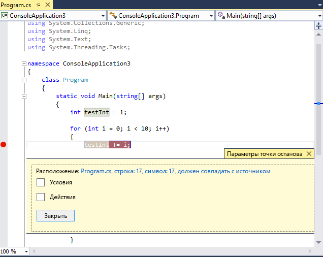
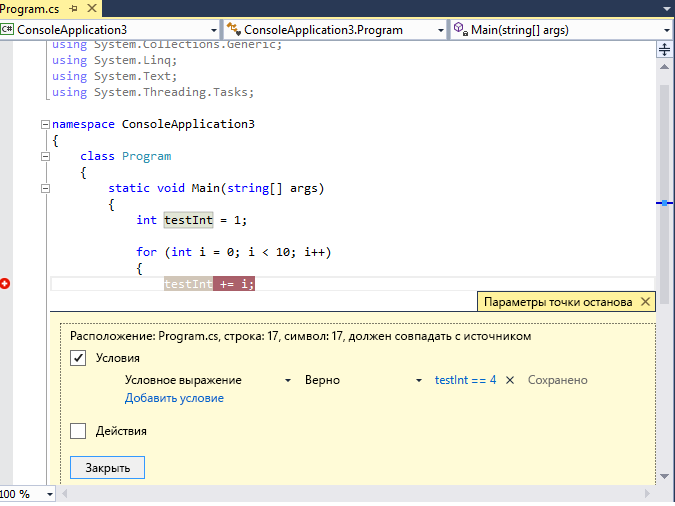
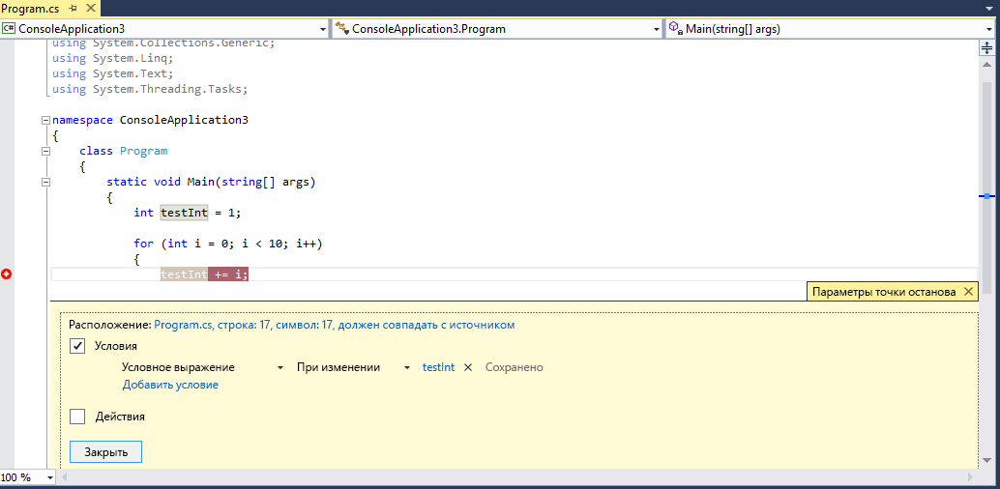
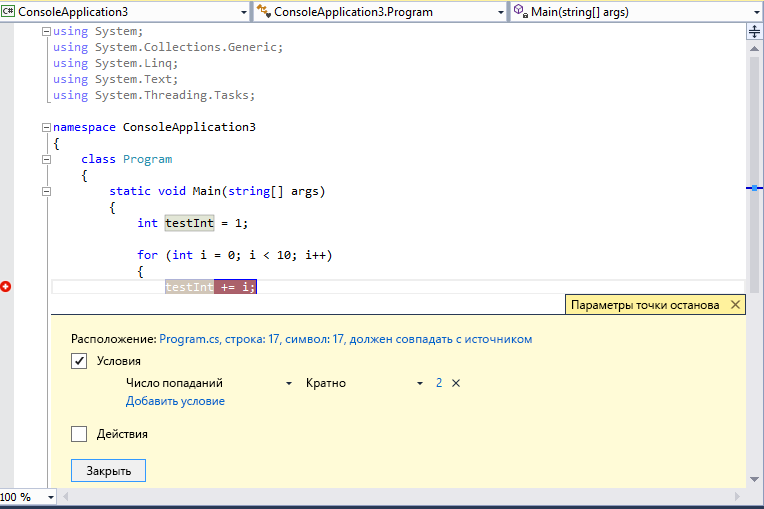

# <a name="use-breakpoints-in-the-visual-studio-debugger"></a>Использование точек останова в отладчике Visual Studio
Точки останова являются одним из самых важных технологий отладки в панели инструментов для разработчиков. Установите точки останова, везде, где требуется приостановить выполнение отладчика. Например может потребоваться см. в разделе состояние переменных кода или просмотреть стек вызовов в точке останова определенных. Если вы не знакомы с процессом отладки, перед выполнением задач в этой статье рекомендуется прочесть документ об [отладке для начинающих](../debugger/debugging-absolute-beginners.md).

##  <a name="BKMK_Overview"></a> Задание точек останова в исходном коде
 Можно установить точку останова в любой строке исполняемого кода. Например, в следующем C# кода, можно было задать точку останова в объявлении переменной `for` цикла или всего кода внутри `for` цикла. Невозможно задать точку останова для объявления пространства имен или класса, или в сигнатуре метода.

 Чтобы установить точку останова в исходном коде, щелкните в крайнем левом поле рядом со строкой кода. Можно также выбрать строку и нажмите клавишу **F9**выберите **Отладка** > **точка останова**, или щелкните правой кнопкой мыши и выберите **точкиостанова**  >  **Вставить точку останова**. Точка останова отображается в виде красной точки в левом поле.

В C# автоматически выделяются кода, точки останова и текущего выполнения строк. Для кода C++, можно включить выделение точки останова и текущей строки, выбрав **средства** (или **Отладка**) > **параметры**  >   **Отладка** >  **выделить всю строку исходного кода для точек останова и текущего оператора (только C++)**.

 

 При отладке, выполнение приостанавливается в точке останова, перед выполнением кода в этой строке. Символ точки останова показывает желтая стрелка.

 В точке останова в следующем примере значение `testInt` равно 1.

 

 Когда отладчик останавливается в точке останова, можно просмотреть текущее состояние приложения, включая значения переменных и стека вызова. Дополнительные сведения о стеке вызовов см. в разделе [Практическое руководство. Использование окна стека вызова](../debugger/how-to-use-the-call-stack-window.md).

- Точка останова является переключателем. Может щелкните его, нажмите клавишу **F9**, или использовать **Отладка** > **точка останова** для удаления или вставлять его повторно.

- Чтобы отключить точку останова, не удаляя его, наведите указатель мыши или щелкните его правой кнопкой мыши и выберите **отключить точку останова**. Отключенные точки останова отображаются как пустые точки в левом поле или **точки останова** окна. Чтобы снова включить точку останова, наведите указатель мыши или щелкните его правой кнопкой мыши и выберите **Включить точку останова**.

- Задайте условия и действия, добавлять и изменять метки или экспортировать точки останова, щелкнув его правой кнопкой мыши и выбрав соответствующую команду или навести на него и выбрав **параметры** значок.

##  <a name="BKMK_Set_a_breakpoint_in_a_function"></a> Установите точки останова из отладчика windows

Также можно установить точки останова из **стек вызовов** и **Дизассемблированный код** окна отладчика.

### <a name="BKMK_Set_a_breakpoint_in_the_call_stack_window"></a> Установите точку останова в окне стека вызовов

 Чтобы приостановить выполнение на инструкции или строке, возвращается вызывающей функции, можно установить точку останова **стек вызовов** окна.

**Чтобы задать точку останова в окне стека вызовов:**

1. Чтобы открыть **стек вызовов** окно, вы должны быть приостановлены во время отладки. Выберите **Отладка** > **Windows** > **стек вызовов**, или нажмите клавишу **Ctrl** + **Alt**+**C**.

2. В **стек вызовов** , щелкните правой кнопкой мыши вызывающую функцию и выберите пункт **точки останова** > **вставить точку останова**, или нажмите клавишу **F9**.

   Символ точки останова отображается рядом с именем вызова функции в левом поле стека вызовов.

Точка останова стека вызова отображается в **точки останова** окно как адрес, с областью памяти, который соответствует следующей исполняемой инструкции в функции.

Отладчик останавливается на инструкции.

Дополнительные сведения о стеке вызовов см. в разделе [Практическое руководство. Использование окна стека вызова](../debugger/how-to-use-the-call-stack-window.md).

Визуальном отслеживании точек останова во время выполнения кода, см. в разделе [сопоставление методов в стеке вызовов при отладке](../debugger/map-methods-on-the-call-stack-while-debugging-in-visual-studio.md).

### <a name="set-a-breakpoint-in-the-disassembly-window"></a>Установите точку останова в окне дизассемблирования

1. Чтобы открыть **Дизассемблированный код** окно, вы должны быть приостановлены во время отладки. Выберите **Отладка** > **Windows** > **Дизассемблированный код**, или нажмите клавишу **Alt** + **8**.

2. В **Дизассемблированный код** окно, щелкните в левом поле инструкцию, чтобы прервать выполнение. Можно также выбрать его и нажмите клавишу **F9**, или щелкните правой кнопкой мыши и выберите **точки останова** > **вставить точку останова**.

##  <a name="BKMK_Set_a_breakpoint_in_a_source_file"></a> Задайте точки останова функции

  Можно прервать выполнение при вызове функции.

**Чтобы задать точки останова в функции:**

1. Выберите **Отладка** > **новую точку останова** > **точки останова в функции**, или нажмите клавишу **Alt** + **F9** > **Ctrl**+**B**.

   Можно также выбрать **New** > **точки останова в функции** в **точки останова** окна.

1. В **новой точки останова в функции** диалоговое окно, введите имя функции в **имя_функции** поле.

   Чтобы сузить спецификацию функции:

   - Используйте полное имя функции.

     Пример: `Namespace1.ClassX.MethodA()`

   - Добавьте типы параметров перегруженной функции.

     Пример: `MethodA(int, string)`

   - Используйте "!" символ, чтобы указать модуль.

     Пример: `App1.dll!MethodA`

   - Используйте оператор контекста в неуправляемом коде C++.

     `{function, , [module]} [+<line offset from start of method>]`

     Пример: `{MethodA, , App1.dll}+2`

1. В **языка** раскрывающемся списке выберите язык функции.

1. Нажмите кнопку **ОК**.

### <a name="set-a-function-breakpoint-using-a-memory-address-native-c-only"></a>Задайте точки останова в функции с использованием адреса памяти (только для машинного кода C++)
 Адрес объекта можно использовать для задания точки останова в функции в методе, вызываемом на определенном экземпляре класса.  Например, если объект, адресуемый типа `my_class`, можно задать точки останова в функции на `my_method` метод, который вызывает экземпляр.

1.  Где-нибудь установите точку останова после создания экземпляра класса экземпляра.

2.  Найдите адрес экземпляра (например, `0xcccccccc`).

3.  Выберите **Отладка** > **новую точку останова** > **точки останова в функции**, или нажмите клавишу **Alt** + **F9** > **Ctrl**+**B**.

4.  Добавьте следующий код в **имя_функции** выберите **C++** языка.

    ```C++
    ((my_class *) 0xcccccccc)->my_method
    ```

## <a name="BKMK_set_a_data_breakpoint_native_cplusplus_only"></a>Задайте точки останова по данным (только для машинного кода C++)

 Точки останова по данным приостанавливают выполнение, когда значение, хранящееся в изменяется указанный адрес памяти. Если значение только считывается, но не изменяется, выполнение программы не прерывается.

**Чтобы задать точку останова по данным:**

1.  В проекте C++ начать отладку и подождите, пока не будет достигнута точка останова. На **Отладка** меню, выберите **новую точку останова** > **точка останова по данным**

    Можно также выбрать **New** > **точка останова по данным** в **точки останова** окна.

2.  В поле **Адрес** введите адрес памяти или выражение, результатом вычисления которого будет адрес памяти. Например, для прерывания при изменении содержимого переменной `&avar` введите `avar` .

3.  В раскрывающемся списке **Счетчик байтов** введите количество байтов, за которыми должен наблюдать отладчик. Например, если выбрать **4**, отладчик будет наблюдать за четырьмя байтами начиная с `&avar` и выполнит прерывание, если какой-либо из этих байтов изменит значение.

Точки останова для данных не работают при следующих условиях:
-   Процесс, для которого не выполняется отладка, производит запись в область памяти.
-   Область памяти совместно используется двумя или более процессами.
-   Область памяти обновляется в ядре. Например, если память передается в 32-разрядной Windows `ReadFile` функции, память будет обновляться из режима ядра, поэтому отладчик не будет останавливаться на обновление.

>[!NOTE]
>- Точки останова по данным зависят от определенных адресов памяти. Адрес переменной изменений в разных сеансах отладки следующей точки останова по данным автоматически отключаются в конце каждого сеанса отладки.
>
>- Если установить точку останова по данным на локальную переменную, точка останова остается включенной при завершении выполнения функции, но адрес памяти больше не применяется, поэтому поведение точки останова будет непредсказуемым. Если задать точку останова по данным на локальную переменную, следует удалить или отключить точку останова до конца функции.

##  <a name="BKMK_Specify_advanced_properties_of_a_breakpoint_"></a> Управление точками останова в окне "Точки останова"

 Можно использовать **точки останова** окно, чтобы просматривать и контролировать все точки останова в решении. Это централизованное расположение особенно полезна в тех случаях, в решении для больших или сложных сценариях отладки, где точки останова имеют принципиально важное.

В **точки останова** окне можно поиска, сортировки, фильтрации, включение или отключение или удаление точек останова. Также можно задать условия и действия или добавить новую функцию или точка останова по данным.

Чтобы открыть **точки останова** выберите **Отладка** > **Windows** > **точки останова**, или нажмите клавишу  **ALT**+**F9** или **Ctrl**+**Alt**+**B**.


Чтобы выбрать столбцы для отображения в **точки останова** выберите **Показать столбцы**. Щелкните заголовок столбца для сортировки списка точек останова по этому столбцу.

###  <a name="BKMK_Set_a_breakpoint_at_a_function_return_in_the_Call_Stack_window"></a> Метки точки останова
Метки можно использовать для сортировки и фильтрации списка точек останова в **точки останова** окна.

1. Для добавления метки к точке останова, щелкните правой кнопкой мыши точку останова в исходном коде или **точки останова** окна, а затем выберите **изменить метки**. Добавить новую метку или выберите уже существующий, а затем выберите **ОК**.
2. Сортировка списка точек останова в **точки останова** окно, выбрав **метки**, **условия**, или другие заголовки столбцов. Можно выбрать столбцы для отображения, выбрав **Показать столбцы** на панели инструментов.

### <a name="export-and-import-breakpoints"></a>Экспорт и импорт точек останова
 Чтобы сохранить или совместно использовать состояние и расположение точек останова, можно экспортировать или импортировать их.

- Чтобы экспортировать отдельной точки останова в XML-файл, щелкните правой кнопкой мыши точку останова в исходном коде или **точки останова** затем выберите **Экспорт** или **экспортируйте выбранные**. Выберите папку для экспорта, а затем выберите **Сохранить**. По умолчанию находится в папке решения.
- Для экспорта нескольких точек останова в **точки останова** окно, установите флажки рядом с точками останова, или введите условия поиска в **поиска** поля. Выберите **экспортировать все точки останова, соответствующие текущим критериям поиска** значок и сохраните файл.
- Чтобы экспортировать все точки останова, снимите все флажки и оставить **поиска** пустым. Выберите **экспортировать все точки останова, соответствующие текущим критериям поиска** значок и сохраните файл.
- Чтобы импортировать точки останова, в **точки останова** выберите **Импорт точек останова из файла** значок, перейдите в расположение файла XML и выберите **откройте**.

##  <a name="breakpoint-conditions"></a>Условия точки останова
 Можно управлять тем, где и когда выполняется точка останова, задавая условия. Условие может быть любое допустимое выражение, которое распознает отладчик. Дополнительные сведения о допустимых выражениях см. в разделе [Выражения в отладчике](../debugger/expressions-in-the-debugger.md).

**Чтобы задать условие точки останова:**

1. Щелкните символ точки останова правой кнопкой мыши и выберите **условия**. Или наведите указатель мыши на символ точки останова, выберите **параметры** значок, а затем выберите **условия** в **параметры точки останова** окна.

   Можно также задать условия **точки останова** окно, щелкните точку останова правой кнопкой мыши и выбрав **параметры**и затем выбрав **условия**.

   

2. В раскрывающемся списке выберите **условное выражение**, **число попаданий**, или **фильтра**и задайте значение соответствующим образом.

3. Выберите **закрыть** или нажмите клавишу **Ctrl**+**ввод** закрыть **параметры точки останова** окна. Или с **точки останова** выберите **ОК** чтобы закрыть диалоговое окно.

Точки останова с заданным условиям, обозначаются **+** символа в исходном коде и **точки останова** windows.

<a name="BKMK_Specify_a_breakpoint_condition_using_a_code_expression"></a>
### <a name="conditional-expression"></a>Условное выражение

При выборе **условное выражение**, можно выбрать два условия: **верно** или **при изменении**. Выберите **верно** чтобы прервать выполнение при истинности выражения, или **при изменении** чтобы прервать выполнение при изменении значения выражения.

 В следующем примере, точка останова достигается только тогда, когда значение `testInt` — **4**:

 

 В следующем примере, точка останова достигается только тогда, когда значение `testInt` изменения:

 

 Если условие точки останова имеет недопустимый синтаксис, появится предупреждающее сообщение. Если указать условие для точки останова с недопустимой семантикой, но допустимым синтаксисом, предупреждающее сообщение появится при достижении точки останова в первый раз. В любом случае отладчик останавливается, когда оно попадет недопустимая точка останова. Точка останова пропускается, только если условие допустимо и принимает значение `false`.

 >[!NOTE]
 >Поведение поля **При изменении** отличается для различных языков программирования.
 >- Для машинного кода отладчик не рассматривает первое вычисление условия как изменение, поэтому не достигнута точка останова при ней исполнение.
 >- Для управляемого кода, отладчик достигает точки останова при первом вычислении после **при изменении** выбран.

### <a name="using-object-ids-in-conditional-expressions-c-and-f-only"></a>Использование идентификаторов объектов в условных выражениях (C# и F# только)
 Бывают случаи, когда необходимо наблюдать за поведением определенного объекта. Например может потребоваться узнать, почему объект был вставлен в коллекцию несколько раз. В C# и F# можно создавать идентификаторы объектов для определенных экземпляров [ссылочных типов](/dotnet/csharp/language-reference/keywords/reference-types) и использовать их в условиях точек останова. Идентификатор объекта создается службами отладки среды CLR и связан с объектом.

**Чтобы создать идентификатор объекта:**

1. Установите точку останова в коде приведено после создания объекта.

2. Начните отладку и, когда выполнение приостанавливается в точке останова, выберите **Отладка** > **Windows** > **"Локальные"** или **Alt** + **4** открыть **"Локальные"** окна.

   Найдите точку останова в **"Локальные"** окно, щелкните его правой кнопкой мыши и выберите **создать идентификатор объекта**.

   В окне **$** вы должны увидеть символ **Локальные** . Это и есть идентификатор объекта.

3. Добавить новую точку останова в точке, которую вы хотите изучить; Например, если объект находится для добавления в коллекцию. Щелкните правой кнопкой мыши точку останова и выберите пункт **Условие**.

4. Используйте идентификатор объекта в поле **Условное выражение**. Например если переменная `item` — это объект, добавляемый в коллекцию, выберите **верно** и тип **item == $\<n >**, где \<n > — номер идентификатора объекта .

   Выполнение прервется в точке добавления объекта в коллекцию.

   Чтобы удалить идентификатор объекта, щелкните правой кнопкой мыши переменную в **"Локальные"** и выберите **удалить идентификатор объекта**.

>[!NOTE]
>Идентификаторы объектов создают слабые ссылки и не предотвращают сборку мусора для объекта. Они действительны только в рамках текущего сеанса отладки.

### <a name="hit-count"></a>Число попаданий
 Если вы подозреваете, что цикл в коде начинает неправильно вести себя после определенного числа итераций, можно установить точку останова для остановки выполнения после выполнения такого количества попаданий, вместо того чтобы несколько раз нажмите клавишу **F5** для доступа к этой итерации.

 В разделе **условия** в **параметры точки останова** выберите **число попаданий**, а затем укажите число итераций. В следующем примере задана точка останова при каждой итерации:

 

### <a name="filter"></a>Фильтр
Вы можете ограничить точку останова, сделав ее срабатывание возможным лишь на определенных устройствах или в определенных процессах или потоках.

В разделе **условия** в **параметры точки останова** выберите **фильтра**, а затем введите один или несколько из следующих выражений:

-   MachineName = "имя"
-   ProcessId = значение
-   ProcessName = "имя"
-   ThreadId = значение
-   ThreadName = "имя"

Значения строк следует заключить в двойные кавычки. Для комбинации условий можно использовать знаки `&` (И), `||` (ИЛИ), `!` (НЕ) и скобки.

##  <a name="BKMK_Print_to_the_Output_window_with_tracepoints"></a> Действия точки останова и точки трассировки
 *Точка трассировки* — это точка останова, которая выводит сообщение в окно **вывода**. Точка трассировки может играть роль временного оператора трассировки в языке программирования.

**Чтобы установить точку трассировки:**

1. Щелкните правой кнопкой мыши точку останова и выберите **действия**. Либо в **параметры точки останова** выберите окно, наведите курсор на точке останова, **параметры** значок, а затем выберите **действия**.

1. Введите сообщение в **регистрировать сообщение в окне вывода** поля. Сообщение может содержать универсальные текстовые строки, значения переменных или выражений, заключенный в фигурные скобки и описателей формата ([ C# ](../debugger/format-specifiers-in-csharp.md) и [C++](../debugger/format-specifiers-in-cpp.md)) для значений.

   Также можно использовать приведенные ниже ключевые слова в сообщении:

   - **$ADDRESS** -текущая инструкция
   - **$CALLER** -имя вызывающей функции
   - **$CALLSTACK** -стек вызовов
   - **$FUNCTION** -имя текущей функции
   - **$PID** — идентификатор процесса
   - **$PNAME** -имя процесса
   - **$TID** -идентификатор потока
   - **$TNAME** -имя потока
   - **$TICK** -счетчик фиксирует (из Windows `GetTickCount`)

1. Чтобы напечатать сообщение, **выходные данные** окно без прерывания, выберите **продолжить выполнение** "флажок". Чтобы распечатать сообщение и приостановит выполнение в точку трассировки, снимите флажок.

Точки трассировки отображаются в виде красного бриллиантов в левом поле исходного кода и **точки останова** windows.

## <a name="see-also"></a>См. также

- [Что такое отладка?](../debugger/what-is-debugging.md)
- [Лучше писать C# кода с помощью Visual Studio](../debugger/write-better-code-with-visual-studio.md)
- [Сначала посмотрим, отладка](../debugger/debugger-feature-tour.md)
- [Устранение неполадок точек останова в отладчике Visual Studio](../debugger/troubleshooting-breakpoints.md)