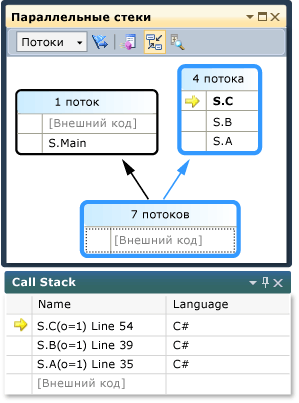
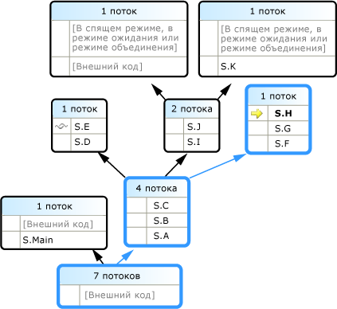
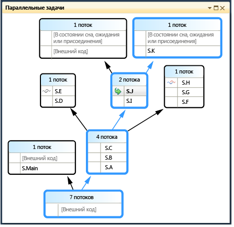
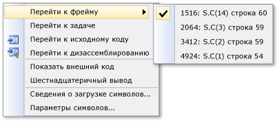
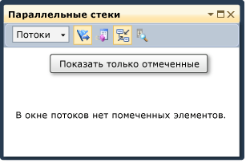
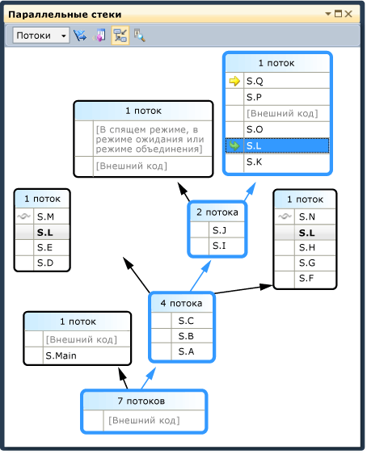
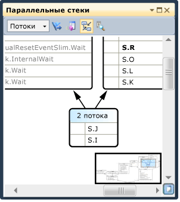
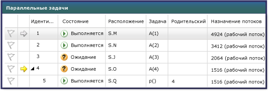
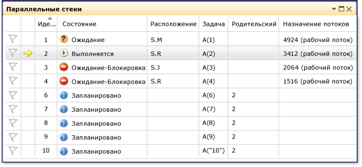
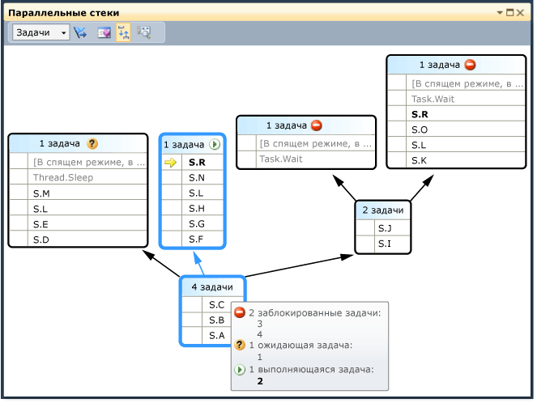

# Пошаговое руководство: Отладка параллельного приложения в Visual Studio
В этом пошаговом руководстве показано, как использовать **параллельных задач** и **Параллельные стеки** windows для отладки параллельного приложения. Эти окна помогают понять и проверить поведение во время выполнения кода, использующего [библиотеки параллельных задач (TPL)](/dotnet/standard/parallel-programming/task-parallel-library-tpl) или [среда выполнения с параллелизмом](/cpp/parallel/concrt/concurrency-runtime). Примеры кода, приведенные в этом пошаговом руководстве, имеют встроенные точки останова. Показаны после прерывания выполнения программы, как использовать **параллельных задач** и **Параллельные стеки** windows, чтобы изучить его.  
  
 В этом пошаговом руководстве рассматриваются следующие задачи:  
  
-   Просмотр стеков вызовов всех потоков в одном представлении.  
  
-   Просмотр списка экземпляров `System.Threading.Tasks.Task`, созданных в приложении.  
  
-   Просмотр активных стеков вызовов задач вместо потоков.  
  
-   Как перейти к коду из **параллельных задач** и **Параллельные стеки** windows.  
  
-   Работа возможностей группирования, масштабирования и прочих связанных возможностей в окнах.  
  
## Предварительные требования  
 В этом пошаговом руководстве предполагается, что **Just My Code** включен (он включен по умолчанию в более поздних версиях Visual Studio). На **средства** меню, нажмите кнопку **параметры**, разверните **Отладка** выберите **Общие**, а затем выберите **включить Только мой код (только управляемый код)**. Если эта возможность не задана, можно продолжить выполнение инструкций настоящего пошагового руководства, однако полученные результаты могут отличаться от описанных здесь.  
  
## Пример на языке C#  
 При использовании примера для C# предполагается, что внешний код является скрытым. Для переключения между режимами отображения внешнего кода, щелкните правой кнопкой мыши **имя** заголовок столбца **стек вызовов** окна, а затем установить или снять **Показать внешний код**. Если эта возможность не задана, можно продолжить выполнение инструкций настоящего пошагового руководства, однако полученные результаты могут отличаться от описанных здесь.  
  
## Пример на языке C++  
 При использовании примера для языка C++ можно пропускать ссылки на внешний код, приведенные в данном разделе. Внешний код применяется только к примеру для языка C#.  
  
## Рисунки  
 Рисунки, приведенные в настоящем разделе, получены на двухъядерном компьютере, на котором выполняется пример C#. Для выполнения инструкций настоящего пошагового руководства можно использовать другие конфигурации, однако диалоговые окна могут отличаться от приведенных в руководстве.  
  
## Создание примера проекта  
 Пример кода, приведенный в данном пошаговом руководстве, предназначен для приложения, которое не выполняет никаких действий. Цель данного примера кода: понять использование окон инструментов для отладки параллельного приложения.  
  
#### Создание примера проекта  
  
1.  В меню **Файл** окна Visual Studio наведите указатель мыши на пункт **Создать** и щелкните **Проект**.  
  
2.  В **установленные шаблоны** области, выберите Visual C#, Visual Basic или Visual C++. При использовании управляемых языков убедитесь, что в окне среды отображается [!INCLUDE[net_v40_short](../code-quality/includes/net_v40_short_md.md)].  
  
3.  Выберите **консольное приложение** и нажмите кнопку **ОК**. Оставайтесь в конфигурации отладки, которая используется по умолчанию.  
  
4.  Откройте CPP-файл, CS-файл или VB-файл кода в проекте. Удалите его содержимое, чтобы создать пустой файл кода.  
  
5.  Вставьте в пустой файл кода следующий код для данного языка.  
  
 [!code-csharp[Debugger#1](../debugger/codesnippet/CSharp/walkthrough-debugging-a-parallel-application_1.cs)]
 [!code-cpp[Debugger#1](../debugger/codesnippet/CPP/walkthrough-debugging-a-parallel-application_1.cpp)]
 [!code-vb[Debugger#1](../debugger/codesnippet/VisualBasic/walkthrough-debugging-a-parallel-application_1.vb)]  
  
1.  На **файл** меню, щелкните **сохранить все**.  
  
2.  На **построения** меню, щелкните **Перестроить решение**.  
  
     Обратите внимание, что имеются четыре вызова `Debugger.Break` (`DebugBreak` в примере C++). Следовательно, установка точек останова не требуется. При выполнении приложения отладчик будет вызываться до 4 раз.  
  
## Использование окна "Параллельные стеки". Представление "Потоки"  
 В меню **Отладка** щелкните **Начать отладку**. Дождитесь попадания в первую точку останова.  
  
#### Просмотр стека вызовов одного потока  
  
1.  На **Отладка** последовательно выберите пункты **Windows** и нажмите кнопку **потоков**. Dock **потоков** окно в нижней части Visual Studio.  
  
2.  На **Отладка** последовательно выберите пункты **Windows** и нажмите кнопку **стек вызовов**. Dock **стек вызовов** окно в нижней Visual Studio.  
  
3.  Дважды щелкните поток в **потоков** окно, чтобы сделать его текущим. Рядом с текущими потоками отображается желтая стрелка. При изменении текущего потока его стек вызовов отображается в **стек вызовов** окна.  
  
#### Изучение окна "Параллельные стеки"  
  
1.  На **Отладка** последовательно выберите пункты **Windows** и нажмите кнопку **Параллельные стеки**. Убедитесь, что **потоков** выбран в поле в верхнем левом углу.  
  
     С помощью **Параллельные стеки** окне можно просматривать несколько стеков вызовов, в то же время в одном представлении. На следующем рисунке показано **Параллельные стеки** над окном **стек вызовов** окна.  
  
       
  
     Стек вызовов главного потока отображается в одном окне, а стеки вызовов для других четырех потоков сгруппированы в другом окне. Четыре потока сгруппированы вместе, поскольку их кадры стека совместно используют одни и те же контексты методов: `A`, `B` и `C`. Представление, идентификаторы и имена потоков, которые совместно используют одно окно, наведите указатель мыши на поле с заголовком (**потоков — 4**). Текущий поток отображается полужирным шрифтом.  
  
       
  
     Желтая стрелка указывает активный кадр стека текущего потока.
  
     Можно задать объем сведений, отображаемых для кадров стеков (**имена модулей**, **типы параметров**, **имена параметров**, **значения параметров**, **Номера строк** и **смещения в байтах**) щелкните правой кнопкой мыши в **стек вызовов** окна.  
  
     Синяя рамка вокруг окна указывает, что текущий поток является частью этого окна. Текущий поток также обозначается полужирным шрифтом в подсказке для кадра стека. Если дважды щелкнуть основной поток в окне потоков, можно наблюдать, синяя рамка в **Параллельные стеки** переместится в окно.  
  
       
  
#### Возобновление выполнения до второй точки останова  
  
1.  Чтобы возобновить выполнение до попадания второй точки останова, в **Отладка** меню, щелкните **Продолжить**. На следующем рисунке показано дерево потоков для второй точки останова.  
  
       
  
     В первой точке останова все четыре потока были получены от методов S.A, S.B и S.C. Что сведения по-прежнему отображается в **Параллельные стеки** окна, однако четыре потока создали дополнительные потоки. Один из них продолжает выполнение сначала в S.D, а затем в S.E. Другой продолжает выполнение в S.F, S.G и S.H. Два других потока продолжают выполнение в S.I и S.J и один из них перешел в S.K, а другой продолжает выполнение во внешнем коде, не принадлежащем пользователю.  
  
     Наведите курсор на заголовок окна, например, **1 поток** или **2 потока**, чтобы просмотреть идентификаторы потоков. Чтобы узнать идентификаторы и другие сведения о кадре, наводите указатель мыши на кадры стека. Синяя рамка указывает текущий поток, а желтая стрелка — активный кадр стека текущего потока.  
  
     Значок (interweaved строк) указывает активные кадры стека потоков, не. В **стек вызовов** окно, дважды щелкните S.B, чтобы переключить кадры. **Параллельные стеки** окно указывает текущий кадр стека текущего потока с помощью зеленой круговой стрелки.  
  
     В **потоков** окно, переключитесь между потоками и обратите внимание, что в представлении в **Параллельные стеки** окно обновляется.  
  
     Можно переключиться на другой поток или кадр другого потока, с помощью контекстного меню в **Параллельные стеки** окна. Например, щелкните правой кнопкой мыши S.J, выберите пункт **перейти к кадру**, а затем выберите команду.  
  
       
  
     Щелкните правой кнопкой мыши S.C и выберите пункт **перейти к кадру**. Напротив одной из команд установлен флажок, который указывает кадр стека текущего потока. Можно переключиться в кадр того же потока (зеленая стрелка будет перемещена) или можно переключиться в другой поток (синяя рамка также будет перемещена). На следующем рисунке показаны команды вложенного меню.  
  
       
  
     Если контекст метода связан с кадром стека только один, отображается заголовок окна **1 поток** и вы можете его двойным щелчком. При двойном щелчке контекста метода, имеющего более 1 кадра стека, связанного с ним, автоматически откроется всплывающее меню. При наведении указателя мыши на контексты методов справа отображается черный треугольник. Контекстное меню также отображается при щелчке этого треугольника.  
  
     В больших приложениях, имеющих множество потоков, можно выделить подмножество потоков. **Параллельные стеки** окне могут отображаться стеки вызовов только для отмеченных потоков. Чтобы отметить потоки, используйте команды контекстного меню или первую ячейку потока. 

     На панели инструментов щелкните **Показать только отмеченные** кнопку рядом со списком.  

       

     Теперь отображается только отмеченные потоки в **Параллельные стеки** окна.
  
#### Возобновление выполнения до третьей точки останова  
  
1.  Чтобы возобновить выполнение до попадания третью точку останова, в **Отладка** меню, щелкните **Продолжить**.  
  
     Если в одном методе присутствует несколько потоков, но метод находится не в начале стека вызовов, метод отображается в отдельных окнах. В примере текущей точкой останова является S.L, которая имеет три потока и отображается в трех окнах. Дважды щелкните точку останова S.L.  
  
       
  
     Обратите внимание, что S.L выделена полужирным шрифтом в других двух окнах для облегчения поиска. Если вы хотите просмотреть, какие кадры вызываются в S.L, и какие кадры вызывает она, нажмите кнопку **представление метода** на панели инструментов. На следующем рисунке показан представление методов **Параллельные стеки** окна.  
  
       
  
     Обратите внимание, как схема расположена на выбранном методе, а также расположение метода в собственном окне схемы в середине представления. В верхней части окна отображается вызываемый и вызывающий метод. Нажмите кнопку **представление метода** кнопку еще раз, чтобы отключить этот режим.  
  
     В контекстном меню **Параллельные стеки** окно также имеет следующие других элементов.  
  
    -   **Шестнадцатеричный вывод** переключение в подсказках между десятичным и шестнадцатеричным представлением чисел.  
  
    -   **Параметры символов** Открытие соответствующих диалоговых окон.  
  
    -   **Показать потоки в исходном коде** включает и отключает отображение маркеры потоков в исходном коде, который показывает расположение потоки в исходном коде.
  
    -   **Показать внешний код** отображение всех кадров, даже если они не в пользовательском коде. Выберите эту команду, чтобы увидеть как расширяется схема для отображения дополнительных кадров (кадры могут быть затемнены, поскольку для них отсутствуют символы).  

2.  В **Параллельные стеки** окна, убедитесь, что **Автопрокрутка к текущему кадру стека** включен на панели инструментов.  

     При наличии объемной схемы и переходе к следующей точке останова может потребоваться автоматическая прокрутка активных кадров стека текущего потока, т. е. просмотр потока, который первым достигает точки останова.
  
3.  Прежде чем продолжить, в **Параллельные стеки** окна, прокрутите схему влево и вниз.  
  
#### Возобновление выполнения до четвертой точки останова  
  
1.  Чтобы возобновить выполнение до попадания четвертую точку останова, в **Отладка** меню, щелкните **Продолжить**.  
  
     Обратите внимание, как представление автоматически прокрутило схему в требуемое расположение. Переключите потоки в **потоков** окна или переключите кадры стека в **стек вызовов** окна и обратите внимание, как представление всегда автоматически выполняет прокрутку к требуемому кадру. Отключить **Автопрокрутка к текущему кадру стека** параметр и просмотрите отличие.  
  
     **Птичьего полета** также помогает обеспечивать больших схем в **Параллельные стеки** окна. По умолчанию **птичьего полета** включен. Но можно включать его, щелкнув расположенную между полосами прокрутки в правом нижнем углу окна, как показано на следующем рисунке.  
  
       
  
     В общее представление можно переместить прямоугольник, чтобы быстро перемещаться на схеме.  
  
     Другой способ перемещения схемы в любом направлении: щелкните по пустой области и перетащите схему в требуемое место.  
  
     Чтобы увеличить или уменьшить схему, нажав и удерживая клавишу CTRL, прокрутите колесико мыши. Другой способ: на панели инструментов нажмите кнопку "Увеличить" и затем воспользуйтесь средством "Увеличить".  
  
     Можно также просмотреть стеки в направлении сверху вниз вместо снизу вверх, щелкнув **средства** меню, щелкнув **параметры**и затем установите или снимите флажок в узле **Отладка** узла.  
  
2.  Прежде чем продолжить в **Отладка** меню, щелкните **остановить отладку** завершения выполнения.  
  
## Использование окна "Параллельные задачи" и представления "Задачи" окна "Параллельные стеки"  
 Прежде чем продолжить, рекомендуется завершить ранее начатые процедуры.  
  
#### Перезапуск приложения до попадания в первую точку останова  
  
1.  На **Отладка** меню, щелкните **начать отладку** и дождитесь попадания в первую точку останова.  
  
2.  На **Отладка** последовательно выберите пункты **Windows** и нажмите кнопку **потоков**. Dock **потоков** окно в нижней части Visual Studio.  
  
3.  На **Отладка** последовательно выберите пункты **Windows** и нажмите кнопку **стек вызовов**. Dock **стек вызовов** окно в нижней Visual Studio.  
  
4.  Дважды щелкните поток в **потоков** окно, чтобы сделать его текущим. Рядом с текущими потоками должна отображаться желтая стрелка. При изменении текущего потока сведения в других окнах обновляются. Далее изучим содержимое окна "Параллельные задачи".  
  
5.  На **Отладка** последовательно выберите пункты **Windows**, а затем нажмите кнопку **задачи**. На следующем рисунке показано **задачи** окна.  
  
       
  
     Для каждой запущенной задачи можно увидеть ее идентификатор, который возвращен свойством с тем же самым именем, имя потока, который запускает задача, ее расположение (при наведении указателя мыши отображается подсказка, у которой есть целый стек вызовов). Кроме того, в разделе **задачи** столбца, можно увидеть метод, который был передан в задачу; другими словами, начальная точка.  
  
     Любой столбец можно отсортировать. Обратите внимание на глиф сортировки, который указывает столбец и направление сортировки. Расположение столбцов можно изменять, перетаскивая их вправо или влево.  
  
     Рядом с текущей задачей отображается желтая стрелка. Чтобы переключить задачи, дважды щелкните задачу или воспользуйтесь командной контекстного меню. При переключении задач потоки, расположенные ниже, становятся текущими, а сведения в других окнах обновляются.  
  
     При переключении с одной задачи на другую вручную желтая стрелка перемещается, но при этом белая стрелка по-прежнему показывает задачу, которая привела к прерыванию работы отладчика.  
  
#### Возобновление выполнения до второй точки останова  
  
1.  Чтобы возобновить выполнение до попадания второй точки останова, в **Отладка** меню, щелкните **Продолжить**.  
  
     Ранее **состояние** столбце все задачи отображались как активное, но теперь две задачи, блокируются. Задачи могут быть заблокированы по разным причинам. В **состояние** столбца, наведите указатель мыши в ожидании задача, чтобы узнать, почему она заблокирована. Например, на следующем рисунке задача 3 ожидает задачу 4.  
  
       
  
     Задача 4, в свою очередь, ожидает монитор, принадлежащий потоку, назначенному задаче 2. (Щелкните правой кнопкой мыши строку заголовка и выберите **столбцы** > **потоку** для просмотра назначения потока для задачи 2).
  
     
  
     Можно пометить задачу, щелкнув значок флага в первом столбце **задачи** окна.  
  
     Флагов можно использовать для отслеживания задач между различными точками останова в одном сеансе отладки или для фильтрации задач которых стеки вызовов отображаются в **Параллельные стеки** окна.  
  
     При использовании **Параллельные стеки** окно ранее, потоки приложения. Представление **Параллельные стеки** окно еще раз, но на этот раз просмотреть задачи приложения. Это сделать, выбрав **задачи** в поле в левом верхнем углу. На следующем рисунке показано представление "Задачи".  
  
       
  
     Потоки, которые в настоящий момент не выполняют задачи не отображаются в представлении задачи **Параллельные стеки** окна. Кроме того, для потоков, которые выполняют задачи, некоторые из кадров стека, которые не относятся к задачам, отфильтрованы от верхней и нижней границы стека.  
  
     Представление **задачи** окно еще раз. Щелкните правой кнопкой мыши заголовок любого столбца, чтобы открыть контекстное меню для столбца.  
  
     Контекстное меню можно использовать для удаления или добавления столбцов. Например, столбец AppDomain не выбран, поэтому он не отображается в списке. Нажмите кнопку **родительского**. **Родительского** столбца не отображаются значения для любого из четырех задач.  
  
#### Возобновление выполнения до третьей точки останова  
  
1.  Чтобы возобновить выполнение до попадания третью точку останова, в **Отладка** меню, щелкните **Продолжить**.  
  
     Теперь запускается новая задача под номером 5, а задача 4 переходит в режим ожидания. Вы увидите, почему наведя ожидающей задачи в **состояние** окна. В **родительского** столбец, обратите внимание на то, что задача 4 является родительским для объекта задача 5.  
  
     Чтобы получить более наглядное «родитель потомок», щелкните правой кнопкой мыши строку заголовков столбцов и нажмите кнопку **родительского дочернее представление**. Должно отображаться такое же окно, как на следующем рисунке.  
  
       
  
     Обратите внимание на то, что задачи 4 и 5 запущены в одном потоке (Показать **потоку** столбца, если он скрыт). Эта информация не отображается в **потоков** окно; является еще одним преимуществом **задачи** окна. Чтобы проверить это, откройте **Параллельные стеки** окна. Убедитесь, что вы просматриваете **задачи**. Определите расположение задач 4 и 5, дважды щелкнув их в **задачи** окна. При этом синяя рамка **Параллельные стеки** окно обновляется. Можно также найти задач 4 и 5 путем сканирования подсказок в **Параллельные стеки** окна.  
  
       
  
     В **Параллельные стеки** окно, щелкните правой кнопкой мыши S.P и затем нажмите кнопку **перейти к потоку**. Окно переключается в представление "Потоки" и соответствующий кадр в представлении. В одном потоке можно увидеть обе задачи.  
  
       
  
     Это является еще одним преимуществом представление "задачи" в **Параллельные стеки** окно, по сравнению с **потоков** окна.  
  
#### Возобновление выполнения до четвертой точки останова  
  
1.  Чтобы возобновить выполнение до попадания третью точку останова, в **Отладка** меню, щелкните **Продолжить**. Нажмите кнопку **идентификатор** заголовок столбца для сортировки по идентификатору. Должно отображаться такое же окно, как на следующем рисунке.  
  
       
  
     Поскольку задача 5 уже завершена, она больше не отображается. Если это не так, на компьютере и не отображается взаимоблокировка, выполнить один раз, нажав клавишу **F11**.  
  
     Задачи 3 и 4 ожидают друг с другом и блокируются. 5 новых задач являются дочерними по отношению к задаче 2 и в данный момент запланированы. Запланированными задачами являются задачи, которые были запущены в коде, но еще не запущены на компьютере. Таким образом их **расположение** и **назначение потоков** столбцы пусты.  
  
     Представление **Параллельные стеки** окно еще раз. Для заголовка каждого окна есть подсказка, в которой отображаются идентификаторы и имена потоков. Переключитесь в представление "задачи" в **Параллельные стеки** окна. Наведите указатель мыши на заголовок, чтобы просмотреть идентификатор и имя задачи, а также состояние задачи, как показано на следующем рисунке.  
  
       
  
     Можно сгруппировать задачи по столбцу. В **задачи** окно, щелкните правой кнопкой мыши **состояние** заголовок столбца и выберите пункт **сгруппировать по состоянию**. На следующем рисунке показано **задачи** окна, сгруппированные по состоянию.  
  
       
  
     Задачи можно группировать по любому другому столбцу. Группировка задач позволяет сосредоточиться на подмножестве задач. Каждая разворачиваемая группа имеет счетчик сгруппированных элементов.
  
     Последняя функция **задачи** изучаемая возможность — контекстное меню, которое отображается при щелчке правой кнопкой мыши задачу.  
  
     В зависимости от состояния задачи в контекстном меню отображаются различные команды. Команды могут включать **копирования**, **выбрать все**, **Шестнадцатеричный вывод**, **перейти к задаче**, **Заморозить назначенный Поток**, **Заморозить все потоки, но это**, и **Разморозить назначенный поток**, и **флаг**.  
  
     Можно зафиксировать поток задачи или задачи, либо зафиксировать все потоки, за исключением назначенного. Зафиксированный поток отображается в **задачи** окно, так как он находится в **потоков** окно с синим *приостановить* значок.  
  
## Сводка  
 В этом пошаговом руководстве демонстрируется **параллельных задач** и **Параллельные стеки** окна отладчика. Используйте эти окна в проектах, в которых используется многопоточный код. Можно проверить параллельный код, написанный на языке C++, C# или Visual Basic.  
  
## См. также  
 [Отладка многопоточных приложений](../debugger/walkthrough-debugging-a-parallel-application.md)   
 [Основы отладки](../debugger/getting-started-with-the-debugger.md)   
 [Отладка управляемого кода](../debugger/debugging-managed-code.md)   
 [Параллельное программирование](/dotnet/standard/parallel-programming/index)   
 [Среда выполнения с параллелизмом](/cpp/parallel/concrt/concurrency-runtime)   
 [В окне параллельных стеков](../debugger/using-the-parallel-stacks-window.md)   
 [Использование окна задач](../debugger/using-the-tasks-window.md)