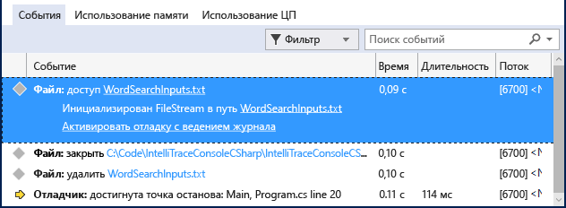

# <a name="view-events-with-intellitrace-in-visual-studio-enterprise-c-visual-basic"></a>Просмотр событий с помощью IntelliTrace в Visual Studio Enterprise (C#, Visual Basic)

IntelliTrace можно использовать для сбора сведений о конкретных событиях или категориях событий, а также об отдельных вызовах функций в дополнение к событиям. Процедура приведена ниже.

IntelliTrace можно использовать в выпуске Visual Studio Enterprise, но не в выпусках Professional или Community.

## <a name="GettingStarted"></a> Настройка IntelliTrace

Вы можете попробовать выполнить отладку только с помощью событий IntelliTrace. События IntelliTrace — это события отладчика, исключения, события .NET Framework и другие системные события. До начала отладки следует включить или отключить определенные события в зависимости от того, должно ли их записывать средство IntelliTrace. Дополнительные сведения см. в разделе [возможности IntelliTrace](../debugger/intellitrace-features.md).

- Включите событие IntelliTrace для доступа к файлам. Перейдите на страницу **Сервис > Параметры > IntelliTrace > События IntelliTrace** и разверните категорию **Файл**. Установите флажок напротив категории событий **Файл** . Будут проверены все события, связанные с файлами (доступ, закрытие, удаление).

## <a name="create-your-app"></a>Создание приложения

1. Создайте консольное приложение C#. В файле Program.cs добавьте следующую инструкцию `using` :

    ```csharp
    using System.IO;
    ```

2. Создайте <xref:System.IO.FileStream> в методе Main, выполните его считывание, закройте его и удалите файл. Добавьте еще одну строку, чтобы задать точку останова:

    ```csharp
    static void Main(string[] args)
    {
        FileStream fs = File.Create("WordSearchInputs.txt");
        fs.ReadByte();
        fs.Close();
        File.Delete("WordSearchInputs.txt");

        Console.WriteLine("done");
    }
    ```

3. Задайте точку останова в `Console.WriteLine("done");`

## <a name="start-debugging-and-view-intellitrace-events"></a>Начните отладку и просматривать события IntelliTrace

1. Запустите отладку обычным образом. (Нажмите клавишу **F5** или щелкните **Отладка > Начать отладку**.

    > [!TIP]
    > Не закрывайте окна **Локальные** и **Видимые** при отладке, чтобы просматривать и записывать отображаемые в них значения.

2. Выполнение прекратится в точке останова. Если вы не видите окно **Средства диагностики**, щелкните **Отладка > Windows > События IntelliTrace**.

    В окне **Средства диагностики** найдите вкладку **События** (должны появиться три вкладки: **События**, **Использование памяти**и **Использование ЦП**). На вкладке **События** показан хронологический список событий, заканчивающийся последним событием перед завершением выполнения отладчика. Должно иметься событие **Доступ к WordSearchInputs.txt**.

    Приведенный ниже снимок экрана сделан в Visual Studio 2015 с обновлением 1.

    

3. Выберите событие и просмотрите подробности о нем.

    Приведенный ниже снимок экрана сделан в Visual Studio 2015 с обновлением 1.

    

    Вы можете щелкнуть ссылку пути, чтобы открыть файл. Если полный путь недоступен, откроется диалоговое окно **Открыть файл** .

    Щелкните **Активировать отладку с ведением журнала**, чтобы задать в контексте отладчика время, когда было собрано указанное событие, после чего в окнах **Стек вызовов**, **Локальные** и других отобразятся данные журнала. Если исходный код доступен, Visual Studio перемещает указатель на соответствующий код в окне источника, чтобы вы могли его изучить.

    Приведенный ниже снимок экрана сделан в Visual Studio 2015 с обновлением 1.

    

4. Если ошибка не найдена, попробуйте изучить другие события, которые предположительно ее вызвали. Вы также можете просмотреть сведения о вызове записи IntelliTrace и выполнить вызовы функций по шагам.

## <a name="next-steps"></a>Следующие шаги

Можно использовать некоторые расширенные возможности IntelliTrace отладки с ведением журнала:

- Чтобы просмотреть моментальные снимки, см. в разделе [проверять предыдущих состояний приложения с помощью IntelliTrace](../debugger/view-historical-application-state.md)
- Узнайте, как проверять значения переменных и навигации по коду, см. в разделе [проверить свое приложение с помощью отладки с ведением журнала](../debugger/historical-debugging-inspect-app.md)
