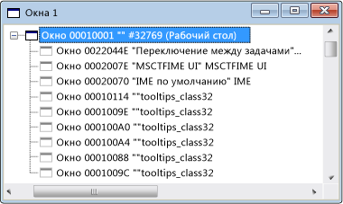

# Windows View
[!INCLUDE[vs2017banner](../code-quality/includes/vs2017banner.md)]

При первом запуске Spy\+\+ в представлении "Окна" отображаются все окна и элементы управления системы в виде дерева.  Показываются дескрипторы окон и имена классов.  Текущее окно рабочего стола располагается в верхней части дерева.  Все остальные окна являются дочерними элементами рабочего стола и перечисляются в соответствии со стандартной иерархией окон.  Дочерние окна отображаются в раскрывающихся списках под соответствующими родительскими окнами.  
  
 На рисунке ниже показано типичное представление окон программы Spy\+\+ с развернутым верхним узлом.  
  
   
Представление "Окна" в Spy\+\+  
  
 Текущее окно рабочего стола располагается в верхней части дерева.  Все остальные окна являются дочерними элементами рабочего стола и перечисляются в соответствии со стандартной иерархией окон, при этом дочерние элементы одного уровня организованы в соответствии с z\-порядком.  Любой родительский узел дерева можно развернуть и свернуть, щелкнув символ "\+" или "\-" рядом с узлом.  
  
 Если представление "Окна" оказывается в фокусе, можно воспользоваться инструментом поиска в [Диалоговое окно "Поиск окна"](../debugger/window-search-dialog-box.md) для просмотра сведений из любого открытого в системе окна.  
  
## Содержание  
 [How to: Use the Finder Tool](../Topic/How%20to:%20Use%20the%20Finder%20Tool.md)  
 Описание процедуры проверки окон на наличие свойств или сообщений с помощью этого инструмента.  
  
 [How to: Search for a Window in Windows View](../debugger/how-to-search-for-a-window-in-windows-view.md)  
 Описание поиска определенного окна в представлении окон.  
  
 [How to: Display Window Properties](../debugger/how-to-display-window-properties.md)  
 Инструкции по открытию диалогового окна "Свойства окна".  
  
## Связанные разделы  
 [Spy\+\+ Views](../debugger/spy-increment-views.md)  
 Описание представлений окон, сообщений, процессов и потоков в виде дерева в средстве Spy\+\+.  
  
 [Using Spy\+\+](../debugger/using-spy-increment.md)  
 Содержит краткое описание средства Spy\+\+ и инструкции по его использованию.  
  
 [Диалоговое окно "Поиск окна"](../debugger/find-window-dialog-box.md)  
 Используется для просмотра свойств или сообщений из указанного окна.  
  
 [Диалоговое окно "Поиск окна"](../debugger/window-search-dialog-box.md)  
 Используется для поиска узла заданного окна в представлении окон.  
  
 [Диалоговое окно "Свойства окна"](../debugger/window-properties-dialog-box.md)  
 Используется для отображения свойств окна, выбранного в представлении окон.  
  
 [Spy\+\+ Reference](../debugger/spy-increment-reference.md)  
 Включает разделы с описанием всех меню и диалоговых окон средства Spy\+\+.