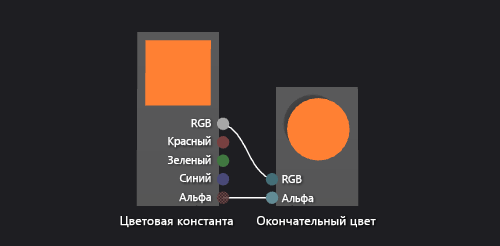

# Практическое руководство. Создание простейшего шейдера цвета
[!INCLUDE[vs2017banner](../code-quality/includes/vs2017banner.md)]

В этом документе показывается, как использовать конструктор шейдера и Язык шейдера направленного графа \(DGSL\) для создания шейдера безрастрового цвета.  Этот шейдер задает конечный цвет на постоянное значение цвета RGB.  
  
 Этот документ демонстрирует эти действия:  
  
-   Удаление узлов из графа  
  
-   Добавление узлов в граф  
  
-   Установка свойств узла  
  
-   Соединение узлов  
  
## Создание шейдера безрастровых цветов  
 Можно реализовать плоский шейдер цвета путем написания значение цвета цветовой константы RGB в окончательный вывод цвета.  
  
 Перед началом убедитесь, что отображаются окно **Свойства** и **Панель элементов**.  
  
#### Создание шейдера безрастровых цветов  
  
1.  Создайте построитель текстуры DGSL, с которым будете работать.  Дополнительные сведения о добавлении построителя текстуры DGSL в проект см. в подразделе "Начало работы" раздела [Конструктор шейдеров](../designers/shader-designer.md).  
  
2.  Удалите узел **Цвет точки**.  Используйте средство **Выбрать** чтобы выбрать узел **Цвет точки**, а затем в строке меню выберите **Изменить**, **Удалить**.  
  
3.  Добавление узла **константа цвета** к диаграмме.  В разделе **Панель элементов** в области **Константы** выберите **Константа цвета** и переместите ее на поверхность разработки.  
  
4.  Укажите значение цвета для узла **Константа цвета**.  Используйте средство **Выбрать** чтобы выбрать узел **Константа цвета**, а затем в окне **Свойства**, в свойстве **Output** \(вывод\), укажите значение цвета.  Для оранжевого укажите значение \(1.0, 0.5, 0.2, 1.0\).  
  
5.  Присоедините константу цвета к окончательному цвету.  Чтобы создать подключения, Переместите терминал **RGB** узла **Константа цвета** к терминалу **RGB** узла **Окончательный цвет**, а затем переместите терминал **Альфа** узла **Константа цвета** к терминалу **Альфа** узла **Окончательный цвет**.  Эти соединения задают конечный цвет константе цвета, указанной на предыдущем шаге.  
  
 На следующей иллюстрации показан готовый граф шейдеров и предварительный просмотр шейдера, применяемого к кубу.  
  
> [!NOTE]
>  На этом рисунке задан оранжевый цвет, чтобы лучше было видно эффект шейдера.  
  
   
  
 Некоторые фигуры могут предоставить лучший предварительный просмотр для некоторых шейдеров.  Дополнительные сведения о способах предварительного просмотра шейдеров в конструкторе шейдеров см. в разделе [Конструктор шейдеров](../designers/shader-designer.md).  
  
## См. также  
 [Практическое руководство. Применение шейдера к трехмерной модели](../designers/how-to-apply-a-shader-to-a-3-d-model.md)   
 [Практическое руководство. Экспорт шейдера](../designers/how-to-export-a-shader.md)   
 [Конструктор шейдеров](../designers/shader-designer.md)   
 [Узлы конструктора шейдеров](../designers/shader-designer-nodes.md)