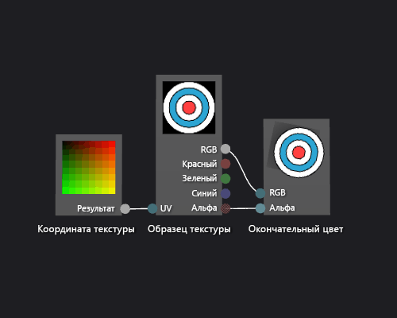

# Практическое руководство. Создание простейшего шейдера текстуры
В этом документе показано, как использовать конструктор шейдеров и язык шейдеров ориентированных графов (Directed Graph Shader Language — DGSL) для создания шейдера с одной текстурой. Этот шейдер задает окончательный цвет непосредственно в RGB-значениях и альфа-факторах, взятых из текстуры.  
  
 В этом документе описаны следующие действия.  
  
-   Удаление узлов из графа шейдеров  
  
-   Добавление узлов в граф  
  
-   Задание параметров шейдера  
  
-   Задание видимости параметра  
  
-   Соединение узлов  
  
## Создание простейшего шейдера текстуры  
 Вы можете создать простейший шейдер из одной текстуры, записав значения цветов и альфа-факторы образца текстуры прям в окончательный цвет вывода.  
  
 Перед началом убедитесь, что отображаются окно **Свойства** и **Панель элементов**.  
  
#### Создание простейшего шейдера текстуры  
  
1.  Создайте построитель текстуры DGSL, с которым будете работать. Дополнительные сведения о добавлении шейдера DGSL в проект см. в подразделе "Начало работы" раздела [Конструктор шейдеров](../designers/shader-designer.md).  
  
2.  Удалите узел **Цвет точки**. В режиме **Выбрать** выберите узел **Цвет точки** и в строке меню выберите **Изменить**, **Удалить**. Таким образом освобождается место для узла, который добавляется на следующем шаге.  
  
3.  Добавьте узел **Образец текстуры** в граф. В окне **Панель элементов** в разделе **Текстура** выберите **Образец текстуры** и переместите этот элемент в область конструктора.  
  
4.  Добавьте узел **Координата текстуры** в граф. В окне **Панель элементов** в разделе **Текстура** выберите **Координата текстуры** и переместите этот элемент в область конструктора.  
  
5.  Выберите текстуру, которую требуется применить. В режиме **Выбрать** выберите узел **Образец текстуры** и в окне **Свойства** укажите текстуру, которую требуется использовать, с помощью свойства **Имя файла**.  
  
6.  Сделайте текстуру общедоступной. Выберите узел **Образец текстуры**, а затем в окне **Свойства** задайте для свойства **Доступ** значение **Общедоступный**. Теперь можно задать текстуру из другого средства, такого как **Редактор моделей**.  
  
7.  Соедините координаты текстуры с образцом текстуры. В режиме **Выбрать** переместите терминал **Вывод** узла **Координата текстуры** к терминалу **UV** узла **Образец текстуры**. Это соединение обеспечивает выборку текстуры по указанным координатам.  
  
8.  Соедините образец текстуры с окончательным цветом. Переместите терминал **RGB** узла **Образец текстуры** к терминалу **RGB** узла **Окончательный цвет**, а затем переместите терминал **Альфа** узла **Образец текстуры** к терминалу **Альфа** узла **Окончательный цвет**.  
  
 Ниже показан готовый граф шейдера и предварительный просмотр шейдера, примененного к кубу.  
  
> [!NOTE]
>  На этом рисунке в качестве фигуры для предварительного просмотра используется плоскость, и задана текстура, чтобы лучше продемонстрировать эффект шейдера.  
  
   
  
 Некоторые фигуры могут лучше подходить для предварительного просмотра некоторых шейдеров. Дополнительные сведения о том, как предварительно просматривать шейдеры в конструкторе шейдеров, см. в разделе [Конструктор шейдеров](../designers/shader-designer.md).  
  
## См. также  
 [Практическое руководство. Применение шейдера к трехмерной модели](../designers/how-to-apply-a-shader-to-a-3-d-model.md)   
 [Редактор изображений](../designers/image-editor.md)   
 [Конструктор шейдеров](../designers/shader-designer.md)   
 [Узлы конструктора шейдеров](../designers/shader-designer-nodes.md)