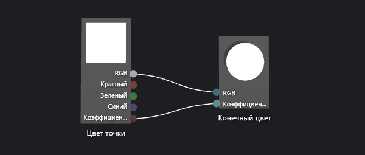
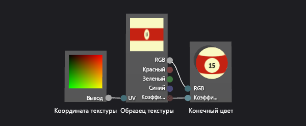
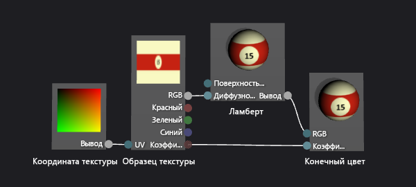
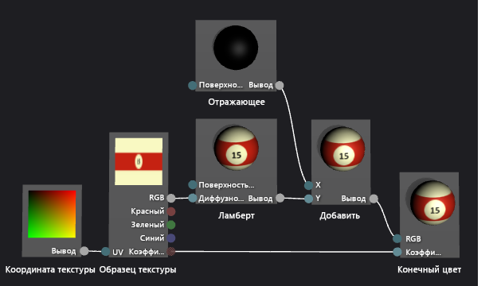
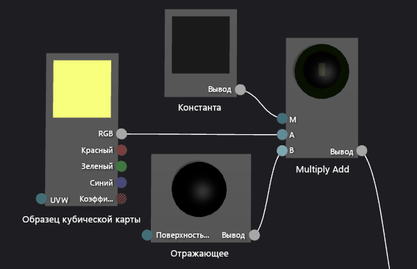
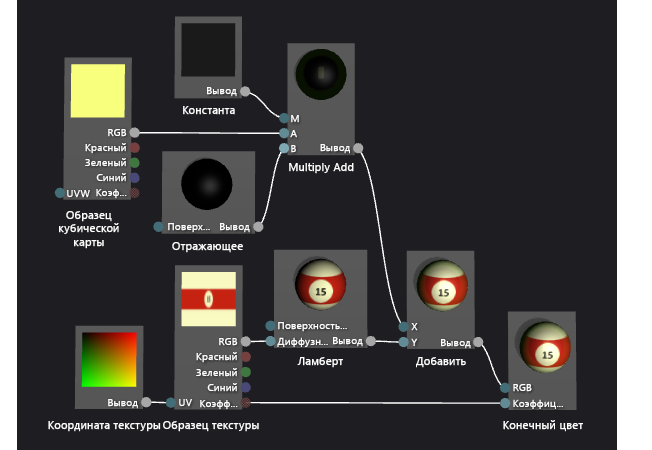

# Пошаговое руководство. Создание реалистичного трехмерного бильярдного шара
[!INCLUDE[vs2017banner](../code-quality/includes/vs2017banner.md)]

В этом пошаговом руководстве демонстрируется создание реалистичного трехмерного биллиардного шара с помощью конструктора шейдеров и редактора изображений в [!INCLUDE[vsprvs](../code-quality/includes/vsprvs_md.md)].  Объемный внешний вид бильярдного шара достигается путем сочетания нескольких шейдерных методик с соответствующими текстурными ресурсами.  
  
 Этот документ демонстрирует эти действия:  
  
-   Создание основного внешнего вида бильярдного шара с помощью фигуры и текстуры.  
  
-   Добавление глубины с помощью модели освещения Ламбера.  
  
-   Улучшение основного вида с помощью зеркального отражения.  
  
-   Создание чувства пространства путем отражения среды.  
  
## Обязательные компоненты  
 Для выполнения инструкций данного пошагового руководства необходимы следующие компоненты и навыки:  
  
-   Средство сбора текстур в кубические карты, например средство текстуры DirectX, которое включается в DirectX SDK за июнь 2010 г.  
  
-   Навыки работы с редактором изображений в [!INCLUDE[vsprvs](../code-quality/includes/vsprvs_md.md)].  
  
-   Навыки работы с конструктором шейдеров в [!INCLUDE[vsprvs](../code-quality/includes/vsprvs_md.md)].  
  
## Создание основного внешнего вида с помощью фигуры и текстуры  
 В компьютерной графике самыми базовыми элементами внешнего вида являются форма и цвет.  В компьютерном моделировании трехмерная модель очень часто используется для представления формы объекта из реального мира.  Затем сведения о цвете применяются к поверхности модели с использованием текстурной карты.  
  
 Как правило, может быть нужно попросить художника создать трехмерную модель, которую можно использовать, но, так как шар для биллиарда — распространенная форма \(сфера\), конструктор шейдеров уже имеет подходящую встроенную модель.  
  
 Сфера — фигура предварительного просмотра по умолчанию в конструкторе шейдера; если в настоящий момент используется другой фигура для предварительного просмотра шейдера, вернитесь к сфере.  
  
#### Предварительный просмотр шейдера с помощью сферы  
  
-   На панели инструментов конструктора шейдера выберите **Просмотр на сфере**.  
  
 На следующем этапе создается программа шейдера, применяющая текстуру к модели, но сначала нужно создать текстуру, которую можно использовать.  В этом пошаговом руководстве демонстрируется создание текстуры с помощью редактора изображений, который является частью [!INCLUDE[vsprvs](../code-quality/includes/vsprvs_md.md)], но можно использовать любой редактор изображений, который может сохранять текстуру в подходящем формате.  
  
 Убедитесь, что отображаются окно **Свойства** и **Панель элементов**.  
  
#### Создание текстура шара для биллиарда с помощью редактора изображений  
  
1.  Создайте текстуру, с которой вы будете работать.  Сведения о добавлении в проект текстуры см. в подразделе "Начало работы" раздела [редактор изображений](../designers/image-editor.md).  
  
2.  Измените размер изображения так, чтобы его ширина была в два раза больше высоты; это необходимо из\-за того, как текстура проецируется на сферическую поверхность бильярдного шара.  Чтобы изменить размер изображения, в окне **Свойства**, задайте новые значения для свойств **Ширина** и **Высота**.  Установим ширину равной 512, а высоту — 256.  
  
3.  Нарисуйте текстуру для бильярдного шара, помня о том, как текстура накладывается на сферу.  
  
     Текстура должна выглядеть следующим образом.  
  
       
  
4.  При необходимости можно снизить потребности в памяти для этой текстуры.  Можно сделать это путем сокращения ширины текстуры, чтобы она совпала с высотой.  Это сжимает текстуру по ее ширине, но в связи с тем, как текстура сопоставляется на сферу, она будет развернута, когда мячик биллиарда отрисовывается.  После изменения размера текстура должна выглядеть следующим образом:  
  
       
  
 Теперь можно создать шейдер, который применяет эту текстуру к модели.  
  
#### Создание базового шейдера текстуры  
  
1.  Создайте построитель текстуры DGSL, с которым будете работать.  Дополнительные сведения о добавлении построителя текстуры DGSL в проект см. в подразделе "Начало работы" раздела [Конструктор шейдеров](../designers/shader-designer.md).  
  
     По умолчанию диаграмма шейдера выглядит следующим образом:  
  
       
  
2.  Измените шейдер по умолчанию таким образом, чтобы он применял к текущему пикселю значение образца текстуры.  Граф шейдера должен выглядеть следующим образом:  
  
       
  
3.  Примените текстуру, созданную в предыдущей процедуре, настроив свойства текстуры.  Задайте значение свойства **Текстура** узла **Образец текстуры** равным **Texture1**, а затем укажите файл текстуры с помощью свойства **Имя файла** группы свойств **Texture1** в том же окне свойств.  
  
 Дополнительные сведения о способах применения текстуры в шейдере см. в разделе [Практическое руководство. Создание простейшего шейдера текстуры](../designers/how-to-create-a-basic-texture-shader.md).  
  
 Теперь биллиардный шар должен выглядеть примерно следующим образом.  
  
   
  
## Создание глубины с помощью модели освещения Ламберта  
 Пока что вы создали вполне узнаваемый бильярдный шар.  Однако он отображается плоским и неинтересным, больше похожим на мультипликационное изображение бильярдного шара, чем на убедительную точную копию.  Плоское представление получается из\-за примитивного шейдера, который ведет себя так, как будто каждый пиксель на поверхности бильярдного шара получает одинаковое количество освещения.  
  
 В реальной жизни свет самый яркий на поверхностях, напрямую обращенных к источнику света, и менее яркий на поверхностях, расположенных под углом к источнику света  Это происходит потому, что энергия в световых лучах распределяется по наименьшей площади поверхности, когда поверхность обращена непосредственно к источнику света.  По мере того как рабочая область отворачивается от источника света, то же самое количество энергии распределяется по все большей области поверхности.  Область, обращенная в другую сторону от источника света, не получает световую энергию, поэтому она полностью темная.  Эта вариативность в яркости по поверхности объекта — важная визуальная подсказка, которая помогает указать форму объекта; без этого объект кажется плоским.  
  
 В компьютерной графике *модели освещения* — это упрощенные, примерные представления сложных световых взаимодействий в реальном мире, используемые для репликации внешнего вида осветительных систем из реального мира.  Модель освещения Ламбера варьирует количество диффузно отраженного света по поверхности объекта, как описано в предыдущем абзаце.  Можно добавлять модели освещения Ламберта к шейдеру для создания шарику биллиарда более достоверный объемный внешний вид.  
  
#### Чтобы Добавить освещение по Ламберту в шейдер  
  
-   Измените свой шейдер для модуляции значения образцы текстуры значением освещения Ламбера.  Граф шейдера должен выглядеть следующим образом:  
  
       
  
-   При необходимости можно отрегулировать поведение освещения, настроив свойство **MaterialDiffuse** графа шейдеров.  Для получения доступа к свойствам графа текстуры выберите пустую область в области конструктора, а затем найдите свойство, которое требуется получить, в окне **Свойства**.  
  
 Дополнительные сведения о способах освещения Ламберта в шейдере см. в разделе [Практическое руководство. Создание простейшего шейдера освещения с использованием модели Ламберта](../designers/how-to-create-a-basic-lambert-shader.md).  
  
 Если применяется освещение по Ламберту, шар для биллиарда должен выглядеть следующим образом:  
  
   
  
## Улучшение основного вида с помощью зеркального отражения  
 Модель освещения Ламбера обеспечивает ощущение формы и измерения, которая отсутствовала в шейдере, использующем только текстуру.  Однако внешний вид бильярдного шара все еще несколько тускловат.  
  
 Реальный бильярдный шар имеет блестящую поверхность, которая отражает часть света, падающего на него.  Некоторая часть из этого отраженного света приводит к появлению зеркальных отражений, которые имитируют отражающие свойства поверхности.  В зависимости от свойств завершения основные особенности могут быть локализованы или использованы широко, а также интенсивными или малозаметными.  Эти отражающие отражения моделируются с помощью связей между источником света, ориентацией рабочей области и положением камеры, то есть подсветка сильнее всего, когда ориентация поверхности отражает источник света непосредственно в камеру и менее интенсивна, если отражение менее напрямую.  
  
 Модель освещения Фонга строится на модели освещения Ламбера и включает зеркальные отражения, как описано в предыдущем абзаце.  Можно добавлять модели освещения Фонга в шейдеру для придания шарику биллиарда имитированной отделки для более интересного вида.  
  
#### Чтобы Отражающие подсветки в шейдер  
  
1.  Измените свой шейдер, чтобы включить вклад отражения с помощью аддитивного смешения.  Граф шейдера должен выглядеть следующим образом:  
  
       
  
2.  При необходимости можно отрегулировать поведение зеркального отражения, настроив свойства отражения \(**MaterialSpecular** и **MaterialSpecularPower**\) графа шейдеров.  Для получения доступа к свойствам графа текстуры выберите пустую область в области конструктора, а затем в окне **Свойства** найдите свойство, которое требуется получить.  
  
 Дополнительные сведения о способах применения зеркального отражения в шейдере см. в разделе [Практическое руководство. Создание простейшего шейдера освещения по методу Фонга](../designers/how-to-create-a-basic-phong-shader.md).  
  
 Если применяется отражающая подсветка, шар для биллиарда должен выглядеть следующим образом:  
  
   
  
## Создание чувства пространства путем отражения среды  
 Когда применяется отражающая подсветка, биллиардный шар выглядит довольно убедительно.  Он имеет правильную форму, правильное задание окраски и правильную отделку.  Однако существует еще один метод, который заставит бильярдный шар выглядеть более правдоподобно как часть его среды.  
  
 При близком изучении настоящего бильярдного шара можно заметить, что его блестящая поверхность не просто отбрасывает блики, но и слабо отражает мир вокруг него.  Можно имитировать это отражение, используя изображение среды как текстуру и объединяя его с собственной текстурой модели, чтобы задать конечный цвет каждого пикселя.  В зависимости от требуемого типа завершения можно сочетать большую или меньшую часть текстуры отражения с остальной частью шейдера.  Например, шейдер, который моделирует поверхность с сильным отражением, такую как зеркало, может использовать только текстуру отражения, но шейдер, который моделирует менее четкое отражение, такой как находящийся на бильярдном шаре, может сочетать лишь небольшую часть значения текстуры отражения вместе с остальными вычислениями шейдера.  
  
 Конечно, отраженное изображение нельзя просто применить к модели так же, как вы применяете карту текстур модели.  Если это было сделано, отражение мира должно переместиться с бильярдным шаром, как будто оно к нему приклеено.  Поскольку отражение может исходить из любого направления, необходим способ указать значение сопоставления отражения для любого угла и способ сохранения ориентации сопоставления отражения в соответствии с миром.  Для удовлетворений этих требований можно воспользоваться особым типом сопоставления текстуры, который называется *сопоставлением куба*, который обеспечивает шесть текстур, упорядоченных таким образом, что они сформируют стороны куба.  Изнутри этого куба можно указывать в любом направлении для обнаружения значения текстуры.  Если текстуры на каждой стороне куба содержат изображения среды, можно моделировать любое отражение путем взятия образца с необходимой точки на поверхности куба.  Сохраняя куб выровненным относительно мировых координат, можно получить точное отражение среды.  Для указания того, где следует брать пробу куба, просто рассчитайте отражение вектора камеры от поверхности объекта, а затем используйте его как координаты трехмерной текстуры.  Использование сопоставлений куба таким образом — обычный метод, известный как *сопоставление среды*.  
  
 Сопоставление среды обеспечивает эффективное приближение реальных отражений, как это описано в предыдущих абзацах.  Можно объединить отражения окружения в шейдер для придания шарику биллиарда сымитированную отделку, что сделает мячик биллиарда лучше вписанным в сцену.  
  
 На первом этапе создается текстура сопоставления куба.  Во многих типах приложений содержимое карты кубов не обязательно должно быть идеальным, чтобы быть эффективным, особенно если отражение является опосредованным или не занимает видного места на экране.  Например, многие игры используют предварительно рассчитанные кубические карты для сопоставления среды и используют лишь одну, ближайшую к отражающему объекту, хотя это означает, что это отражение неверно.  Даже грубое приближение часто достаточно для оказания убедительного эффекта.  
  
#### Создание текстур для сопоставления среды с помощью редактора изображений  
  
1.  Создайте текстуру, с которой вы будете работать.  Сведения о добавлении в проект текстуры см. в подразделе "Начало работы" раздела [редактор изображений](../designers/image-editor.md).  
  
2.  Задайте размер изображения, чтобы ширина была равна высоте и по размеру была равна степени 2; это необходимо из\-за способа индексации карты кубов.  Чтобы изменить размер изображения, в окне **Свойства**, задайте новые значения для свойств **Ширина** и **Высота**.  Например, значения свойств **Ширина** и **Высота** заданы равными 256.  
  
3.  Используйте сплошной цвет для заполнения текстуры.  Эта текстура будет низом сопоставления куба, который соответствует поверхности стола для биллиарда.  Запомните использованный цвет для следующей текстуры.  
  
4.  Создайте вторую текстуру того же размера, что и первая.  Эта текстура будет повторена на 4 сторонах сопоставления куба, которые соответствуют поверхности и сторонам стола для биллиарда, и области вокруг стола для биллиарда.  Нарисуйте поверхность биллиардного стола с помощью этой текстуры, используя тот же цвет, что и в нижней текстуре.  Текстура должна выглядеть следующим образом.  
  
       
  
     Помните, что карта отражения не обязательно должна быть фотореалистичной, чтобы быть эффективной: например, кубическая карта, используемая для создания изображений в этой статье содержит только четыре кармана, а не шесть.  
  
5.  Создайте третью текстуру того же размера, что и первые две.  Эта текстура будет верхом сопоставления куба, который соответствует потолку над столом для биллиарда.  Чтобы сделать эту часть отражения более интересной, можно нарисовать верхний свет, чтобы усилить отражающую подсветку, добавленную в шейдер в предыдущей процедуре.  Текстура должна выглядеть следующим образом.  
  
       
  
 Теперь, когда вы создали отдельные текстуры для сторон кубической карты, с помощью специального средства их можно собрать в кубическую карту, которую можно будет хранить в одной DDS\-текстуре.  Можно использовать любую программу по желанию, чтобы создать сопоставление куба, если она может сохранять сопоставление куба в формате текстуры .dds.  В этом пошаговом руководстве демонстрируется создание текстуры с помощью средства текстуры DirectX, входящего в SDK DirectX от июня 2010.  
  
#### Чтобы Собрать сопоставление куба с помощью средства текстуры DirectX  
  
1.  В средстве работы с текстурой DirectX в главном меню выберите **Файл**, **Создать текстуру**.  Откроется диалоговое окно **Новая текстура**.  
  
2.  В группе **Тип текстуры** выберите текстуру **Кубическая карта**.  
  
3.  В группе **Размеры** введите нужное значение в полях **Ширина** и **Высота**, а затем нажмите кнопку **ОК**.  Отобразится новый документ текстуры.  По умолчанию текстура, которая сначала отображается в документе текстуры, соответствует грани куба **Положительный X**.  
  
4.  Загрузите текстуру, созданную для верхней части куба текстуры для поверхности куба.  В главном меню выберите **Файл**, **Открыть на эту поверхность кубической карты**, выберите текстуру, созданную для стороны куба, а затем выберите **Открыть**.  
  
5.  Повторите шаг 4 для сторон куба **Отрицательная X**, **Положительная Z** и **Отрицательная Z**.  Для этого необходимо посмотреть сторону, которую нужно загрузить.  Чтобы просмотреть другую сторону сопоставления куба, на главном меню выберите **Вид**, **Сторона сопоставления куба**, а затем выберите сторону, который необходимо просмотреть.  
  
6.  Для грани куба **Положительный Y** загрузите текстуру, созданную для верхней части куба текстуры.  
  
7.  Для грани куба **Отрицательный Y** загрузите текстуру, созданную для нижней части куба текстуры.  
  
8.  Сохраните текстуру.  
  
 Представить себе структуру из кубической карты можно следующим образом:  
  
   
  
 Изображение сверху — это сторона куба, соответствующая положительной полуоси Y \(\+Y\); посередине, слева направо — стороны –X, \+Z, \+X и –Z; внизу — сторона куба –Y.  
  
 Теперь можно изменить шейдер для вмешивания образца кубической карты в остальную часть шейдера.  
  
#### Чтобы Добавить сопоставление среды в шейдер  
  
1.  Измените свой шейдер, чтобы включить вклад сопоставления среды с помощью аддитивного смешения.  Граф шейдера должен выглядеть следующим образом:  
  
       
  
     Обратите внимание, что можно использовать узел **Multiply Add** для упрощения графа шейдеров.  
  
     Ниже приводится более подробное представление узлов построителя текстуры, которые реализуют сопоставление среды.  
  
       
  
2.  Примените текстуру, созданную в предыдущей процедуре, настроив свойства текстуры сопоставления куба.  Задайте значение свойства **Текстура** узла **Образец кубической карты** равным **Texture2**, а затем укажите файл текстуры с помощью свойства **Имя файла** группы свойств **Texture2**.  
  
3.  При необходимости можно отрегулировать отражательную способность бильярдного шара, настроив свойство **Вывод** узла **Константа**.  Чтобы получить свойства узла, выделите его и затем в окне **Свойства** найдите свойство, которое требуется получить.  
  
 Если применяется сопоставление среды, шар для биллиарда должен выглядеть следующим образом:  
  
   
  
 На этом последнем рисунке обратите внимание, как добавленные эффекты все вместе позволяют создать выглядящий очень реалистично бильярдный шар.  Форма, текстура и освещение создают основной внешний вид трехмерного объекта, а отражающие яркие зоны и отражения делают биллиардный шар более интересным и уместным в своем окружении.  
  
## См. также  
 [Практическое руководство. Экспорт шейдера](../designers/how-to-export-a-shader.md)   
 [Практическое руководство. Применение шейдера к трехмерной модели](../designers/how-to-apply-a-shader-to-a-3-d-model.md)   
 [Конструктор шейдеров](../designers/shader-designer.md)   
 [редактор изображений](../designers/image-editor.md)   
 [Узлы конструктора шейдеров](../designers/shader-designer-nodes.md)