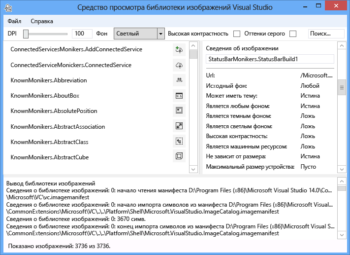
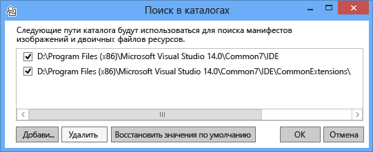
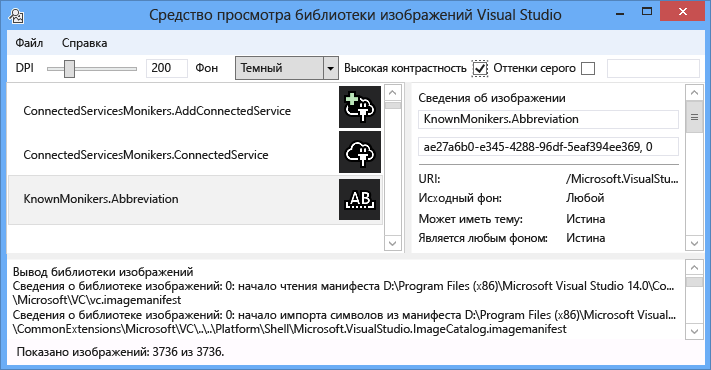
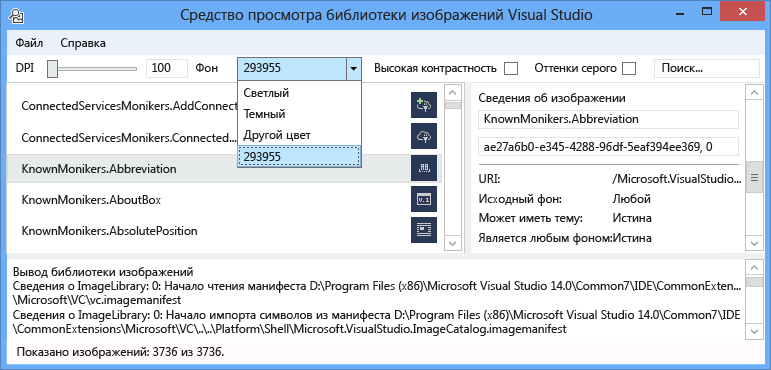
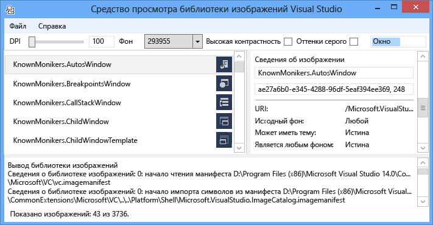

# Средство просмотра изображений библиотеки
[!INCLUDE[vs2017banner](../../code-quality/includes/vs2017banner.md)]

Средство просмотра библиотеки изображений Visual Studio можно загрузить и поиска манифесты изображения, позволяя пользователю работать с ними так же, что и Visual Studio. Пользователь может изменить фон, размеры, точек на ДЮЙМ, высокая контрастность и другие параметры. Средство также отображает сведения о загрузки для каждого образа манифеста и отображает сведения об источнике для каждого изображения в манифесте изображения. Это средство полезно для:  
  
1.  Диагностика ошибок  
  
2.  Обеспечение атрибуты настроены правильно, в манифестах пользовательского образа  
  
3.  Поиск изображения в каталоге изображений Visual Studio, чтобы расширение Visual Studio можно использовать образы, стилю Visual Studio  
  
   
  
 **Специальное имя изображения**  
  
 Моникер изображения (или моникера для краткости) является парой GUID:ID, однозначно определяющий ресурс изображения или изображения список активов в библиотеке изображений.  
  
 **Файлы манифеста изображений**  
  
 Файлы манифеста (.imagemanifest) изображений, XML-файлы, которые определяют набор графических ресурсов, специальные имена, представляющие эти ресурсы и реального изображения или изображения, представляющие каждого ресурса. Манифесты изображения можно определить автономных образов или списки изображений для поддержки устаревшего кода пользовательского интерфейса. Кроме того существуют атрибуты, которые могут быть установлены на ресурс или на отдельных изображений за каждый актив Чтобы изменить условия и способ отображения этих ресурсов.  
  
 **Схема манифеста изображения**  
  
 Полный образ манифест выглядит следующим образом:  
  
```xml  
<ImageManifest>  
      <!-- zero or one Symbols elements -->  
      <Symbols>  
        <!-- zero or more Guid, ID, or String elements -->  
      </Symbols>  
      <!-- zero or one Images elements -->  
      <Images>  
        <!-- zero or more Image elements -->  
      </Images>  
      <!-- zero or one ImageLists elements -->  
      <ImageLists>  
        <!-- zero or more ImageList elements -->  
      </ImageLists>  
</ImageManifest>  
```  
  
 **Символы**  
  
 Как помочь читаемость и обслуживания, манифест изображения можно использовать символы для значений атрибутов. Символы, которые определены следующим образом:  
  
```xml  
<Symbols>  
      <Import Manifest="manifest" />  
      <Guid Name="ShellCommandGuid" Value="8ee4f65d-bab4-4cde-b8e7-ac412abbda8a" />  
      <ID Name="cmdidSaveAll" Value="1000" />  
      <String Name="AssemblyName" Value="Microsoft.VisualStudio.Shell.UI.Internal" />  
</Symbols>  
```  
  
|||  
|-|-|  
|**Дочерний элемент**|**Определение**|  
|Импорт|Импорт символов из заданного файла манифеста для использования в текущий манифест.|  
|Guid|Символ представляет собой идентификатор GUID и должно соответствовать формат GUID.|  
|Идентификатор|Символ представляет идентификатор и должно быть неотрицательным целым числом.|  
|Строка|Символ представляет произвольное строковое значение.|  
  
 Символы учитывается регистр, на который ссылаются, используя синтаксис $(symbol-name):  
  
```xml  
<Image Guid="$(ShellCommandGuid)" ID="$(cmdidSaveAll)" >  
      <Source Uri="/$(AssemblyName);Component/Resources/image.xaml" />  
</Image>  
```  
  
 Некоторые символы являются стандартными для всех манифестов. Они могут использоваться в Uri атрибут \< источника> или \< Import> элемент пути для ссылок на локальном компьютере.  
  
|||  
|-|-|  
|**Символ**|**Описание**|  
|CommonProgramFiles|Значение переменной среды % CommonProgramFiles %|  
|LocalAppData|Значение переменной среды % LocalAppData %|  
|ManifestFolder|Папка, содержащая файл манифеста|  
|Мои документы|Полный путь папки "Мои документы" текущего пользователя|  
|ProgramFiles|Значение переменной среды % ProgramFiles %|  
|System|В папку Windows\System32|  
|WinDir|Значение переменной среды % WinDir %|  
  
 **Изображение**  
  
 \< Изображение> элемент определяет образ, который может ссылаться моникера. GUID и идентификатор, в совокупности формируют моникер изображения. Моникер для изображения должно быть уникальным для всего изображения библиотеки. Если более одного изображения данного моникера, возникла при построении библиотеки первый из них — тот, который сохраняется.  
  
 Он должен содержать хотя бы один источник. Зависящий от размера источников даст наилучший результат широкого ряда размеры, но они не требуются. Если служба получает запрос на изображение размером не определены в \< изображение> элемента и не указан источник зависящий от размера, служба будет выбрать лучший источник определенного размера и масштабировать его до необходимого размера.  
  
```xml  
<Image Guid="guid" ID="int" AllowColorInversion="true/false">  
      <Source ... />  
      <!-- optional additional Source elements -->  
</Image>  
```  
  
|||  
|-|-|  
|**Атрибут**|**Определение**|  
|Guid|[Required] GUID для специального имени образа|  
|Идентификатор|[Required] Идентификатор часть моникер изображения|  
|AllowColorInversion|[Необязательно, по умолчанию true] Указывает, имеют ли изображение его цвета программно инвертированного использование темного фона.|  
  
 **Источник**  
  
 \< Источник> элемент определяет один исходный ресурс изображения (XAML и PNG).  
  
```xml  
<Source Uri="uri" Background="background">  
      <!-- optional NativeResource element -->  
 </Source>  
```  
  
|||  
|-|-|  
|**Атрибут**|**Определение**|  
|URI|[Required] URI, который определяет, где можно загрузить изображение из. Это может быть одно из следующих:<br /><br /> -A [пакет URI](http://msdn.microsoft.com/en-US/library/aa970069\(v=vs.100\).aspx) с помощью приложения: / / / центр<br /><br /> -Ссылки на ресурс абсолютный компоненты<br /><br /> — Путь к файлу, содержащему машинный ресурс|  
|Фон|[Необязательно] Указывает, что для типа источника планируется использовать фоновый рисунок.<br /><br /> Это может быть одно из следующих:<br /><br /> - *Индикатор*: источник можно использовать на светло-фон.<br /><br /> - *Темный*: источник можно использовать на темного фона.<br /><br /> - *Высокая контрастность*: источник можно использовать на любой фона в режиме высокой контрастности.<br /><br /> - *HighContrastLight*: источник можно использовать на светло-фон в режиме высокой контрастности.<br /><br /> -*HighContrastDark*: источник можно использовать на темного фона в режиме высокой контрастности.<br /><br /> Если **Фон** атрибут указан, источник можно использовать на любой фона.<br /><br /> Если **фона** — *свет*, *темной*, *HighContrastLight*, или *HighContrastDark*, никогда не инвертированы исходного цвета. Если **Фон** опущен или установлен *Высокая контрастность*, управляет инверсия цветов исходного изображения **AllowColorInversion** атрибута.|  
  
 Объект \< источника> элемент может иметь только один из следующих подэлементов необязательно:  
  
||||  
|-|-|-|  
|**Элемент**|**Атрибуты (все обязательные)**|**Определение**|  
|\< размер>|Значение|Источник будет использоваться для изображений определенного размера (в единицах устройства). Изображение будет квадрата.|  
|\< SizeRange>|MinSize MaxSize|Будет использоваться источник для образов из MinSize MaxSize (в единицах устройства) включительно. Изображение будет квадрата.|  
|\< измерений>|Ширина, высота|Источник будет использоваться для образов заданную ширину и высоту (в единицах устройства).|  
|\< DimensionRange>|MinWidth MinHeight,<br /><br /> MaxWidth MaxHeight|Будет использоваться источник для образов из минимальную ширину и высоту в максимальной ширины или высоты (в единицах устройства) включительно.|  
  
 Объект \< источника> элемент может иметь необязательное \< NativeResource> дочерний элемент, который определяет \< источника> загруженный из сборки в машинном коде, а не управляемую сборку.  
  
```xml  
<NativeResource Type="type" ID="int" />  
```  
  
|||  
|-|-|  
|**Атрибут**|**Определение**|  
|Тип|[Required] Тип машинный ресурс, XAML или PNG|  
|Идентификатор|[Required] Идентификатор целой части машинный ресурс|  
  
 **ImageList**  
  
 \< ImageList> элемент определяет коллекцию изображений, которые могут быть возвращены в одной области. Лента строится по требованию, при необходимости.  
  
```xml  
<ImageList>  
      <ContainedImage Guid="guid" ID="int" External="true/false" />  
      <!-- optional additional ContainedImage elements -->  
 </ImageList>  
```  
  
|||  
|-|-|  
|**Атрибут**|**Определение**|  
|Guid|[Required] GUID для специального имени образа|  
|Идентификатор|[Required] Идентификатор часть моникер изображения|  
|Внешнее|[Необязательно, по умолчанию-false] Указывает ли изображение моникер ссылается на изображение в текущий манифест.|  
  
 Моникер для изображения, содержащегося не должно ссылаться на определенные в манифесте текущего изображения. Если не удается найти изображения, содержащиеся в библиотеке изображений, пустой замещающее изображение будет использоваться на его месте.  
  
## <a name="how-to-use-the-tool"></a>Как использовать средство  
 **Проверка манифеста пользовательского образа**  
  
 Чтобы создать пользовательский манифест, рекомендуется использовать средство ManifestFromResources, чтобы автоматически создать манифест. Чтобы проверить пользовательский манифест, запустите средство просмотра изображений библиотеки и выберите Файл > задать пути... Чтобы открыть диалоговое окно поиска каталогов. Каталоги поиска будет использовать инструмент для загрузки образа манифестов, но он будет также использовать их, чтобы найти DLL-файлы, содержащие изображения в манифесте, поэтому убедитесь, что включают каталоги DLL и манифест в этом диалоговом окне.  
  
   
  
 Щелкните **Добавить...** для выбора новых папок поиска для поиска манифесты и их соответствующие библиотеки DLL. Средство будет помнить эти каталоги для поиска, и их можно включить или отключить, установив или сняв каталог.  
  
 По умолчанию средство будет пытаться найти каталог установки Visual Studio и добавьте их в список каталогов для поиска. Каталоги, в которых не удается найти средство можно добавить вручную.  
  
 После загрузки все манифесты средство можно использовать для переключения **Фон** цветов, **DPI**, **высокой контрастности**, или **полутоновые изображения** изображений, чтобы пользователей можно визуально проверить графических ресурсов, чтобы проверить отображаются правильно для различных параметров.  
  
   
  
 Цвет фона можно задать для освещения, темный или пользовательское значение. Выбрав «Пользовательский цвет» откройте диалоговое окно выбора цвета и добавьте пользовательские цвета фона списком легко отзыва позже.  
  
   
  
 При выборе моникер изображения отображаются сведения для каждого изображения реальных за моникера, в области сведений изображение справа. Области также позволяет пользователям копировать моникера по имени или по значению raw GUID:ID.  
  
   
  
 Сведения, отображаемые для каждого источника изображения можно применять различные темы, включает какого рода фон, чтобы отобразить его, или поддерживает высокой контрастности, какие размеры, он является действительным для ли это зависящий от размера и ли изображение поступает из собственной сборки.  
  
   
  
 При проверке файла манифеста изображения, рекомендуется развернуть манифест и образа библиотеки DLL на свои места реального мира. Это будет проверить работоспособность все относительные пути, и что библиотека изображений для поиска и загрузки манифеста и образа библиотеки DLL.  
  
 **Поиск каталога изображения KnownMonikers**  
  
 Соответствие стилей Visual Studio, расширения Visual Studio можно использовать изображения в Visual Studio каталог образа вместо создания и с помощью своих собственных. Это преимущество не для обслуживания этих образов и гарантирует, что изображение будет высоким Разрешением резервного образа, он должен выглядеть в все параметры DPI, поддерживаемых Visual Studio.  
  
 Средство просмотра изображений библиотеки позволяет манифеста для поиска, чтобы пользователь может найти моникер, который представляет ресурс, изображение и использование этого специального имени в коде. Для поиска изображений, в поле поиска введите слово условия поиска и нажмите клавишу ВВОД. Отображает в строке состояния в нижней сколько совпадения найдены из всего изображения во всех манифестов.  
  
   
  
 При поиске изображения моникеров в существующих манифестов, рекомендуется найти и использовать только моникеров Visual Studio изображение каталога, другие намеренно общедоступным моникеров или собственные пользовательские моникеры. При использовании закрытых моникеров пользовательского Интерфейса могут не работать или его изображения или были изменены непредвиденным образом Если при изменении или обновить эти закрытые моникеров и изображения.  
  
 Кроме того поиск по идентификатору GUID возможна. Такой тип поиска для фильтрации по списку один манифест или один подраздел манифеста, если этот манифест содержит несколько идентификаторов GUID.  
  
   
  
 Наконец поиск по Идентификатору тоже возможно.  
  
   
  
## <a name="notes"></a>Примечания  
  
-   По умолчанию средство будет получать несколько манифестов изображение присутствует в каталоге установки Visual Studio. — Единственный, который имеет общедоступной моникеров **Microsoft.VisualStudio.ImageCatalog** манифеста. Идентификатор GUID: ae27a6b0-e345-4288-96df-5eaf394ee369 (сделать **не** переопределить этот идентификатор GUID в пользовательский манифест) типа: KnownMonikers  
  
-   Средство попыток запуска, чтобы загрузить все манифесты изображение найденную, поэтому может занять несколько секунд, приложение реально отображаются. Он также может медленно или не отвечает при загрузке манифестов.  
  
## <a name="sample-output"></a>Пример результатов выполнения  
 Это средство не создает никаких выходных данных.