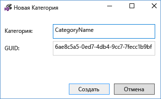
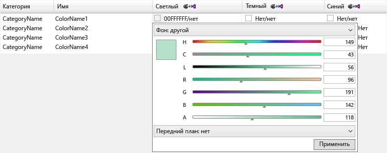
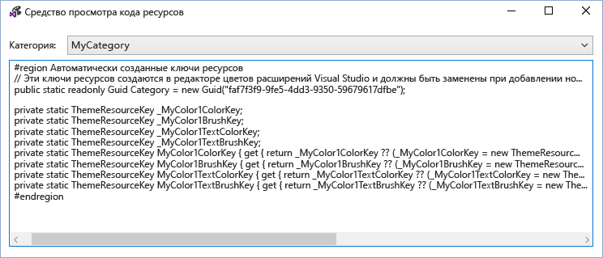

# <a name="vsix-color-editor"></a>Редактор цветов VSIX
Средство редактор цветов расширений Visual Studio можно создавать и изменять пользовательские цвета для Visual Studio. Средство также можно создавать ключи ресурсов темы, чтобы цвета, которые можно использовать в коде. Это средство удобно использовать для выбора цвета для расширения Visual Studio, которое поддерживает темы. Это средство позволяет открывать .pkgdef и XML-файлы. Тем Visual Studio (.vstheme-файлы) можно использовать с Visual Studio расширения редактора цвета, изменив расширение файла с XML-файла. Кроме того .vstheme файлы можно импортировать в текущий XML-файл.  
  
   
  
 **Файлы определений пакетов**  
  
 Определение (.pkgdef) файлы пакета находятся все файлы, определяющие темы. Цвета, сами хранятся в тему цвет XML-файлов, которые компилируются в pkgdef-файл. Файлы .pkgdef развертывания в Visual Studio для поиска места, обработано во время выполнения и объединяются друг с другом, для определения темы.  
  
 **Токены цветов**  
  
 Токен цвета состоит из четырех элементов:  
  
-   **Имя категории:** логическое группирование для набора цветов. Используйте существующее имя категории, если уже есть цветов, которые относятся к нужному элементу пользовательского интерфейса или группы элементов пользовательского интерфейса.  
  
-   **Имя токена:** токен цвета и маркера задает описательное имя. Наборы содержат фона и имена токенов передний план (текст), а также их состояния, и они должны иметь имя, который позволяет легко определить пары и состояния, которые применяются к.  
  
-   **Цвет значений (или оттенки):** необходимые для каждой цвет темы. Всегда создавайте фона и текста значения цвета в парах. Цвета объединены в пару для фона и цвета переднего плана, чтобы цвет текста (основной) всегда для чтения цвете фона, на котором рисуется. Эти цвета связаны и должны использоваться вместе в пользовательском Интерфейсе. Если фон не предназначен для использования с текстом, не определяет цвет переднего плана.  
  
-   **Системное имя цвета:** для использования при отображении высокой контрастности.  
  
## <a name="how-to-use-the-tool"></a>Как использовать средство  
 Насколько возможно, где это применимо, следует повторно использовать существующими цветами Visual Studio вместо внесения новых. Тем не менее для случаев, где определены соответствующие цветов, пользовательских цветов должны создаваться для сохранения темы расширения совместимы.  
  
 **Создание нового токены цветов**  
  
 Для создания настраиваемых цветов, используя редактор цветов расширений Visual Studio, выполните следующие действия.  
  
1.  Чтобы Определите категории и маркер имена новые токены цветов.  
  
2.  Выберите оттенки, которые используют элемент пользовательского интерфейса для каждой темы и системный цвет режима высокой контрастности.  
  
3.  Редактор цвета для создания новых цветов маркеров.  
  
4.  Используйте цвета в расширение Visual Studio.  
  
5.  Тестирование изменений в Visual Studio.  
  
 **Шаг 1: Определите категории и имена токенов для нового токены цветов.**  
  
 Предпочтительный именования схемы для VSColor **[категория] [тип пользовательского интерфейса] [Состояние]**. Не используйте слово «color» в именах VSColor, как он является избыточным.  
  
 Имена категорий укажите логические группы и должен быть определен как узко максимально. Например имя окна одно средство может быть имя категории, но недопустимое имя группы единицы или проект всего предприятия. Группирование элементов по категориям помогает избежать путаницы между цвета с тем же именем.  
  
 Имя токена четко необходимо указать тип элемента и ситуациях или «состояние», для которой будет применен цвет. Например, активные данные совета по **[тип пользовательского интерфейса]** может называться "**подсказки данных**» и **[Состояние]** может называться"**Active**,» в результате имя цвета "**DataTipActive**.» Поскольку подсказки данных текста, цвет фона и переднего плана должны быть определены. С помощью связывания фона и цвета переднего плана, редактора цвета и автоматически создаст цвета»**DataTipActive**» для фона и «**DataTipActiveText**» для переднего плана.  
  
 Если часть пользовательского интерфейса, имеет только одно состояние **[Состояние]** можно опустить часть имени. Например, если границу имеет поле поиска и останется без изменений состояния, которые могут повлиять на цвет границы, затем имя токен цвета границы можно просто вызывать "**SearchBoxBorder**.»  
  
 Некоторые распространенные коды состояния:  
  
-   Активная  
  
-   Неактивные  
  
-   MouseOver  
  
-   MouseDown  
  
-   Selected  
  
-   Focused  
  
 Примеры имена нескольких токенов для части списка элемента управления.  
  
-   ListItem  
  
-   ListItemBorder  
  
-   ListItemMouseOver  
  
-   ListItemMouseOverBorder  
  
-   ListItemSelected  
  
-   ListItemSelectedBorder  
  
-   ListItemDisabled  
  
-   ListItemDisabledBorder  
  
 **Шаг 2: Выберите оттенки, которые используют элемент пользовательского интерфейса для каждой темы и системный цвет режима высокой контрастности.**  
  
 При выборе пользовательских цветов для пользовательского интерфейса, выберите аналогичные существующий элемент пользовательского интерфейса и использования его цвета в качестве базового. Цвета для элементов пользовательского интерфейса, входящие в претерпели исследовании и проверке, для поиска соответствующего и правильно работать в все темы.  
  
 **Шаг 3: Редактор цвет используется для создания новых цветов маркеров.**  
  
 Запуск редактора цвета и откройте или создайте новый XML-файл пользовательскую тему цвета. Выберите **Правка > новый цвет** в меню. Откроется диалоговое окно для определения категории и одно или несколько имен для записей цветов в этой категории:  
  
   
  
 Выберите существующую категорию или **новой категории** для создания новой категории. Будет открыто другое диалоговое окно, создается новое имя категории:  
  
   
  
 Затем будут доступны в новой категории **новый цвет** раскрывающееся меню категории. После выбора категории, введите одно имя в строке для каждого нового цвета токена и выберите «Создать», после завершения:  
  
   
  
 Значения цвета отображаются в парах фона и цвета переднего плана с «None», указывающее на то, что цвет не определен. Примечание: Если цвет не имеет текста фоном пара цветов, выберите только фон необходимо определить.  
  
   
  
 Чтобы изменить цвет маркера, выберите запись цвет из темы (столбец) этого токена. Добавьте значение цвета, либо введите значение шестнадцатеричных цвета в формате ARGB 8 цифр, введя имени системного цвета в ячейку или выберите нужный цвет через набор шкалы или список системных цветов с помощью раскрывающегося меню.  
  
   
  
   
  
 Для компонентов, которые не нужно отображать текст, введите значение только один цвет: цвет фона. В противном случае введите значения для цвета фона и текста, разделенных косой чертой.  
  
 При вводе значения для режима высокой контрастности, введите допустимые имена цветов системы Windows. Не вводите жестко запрограммированные значения ARGB. Список имен допустимый системный цвет можно просмотреть, выбрав «Фон: система» или «Система: переднего плана» из раскрывающихся меню значение цвета. При создании элементов, имеющих компонентов текста, используйте пара цветов системы правильный фона и текста или текста могут стать нечитаемыми.  
  
 Завершив создание, Настройка и изменение токены цветов, сохраните их в нужное XML или формат .pkgdef. Цвет маркеров ни на фоне, ни основной набор будет сохранен как пустой цвета в формате XML, но в формате .pkgdef отброшены. Диалоговое окно будет предупреждать о потенциальной потере цвет при попытке сохранить пустой цветов в pkgdef-файл.  
  
 **Шаг 4: Использование цвета в расширение Visual Studio.**  
  
 Определив новый цвет маркеров, включают .pkgdef в файле проекта с «Действие при построении» значение «Content» и «Включить в VSIX» значение «True».  
  
   
  
 В редакторе Visual Studio расширения цветов, выберите Файл > Просмотреть код ресурса, чтобы просмотреть код, который используется для доступа к пользовательского цвета пользовательского интерфейса на основе WPF.  
  
   
  
 Включить этот код в статическом классе в проекте. Ссылку на **Microsoft.VisualStudio.Shell.\< VSVersion >.0.dll** должен быть добавлен в проект для использования **ThemeResourceKey** типа.  
  
```csharp  
namespace MyCustomColors  
{  
    public static class MyCategory  
    {  
        #region Autogenerated resource keys  
        // These resource keys are generated by Visual Studio Extension Color Editor, and should be replaced when new colors are added to this category.  
        public static readonly Guid Category = new Guid("faf7f3f9-9fe5-4dd3-9350-59679617dfbe");  
  
        private static ThemeResourceKey _MyColor1ColorKey;  
        private static ThemeResourceKey _MyColor1BrushKey;  
        private static ThemeResourceKey _MyColor1TextColorKey;  
        private static ThemeResourceKey _MyColor1TextBrushKey;  
        public static ThemeResourceKey MyColor1ColorKey { get { return _MyColor1ColorKey ?? (_MyColor1ColorKey = new ThemeResourceKey(Category, "MyColor1", ThemeResourceKeyType.BackgroundColor)); } }  
        public static ThemeResourceKey MyColor1BrushKey { get { return _MyColor1BrushKey ?? (_MyColor1BrushKey = new ThemeResourceKey(Category, "MyColor1", ThemeResourceKeyType.BackgroundBrush)); } }  
        public static ThemeResourceKey MyColor1TextColorKey { get { return _MyColor1TextColorKey ?? (_MyColor1TextColorKey = new ThemeResourceKey(Category, "MyColor1", ThemeResourceKeyType.ForegroundColor)); } }  
        public static ThemeResourceKey MyColor1TextBrushKey { get { return _MyColor1TextBrushKey ?? (_MyColor1TextBrushKey = new ThemeResourceKey(Category, "MyColor1", ThemeResourceKeyType.ForegroundBrush)); } }  
        #endregion  
    }  
}  
```  
  
 Это обеспечивает доступ к цвета в коде XAML и позволяет пользовательскому Интерфейсу реагировать на изменения темы.  
  
```xaml  
<UserControl x:Class="NewTestProject.TestPackageControl" Name="MyToolWindow"  
             xmlns="http://schemas.microsoft.com/winfx/2006/xaml/presentation"  
             xmlns:x="http://schemas.microsoft.com/winfx/2006/xaml"  
             xmlns:ns="clr-namespace:MyCustomColors">  
  <Grid>  
    <TextBlock Background="{DynamicResource {x:Static ns:MyCategory.MyColor1BrushKey}}"  
               Foreground="{DynamicResource {x:Static ns:MyCategory.MyColor1TextBrushKey}}"  
      >Sample Text</TextBlock>  
  
  </Grid>  
</UserControl>  
```  
  
 **Шаг 5: Тестирование изменений в Visual Studio.**  
  
 Временно редактора цвета можно применить цвет маркеров к работающим экземплярам Visual Studio для просмотра динамической изменения цвета без перестроения пакета расширения. Чтобы сделать это, нажмите кнопку «Применить эту тему к работающим окнам Visual Studio» находится в заголовке каждого столбца темы. Этот временный темы исчезнет при закрытии редактора цветов VSIX.  
  
   
  
 Для внесения постоянных изменений, повторить сборку и развертывание расширения Visual Studio после добавления новых цветов в pkgdef-файл и написания кода, который будет использовать эти цвета. Перестроение расширение Visual Studio объединит значения реестра для отображения новых цветов в остальные темы. Перезапустите Visual Studio, просмотр пользовательского интерфейса и убедитесь, что новые цвета отображаются должным образом.  
  
## <a name="notes"></a>Примечания  
 Этот инструмент предназначен для использования при создании пользовательских цветов для уже существующих тем Visual Studio или для изменения цвета пользовательскую тему Visual Studio. Чтобы создать полный пользовательские темы Visual Studio, загрузите [редактор цветовых тем Visual Studio расширения](http://visualstudiogallery.msdn.microsoft.com/6f4b51b6-5c6b-4a81-9cb5-f2daa560430b) из коллекции расширений Visual Studio.  
  
## <a name="sample-output"></a>Пример результатов выполнения  
 **Цвет вывода XML**  
  
 XML-файл, созданный средством будет иметь следующий вид:  
  
```xml  
<Themes>  
  <Theme Name="Light" GUID="{de3dbbcd-f642-433c-8353-8f1df4370aba}">  
    <Category Name="CategoryName" GUID="{eee9d521-dac2-48d9-9a5e-5c625ba2040c}">  
      <Color Name="ColorName1">  
        <Background Type="CT_RAW" Source="FFFFFFFF" />  
      </Color>  
      <Color Name="ColorName2">  
        <Background Type="CT_RAW" Source="FFFFFFFF" />  
        <Foreground Type="CT_RAW" Source="FF000000" />  
      </Color>  
      <Color Name="ColorName3">  
        <Background Type="CT_RAW" Source="FFFF0000" />  
      </Color>  
      <Color Name="ColorName4">  
        <Background Type="CT_RAW" Source="FF000088" />  
        <Foreground Type="CT_RAW" Source="FFFFFFFF" />  
      </Color>  
    </Category>  
  </Theme>  
  <Theme Name="Dark" GUID="{1ded0138-47ce-435e-84ef-9ec1f439b749}">...</Theme>  
  <Theme Name="Blue" GUID="{a4d6a176-b948-4b29-8c66-53c97a1ed7d0}">...</Theme>  
  <Theme Name="HighContrast" GUID="{a5c004b4-2d4b-494e-bf01-45fc492522c7}">...</Theme>  
</Themes>  
  
```  
  
 **Выходной цвет PKGDEF**  
  
 Pkgdef-файл, созданный средством будет иметь следующий вид:  
  
```  
[$RootKey$\Themes\{de3dbbcd-f642-433c-8353-8f1df4370aba}\CategoryName]  
"Data"=hex:78,00,00,00,0b,00,00,00,01,00,00,00,21,d5,e9,ee,c2,da,d9,48,9a,5e,5c,62,5b,a2,04,0c,04,00,00,00,0a,00,00,00,43,6f,6c,6f,72,4e,61,6d,65,31,01,ff,ff,ff,ff,00,0a,00,00,00,43,6f,6c,6f,72,4e,61,6d,65,32,01,ff,ff,ff,ff,01,00,00,00,ff,0a,00,00,00,43,6f,6c,6f,72,4e,61,6d,65,33,01,ff,00,00,ff,00,0a,00,00,00,43,6f,6c,6f,72,4e,61,6d,65,34,01,00,00,88,ff,01,ff,ff,ff,ff  
[$RootKey$\Themes\{1ded0138-47ce-435e-84ef-9ec1f439b749}\CategoryName]  
"Data"=hex:...  
[$RootKey$\Themes\{a4d6a176-b948-4b29-8c66-53c97a1ed7d0}\CategoryName]  
"Data"=hex:...  
[$RootKey$\Themes\{a5c004b4-2d4b-494e-bf01-45fc492522c7}\CategoryName]  
"Data"=hex:...  
  
```  
  
 **Оболочки ключи ресурсов C#**  
  
 Цвет ключи ресурсов, созданные с помощью средства будет иметь следующий вид:  
  
```csharp  
namespace MyNamespace  
{  
    public static class MyColors  
    {  
        #region Autogenerated resource keys  
        // These resource keys are generated by Visual Studio Extension Color Editor, and should be replaced when new colors are added to this category.  
  
        public static string ColorName1ColorKey { get { return "ColorName1ColorKey"; } }  
        public static string ColorName1BrushKey { get { return "ColorName1BrushKey"; } }  
  
        public static string ColorName2ColorKey { get { return "ColorName2ColorKey"; } }  
        public static string ColorName2BrushKey { get { return "ColorName2BrushKey"; } }  
        public static string ColorName2TextColorKey { get { return "ColorName2TextColorKey"; } }  
        public static string ColorName2TextBrushKey { get { return "ColorName2TextBrushKey"; } }  
  
        public static string ColorName3ColorKey { get { return "ColorName4ColorKey"; } }  
        public static string ColorName3BrushKey { get { return "ColorName4BrushKey"; } }  
        public static string ColorName3TextColorKey { get { return "ColorName4TextColorKey"; } }  
        public static string ColorName3TextBrushKey { get { return "ColorName4TextBrushKey"; } }  
        #endregion  
    }  
}  
```  
  
 **Оболочки словарь ресурсов WPF**  
  
 Цвет **ResourceDictionary** ключей, созданных с помощью средства будет иметь следующий вид:  
  
```xaml  
<ResourceDictionary xmlns="http://schemas.microsoft.com/winfx/2006/xaml/presentation"  
        xmlns:x="http://schemas.microsoft.com/winfx/2006/xaml"  
        xmlns:colors="clr-namespace:MyNamespace">  
  
  <SolidColorBrush x:Key="{x:Static colors:MyColors.ColorName1BrushKey}" Color="#FFFFFFFF" />  
  <Color x:Key="{x:Static colors:MyColors.ColorName1ColorKey}" A="255" R="255" G="255" B="255" />  
  
  <SolidColorBrush x:Key="{x:Static colors:MyColors.ColorName2BrushKey}" Color="#FFFFFFFF" />  
  <Color x:Key="{x:Static colors:MyColors.ColorName2ColorKey}" A="255" R="255" G="255" B="255" />  
  <SolidColorBrush x:Key="{x:Static colors:MyColors.ColorName2TextBrushKey}" Color="#FF000000" />  
  <Color x:Key="{x:Static colors:MyColors.ColorName2TextColorKey}" A="255" R="0" G="0" B="0" />  
  
  <SolidColorBrush x:Key="{x:Static colors:MyColors.ColorName3BrushKey}" Color="#FFFF0000" />  
  <Color x:Key="{x:Static colors:MyColors.ColorName3ColorKey}" A="255" R="255" G="0" B="0" />  
  
  <SolidColorBrush x:Key="{x:Static colors:MyColors.ColorName4BrushKey}" Color="#FF000088" />  
  <Color x:Key="{x:Static colors:MyColors.ColorName4ColorKey}" A="255" R="0" G="0" B="136" />  
  <SolidColorBrush x:Key="{x:Static colors:MyColors.ColorName4TextBrushKey}" Color="#FFFFFFFF" />  
  <Color x:Key="{x:Static colors:MyColors.ColorName4TextColorKey}" A="255" R="255" G="255" B="255" />  
</ResourceDictionary>  
```