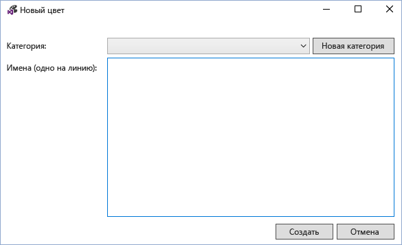
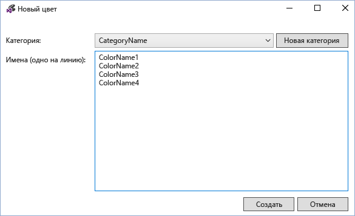
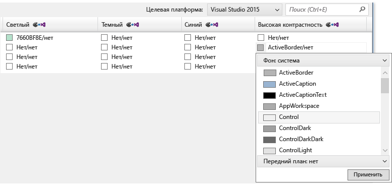

# Редактор цвета VSIX
[!INCLUDE[vs2017banner](../../code-quality/includes/vs2017banner.md)]

Средства редактора цвета расширения Visual Studio можно создавать и изменять пользовательские цвета для Visual Studio. Средство также можно создавать ключи ресурсов темы, чтобы цвета можно использовать в коде. Это средство полезно для создания цвета для расширения Visual Studio, которая поддерживает темы. Это средство можно открыть .pkgdef и XML\-файлы. Тем Visual Studio \(файлы .vstheme\) может использоваться в редакторе Visual Studio расширение цвета, изменив расширение на .xml. Кроме того можно импортировать файлы .vstheme в текущей XML\-файл.  
  
   
  
 **Файлы определений пакетов**  
  
 Файлы определения \(.pkgdef\) пакета — это файлы, определяющие темы. Цвета, сами хранятся в тему цвет XML\-файлов, которые компилируются в pkgdef\-файл. Файлы .pkgdef развертывания в Visual Studio для поиска местоположения, обрабатываются во время выполнения и объединяются друг с другом, для определения темы.  
  
 **Цвет маркеров**  
  
 Цвет маркера состоит из четырех элементов:  
  
-   **Имя категории:** логическая группировка набор цветов. Используйте существующее название категории, если уже есть цветов, которые относятся к требуемый элемент пользовательского интерфейса или группы элементов пользовательского интерфейса.  
  
-   **Имя маркера:** цвет маркера и маркера задает описательное имя. Наборы содержат фона и переднего плана \(текст\) маркера имена, а также их состояния, и они должны иметь имя, чтобы оно было легко идентифицировать пары и состояния, которые относятся к.  
  
-   **Цветовые значения \(или тона\):** для каждой темы цветных. Всегда создавайте фона и текста значения цвета в парах. Цвета сопоставляются для фона и переднего плана, чтобы цвет текста \(основной\) всегда читается цвете фона, на котором рисуется. Эти цвета связаны и должны использоваться вместе в пользовательском Интерфейсе. Если фон не предназначен для использования с текстом, не определяет цвет переднего плана.  
  
-   **Имени системного цвета:** для использования при отображении высокой контрастности.  
  
## Как использовать средство  
 Насколько возможно и уместно, существующими цветами Visual Studio следует повторно вместо создания новых. Тем не менее для случаев, где определены соответствующие цветов, пользовательских цветов должны создаваться для сохранения темы расширения совместимы.  
  
 **Создание нового цвета маркеров**  
  
 Для создания настраиваемых цветов, с помощью редактора цвета расширения Visual Studio, выполните следующие действия.  
  
1.  Чтобы Определите категории и маркера имена новый цвет маркеров.  
  
2.  Выберите оттенки, элемент пользовательского интерфейса будет использоваться для каждой темы и системный цвет для режима высокой контрастности.  
  
3.  Редактор цвета для создания новых цвет маркеров.  
  
4.  Используйте цвета в расширение Visual Studio.  
  
5.  Протестируйте изменения в Visual Studio.  
  
 **Шаг 1: Определите категории и маркера имена для новых цвет маркеров.**  
  
 Предпочтительный именования схемы для VSColor **\[категория\] \[тип пользовательского интерфейса\] \[Состояние\]**. Не используйте слова «цвет» в именах VSColor как избыточно.  
  
 Имена категорий обеспечивают логические группы и должен быть определен как узко максимально. Например имя окна одно средство может быть имя категории, но имя весь бизнес\-единицы или проекта группа не является. Группировка записей по категориям помогает предотвратить смешения цветов с тем же именем.  
  
 Имя маркера должен явно указывает тип элемента и ситуациях или «state», для которого применяется цвет. Например, активных данных совета по **\[тип пользовательского интерфейса\]** может называться»**подсказка**» и **\[Состояние\]** может называться «**Active**,» приведет к имени цвета из»**DataTipActive**.» Поскольку подсказки данных текста, цвет фона и переднего плана должны быть определены. С помощью связывания фона и переднего плана, редактора цвета автоматически создаст цвета»**DataTipActive**» для фона и»**DataTipActiveText**» в качестве основного цвета.  
  
 Если часть пользовательского интерфейса имеет только одно состояние **\[Состояние\]** часть имени можно опустить. Например, если поле поиска имеет границу и останется без изменений состояния, которые могут повлиять на цвет границы, затем имя для маркера границы цвет можно просто вызвать «**SearchBoxBorder**.»  
  
 Имена некоторых общих состояний включают:  
  
-   Активно  
  
-   Неактивные  
  
-   Наведения мыши  
  
-   MouseDown  
  
-   Выбранные  
  
-   Focused  
  
 Примеры несколько маркеров имен частей списка элемента управления.  
  
-   ListItem  
  
-   ListItemBorder  
  
-   ListItemMouseOver  
  
-   ListItemMouseOverBorder  
  
-   ListItemSelected  
  
-   ListItemSelectedBorder  
  
-   ListItemDisabled  
  
-   ListItemDisabledBorder  
  
 **Шаг 2: Выберите оттенки, элемент пользовательского интерфейса будет использоваться для каждой темы и системный цвет для режима высокой контрастности.**  
  
 При выборе пользовательских цветов для пользовательского интерфейса, выберите аналогичные существующего элемента пользовательского интерфейса и использования его цвета в качестве базового. Цвета для элементов пользовательского интерфейса в комплект подверженные исследовании и проверке, поэтому они будут выглядеть соответствующий и правильно работать в все темы.  
  
 **Шаг 3: Редактор цвета для создания новых цвет маркеров.**  
  
 Запуск редактора цвета и откройте или создайте новый XML\-файл цвета пользовательские темы. Выберите **Правка \> новый цвет** в меню. Откроется диалоговое окно для определения категории и одно или несколько имен для записей цветов в этой категории:  
  
   
  
 Выберите существующую категорию или **новую категорию** для создания новой категории. Будет открыто другое диалоговое окно, создается новое имя категории:  
  
   
  
 Новая категория станет доступной в **новый цвет** раскрывающееся меню категории. После выбора категории, введите одно имя в строке для каждого нового маркера цвета и выберите «Создать», после завершения:  
  
   
  
 Значения цвета отображаются в парах фона и переднего плана с «None», указывающее на то, что цвет не был определен. Примечание: Если цвет не имеет текста фоном пара цветов, выберите только фон необходимо определить.  
  
   
  
 Чтобы изменить цвет маркера, выберите запись цвет из темы \(столбец\) этого токена. Добавьте значение цвета, введя значение цвет с шестнадцатеричным значением в формате ARGB 8 цифр, ввод имени системного цвета в ячейку или выберите нужный цвет через набор шкалы или список системных цветов с помощью раскрывающегося меню.  
  
   
  
   
  
 Для компонентов, которые не нужно отображать текст, введите значение только одного цвета: цвет фона. В противном случае введите значения для цвета фона и текста, разделенных косой чертой.  
  
 При вводе значения режима высокой контрастности, введите допустимые имена цветов системы Windows. Не вводите жестко закодированные значения ARGB. Список названий цветов допустимой системы можно просмотреть, выбрав «Фон: системы» или «переднего плана:» из раскрывающихся меню значение цвета. При создании элементов, имеющих текстовых компонентов, используйте пара цветов системы правильный фона и текста или текста могут стать нечитаемыми.  
  
 Завершив создание, Настройка и изменение цвета маркеров, сохраните их в нужный XML или формат .pkgdef. Цвет маркеров ни на фоне, ни набор переднего плана будет сохранен как пустой цвета в формате XML, но удаляются в формате .pkgdef. Диалоговое окно предупредит о потенциальной потере цвет при попытке сохранить пустой цветов в pkgdef\-файл.  
  
 **Шаг 4: Использование цвета в расширение Visual Studio.**  
  
 Определив новый цвет маркеры, включают .pkgdef в файле проекта с «Действие при построении» значение «Содержимое» и «Включить в VSIX» значение «True».  
  
   
  
 В редакторе Visual Studio расширение цветов, выберите Файл \> Просмотреть код ресурса, чтобы просмотреть код, который используется для доступа к пользовательского цвета в пользовательский Интерфейс на основе WPF.  
  
   
  
 Включать этот код в статическом классе в проекте. Ссылку на **.0.dll Microsoft.VisualStudio.Shell. \< VSVersion \>** должен быть добавлен в проект для использования **ThemeResourceKey** типа.  
  
```c#  
namespace MyCustomColors { public static class MyCategory { #region Autogenerated resource keys // These resource keys are generated by Visual Studio Extension Color Editor, and should be replaced when new colors are added to this category. public static readonly Guid Category = new Guid("faf7f3f9-9fe5-4dd3-9350-59679617dfbe"); private static ThemeResourceKey _MyColor1ColorKey; private static ThemeResourceKey _MyColor1BrushKey; private static ThemeResourceKey _MyColor1TextColorKey; private static ThemeResourceKey _MyColor1TextBrushKey; public static ThemeResourceKey MyColor1ColorKey { get { return _MyColor1ColorKey ?? (_MyColor1ColorKey = new ThemeResourceKey(Category, "MyColor1", ThemeResourceKeyType.BackgroundColor)); } } public static ThemeResourceKey MyColor1BrushKey { get { return _MyColor1BrushKey ?? (_MyColor1BrushKey = new ThemeResourceKey(Category, "MyColor1", ThemeResourceKeyType.BackgroundBrush)); } } public static ThemeResourceKey MyColor1TextColorKey { get { return _MyColor1TextColorKey ?? (_MyColor1TextColorKey = new ThemeResourceKey(Category, "MyColor1", ThemeResourceKeyType.ForegroundColor)); } } public static ThemeResourceKey MyColor1TextBrushKey { get { return _MyColor1TextBrushKey ?? (_MyColor1TextBrushKey = new ThemeResourceKey(Category, "MyColor1", ThemeResourceKeyType.ForegroundBrush)); } } #endregion } }  
```  
  
 Это позволяет доступ к цвета в коде XAML и пользовательского интерфейса реагировать на изменения темы.  
  
```xaml  
<UserControl x:Class="NewTestProject.TestPackageControl" Name="MyToolWindow" xmlns="http://schemas.microsoft.com/winfx/2006/xaml/presentation" xmlns:x="http://schemas.microsoft.com/winfx/2006/xaml" xmlns:ns="clr-namespace:MyCustomColors"> <Grid> <TextBlock Background="{DynamicResource {x:Static ns:MyCategory.MyColor1BrushKey}}" Foreground="{DynamicResource {x:Static ns:MyCategory.MyColor1TextBrushKey}}" >Sample Text</TextBlock> </Grid> </UserControl>  
```  
  
 **Шаг 5: Протестируйте изменения в Visual Studio.**  
  
 Временно редактора цвета можно применить цвет маркеров для запущенных экземпляров Visual Studio, чтобы просмотреть изменения цветов без перестроения пакета расширения. Чтобы сделать это, нажмите кнопку «Применить эту тему для операционной системы windows в Visual Studio» находится в заголовке каждого столбца темы. Этот временный темы исчезнет при закрытии редактора цвета VSIX.  
  
   
  
 Для внесения постоянных изменений, повторной сборки и развертывания расширений Visual Studio после добавления новых цветов в pkgdef\-файл и написания кода, который будет использовать эти цвета. Перестроение расширения Visual Studio объединяют значения реестра для новых цветов в остальной части темы. Перезапустите Visual Studio, просмотр пользовательского интерфейса и убедитесь, что новые цвета отображаются так, как ожидалось.  
  
## Примечания  
 Это средство предназначено для использования для создания настраиваемых цветов для уже существующих тем Visual Studio или для изменения цвета пользовательские темы Visual Studio. Чтобы создать полный настраиваемых тем Visual Studio, загрузите [Редактор цветовой схемы Visual Studio расширение](http://visualstudiogallery.msdn.microsoft.com/6f4b51b6-5c6b-4a81-9cb5-f2daa560430b) из коллекции расширений Visual Studio.  
  
## Пример результатов выполнения  
 **Цвет вывода XML**  
  
 XML\-файл, созданный средством будет примерно так:  
  
```xml  
<Themes> <Theme Name="Light" GUID="{de3dbbcd-f642-433c-8353-8f1df4370aba}"> <Category Name="CategoryName" GUID="{eee9d521-dac2-48d9-9a5e-5c625ba2040c}"> <Color Name="ColorName1"> <Background Type="CT_RAW" Source="FFFFFFFF" /> </Color> <Color Name="ColorName2"> <Background Type="CT_RAW" Source="FFFFFFFF" /> <Foreground Type="CT_RAW" Source="FF000000" /> </Color> <Color Name="ColorName3"> <Background Type="CT_RAW" Source="FFFF0000" /> </Color> <Color Name="ColorName4"> <Background Type="CT_RAW" Source="FF000088" /> <Foreground Type="CT_RAW" Source="FFFFFFFF" /> </Color> </Category> </Theme> <Theme Name="Dark" GUID="{1ded0138-47ce-435e-84ef-9ec1f439b749}">...</Theme> <Theme Name="Blue" GUID="{a4d6a176-b948-4b29-8c66-53c97a1ed7d0}">...</Theme> <Theme Name="HighContrast" GUID="{a5c004b4-2d4b-494e-bf01-45fc492522c7}">...</Theme> </Themes>  
  
```  
  
 **Цвет вывода PKGDEF**  
  
 Файл pkgdef, созданные с помощью средства будет примерно так:  
  
```  
[$RootKey$\Themes\{de3dbbcd-f642-433c-8353-8f1df4370aba}\CategoryName] "Data"=hex:78,00,00,00,0b,00,00,00,01,00,00,00,21,d5,e9,ee,c2,da,d9,48,9a,5e,5c,62,5b,a2,04,0c,04,00,00,00,0a,00,00,00,43,6f,6c,6f,72,4e,61,6d,65,31,01,ff,ff,ff,ff,00,0a,00,00,00,43,6f,6c,6f,72,4e,61,6d,65,32,01,ff,ff,ff,ff,01,00,00,00,ff,0a,00,00,00,43,6f,6c,6f,72,4e,61,6d,65,33,01,ff,00,00,ff,00,0a,00,00,00,43,6f,6c,6f,72,4e,61,6d,65,34,01,00,00,88,ff,01,ff,ff,ff,ff [$RootKey$\Themes\{1ded0138-47ce-435e-84ef-9ec1f439b749}\CategoryName] "Data"=hex:... [$RootKey$\Themes\{a4d6a176-b948-4b29-8c66-53c97a1ed7d0}\CategoryName] "Data"=hex:... [$RootKey$\Themes\{a5c004b4-2d4b-494e-bf01-45fc492522c7}\CategoryName] "Data"=hex:...  
  
```  
  
 **Оболочки ключи ресурсов C\#**  
  
 Цвет ключей ресурсов, созданные с помощью средства будет примерно так:  
  
```c#  
namespace MyNamespace { public static class MyColors { #region Autogenerated resource keys // These resource keys are generated by Visual Studio Extension Color Editor, and should be replaced when new colors are added to this category. public static string ColorName1ColorKey { get { return "ColorName1ColorKey"; } } public static string ColorName1BrushKey { get { return "ColorName1BrushKey"; } } public static string ColorName2ColorKey { get { return "ColorName2ColorKey"; } } public static string ColorName2BrushKey { get { return "ColorName2BrushKey"; } } public static string ColorName2TextColorKey { get { return "ColorName2TextColorKey"; } } public static string ColorName2TextBrushKey { get { return "ColorName2TextBrushKey"; } } public static string ColorName3ColorKey { get { return "ColorName4ColorKey"; } } public static string ColorName3BrushKey { get { return "ColorName4BrushKey"; } } public static string ColorName3TextColorKey { get { return "ColorName4TextColorKey"; } } public static string ColorName3TextBrushKey { get { return "ColorName4TextBrushKey"; } } #endregion } }  
```  
  
 **WPF оболочки словаря ресурсов**  
  
 Цвет **ResourceDictionary** ключи, созданные с помощью средства будет иметь следующий вид:  
  
```xaml  
<ResourceDictionary xmlns="http://schemas.microsoft.com/winfx/2006/xaml/presentation" xmlns:x="http://schemas.microsoft.com/winfx/2006/xaml" xmlns:colors="clr-namespace:MyNamespace"> <SolidColorBrush x:Key="{x:Static colors:MyColors.ColorName1BrushKey}" Color="#FFFFFFFF" /> <Color x:Key="{x:Static colors:MyColors.ColorName1ColorKey}" A="255" R="255" G="255" B="255" /> <SolidColorBrush x:Key="{x:Static colors:MyColors.ColorName2BrushKey}" Color="#FFFFFFFF" /> <Color x:Key="{x:Static colors:MyColors.ColorName2ColorKey}" A="255" R="255" G="255" B="255" /> <SolidColorBrush x:Key="{x:Static colors:MyColors.ColorName2TextBrushKey}" Color="#FF000000" /> <Color x:Key="{x:Static colors:MyColors.ColorName2TextColorKey}" A="255" R="0" G="0" B="0" /> <SolidColorBrush x:Key="{x:Static colors:MyColors.ColorName3BrushKey}" Color="#FFFF0000" /> <Color x:Key="{x:Static colors:MyColors.ColorName3ColorKey}" A="255" R="255" G="0" B="0" /> <SolidColorBrush x:Key="{x:Static colors:MyColors.ColorName4BrushKey}" Color="#FF000088" /> <Color x:Key="{x:Static colors:MyColors.ColorName4ColorKey}" A="255" R="0" G="0" B="136" /> <SolidColorBrush x:Key="{x:Static colors:MyColors.ColorName4TextBrushKey}" Color="#FFFFFFFF" /> <Color x:Key="{x:Static colors:MyColors.ColorName4TextColorKey}" A="255" R="255" G="255" B="255" /> </ResourceDictionary>  
```