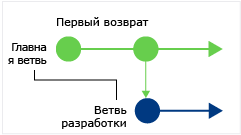
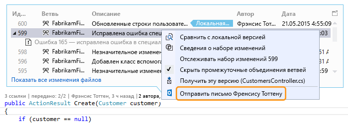
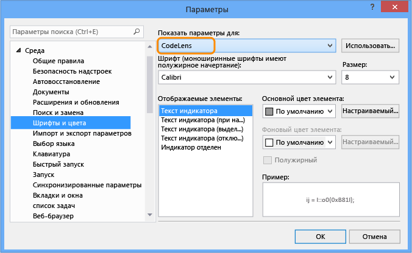
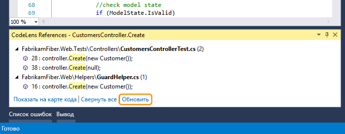

# Поиск изменений кода и других журналов с помощью CodeLens

CodeLens позволяет вам получать дополнительные сведения о коде, не отрываясь от работы и не выходя из редактора. Вы можете найти ссылки на фрагмент кода, изменения кода, связанные ошибки, рабочие элементы, проверки кода и модульные тесты.

> [!NOTE]
> Средство CodeLens доступно только в выпусках Visual Studio Enterprise и Visual Studio Professional. Оно не доступно в выпуске Visual Studio Community.

Посмотрите, где и как отдельные части вашего кода используются в решении.

Сообщите рабочей группе об изменениях в коде, не выходя из редактора.

Чтобы выбрать, какие индикаторы должны отображаться, или чтобы включить или выключить средство CodeLens, последовательно выберите пункты **Инструменты** > **Параметры** > **Текстовый редактор** > **Все языки** > **CodeLens**.

## Поиск ссылок на код

Можно находить ссылки в коде Visual Basic или C#.

1. Выберите индикатор **ссылок** или нажмите **ALT**+**2**.

   

   > [!NOTE]
   > Если в индикаторе отображается **0 ссылок**, это значит, что ссылки из кода C# или Visual Basic отсутствуют. Однако могут существовать ссылки из других элементов, таких как *XAML*- и *ASPX*-файлы.

2. Чтобы просмотреть код ссылки, наведите указатель мыши на ссылку в списке.

   

3. Чтобы открыть файл, который содержит ссылку, дважды щелкните эту ссылку.

### Карты кода

Чтобы просмотреть отношения между этим кодом и его ссылками, [создайте карту кода](../modeling/map-dependencies-across-your-solutions.md). В контекстном меню карты кода выберите **Показать все ссылки**.

## <a name="find-code-history"/>Поиск изменений в коде

Изучите журнал кода, чтобы узнать, что случилось. Можно также изучить изменения до их внедрения в ваш код, чтобы понять, как изменения в других ветвях могут повлиять на него.

Вам понадобится:

- Visual Studio Enterprise или Visual Studio Professional

- Team Foundation Server 2013 и более поздние версии, Azure DevOps Services или Git.

- [Skype для бизнеса](/skypeforbusiness/) для связи с коллегами без выхода из редактора кода

Для кода на C# или Visual Basic, который хранится вместе с системой управления версиями Team Foundation (TFVC) или Git, сведения CodeLens предоставляются на уровнях класса и метода (индикаторы *уровня кода элемента*). Если репозиторий Git находится в TfGit, можно также получить ссылки на рабочие элементы TFS.

Для типов файлов, отличных от *.cs* и *.vb*, сведения о CodeLens по всему файлу приводятся в одном месте — в нижней части окна (индикаторы *уровня файла*).

### Индикаторы кода на уровне элемента

Индикаторы кода на уровне элемента позволяют увидеть, кто изменил ваш код и какие изменения кода были сделаны. Индикаторы на уровне элемента кода доступны для кода на C# и Visual Basic.

При использовании системы управления версиями Team Foundation (TFVC) в Team Foundation Server или Azure DevOps Services отображается следующее:

Период времени по умолчанию — последние 12 месяцев. Если код хранится в Team Foundation Server, то этот период можно изменить, выполнив [команду TFSConfig](/tfs/server/ref/command-line/tfsconfig-cmd) вместе с [командой CodeIndex](../ide/codeindex-command.md) и флагом **/indexHistoryPeriod**.

Чтобы просмотреть подробный журнал всех изменений, включая сделанные более года назад, выберите параметр **Показать все изменения файла**:

Откроется окно **Журнал**:

Если ваши файлы хранятся в репозитории Git и вы выбираете индикатор изменений на уровне элемента кода, отображается следующее:

### Индикаторы уровня файлов

Просмотрите изменения для всего файла на индикаторах уровня файла в нижней части окна:

> [!NOTE]
> Индикаторы на уровне файла недоступны для файлов C# и Visual Basic.

Чтобы получить дополнительные сведения об изменении, щелкните этот элемент правой кнопкой мыши. В зависимости от того, используется TFVC или Git, существуют различные варианты сравнения версий файла, просмотра сведений и отслеживания изменений, получения выбранной версии файла и уведомления автора об изменениях по электронной почте. Некоторые из этих сведений отображаются в **Team Explorer**.

Также можно узнать, кто вносил изменения в код в течение определенного времени. Это поможет обнаружить закономерности во вносимых рабочей группой изменениях и оценить их влияние.

### Поиск изменений в текущем подразделении

Ваша группа может работать с несколькими ветвями (например, с основной и дочерней ветвями разработки) для снижения риска нарушения стабильности кода.

Можно узнать, сколько пользователей вносили изменения в код и сколько изменений было сделано в основной ветви, нажав **ALT**+**6**:

### Поиск разветвления кода

Чтобы определить, когда ваш код был разделен на ветви, перейдите к коду в дочерней ветви. Затем выберите индикатор **изменений** или нажмите сочетание клавиш **ALT**+**6**.

### Поиск входящих изменений от других подразделений

Вы можете просмотреть входящие изменения. В примере, изображенном на рисунке ниже, была исправлена ошибка в ветви "Dev":

Вы можете просмотреть это изменение, не покидая текущей ветви ("Main"):

### Поиск объединения изменений

Вы можете просмотреть слияния изменений, поэтому можно определить, какие изменения были добавлены в вашу ветвь:

Например, код в ветви "Main" теперь содержит исправление ошибки из ветви "Dev":

### Сравнение входящего изменения с локальной версией

Сравните входящее изменение с локальной версией, нажав сочетание клавиш **SHIFT**+**F10** или дважды щелкнув набор изменений.

### Значки ветвей

Значок в столбце **Ветвь** показывает связь с ветвью, в которой вы работаете.

|**Значок**|**Откуда пришли изменения:**|
|--------------| - |
||Текущее подразделение|
||Родительское подразделение|
||Дочернее подразделение|
||Одноранговое подразделение|
||Подразделение, отличное от родительского, дочернего или однорангового|
||Слияние с данными от родительского подразделения с дочерним подразделением|
||Слияние с данными от дочернего подразделения с родительским подразделением|
||Слияние с данными от несвязанного подразделения (слияние без базовой версии)|

## Связанные рабочие элементы

Найдите связанные рабочие элементы, выбрав индикатор **рабочие элементы** или нажав **ALT**+**8**.

## Связанные проверки кода

Найдите связанные проверки кода, выбрав индикатор **проверки**. Чтобы перемещаться по индикаторам с помощью клавиатуры, при нажатой клавише **ALT** нажимайте **СТРЕЛКУ ВЛЕВО** или **СТРЕЛКУ ВПРАВО**.

## Связанные ошибки

Найдите связанные ошибки, выбрав индикатор **ошибки** или нажав **ALT**+**7**.

## Обращение к владельцу элемента

Найдите автора элемента, выбрав индикатор **авторы** или нажав **ALT**+**5**.

Откройте контекстное меню элемента, чтобы увидеть параметры контакта. Если на компьютере установлено приложение Lync или Skype для бизнеса, отобразятся следующие параметры:

## Связанные модульные тесты

Вы можете узнать, какие имеются модульные тесты для вашего кода C# или Visual Basic, не открывая **обозреватель тестов**.

1. Перейдите к коду приложения, содержащему связанный [код модульного теста](../test/unit-test-your-code.md).

2. Если вы еще этого не сделали, создайте приложение для загрузки индикаторов тестов CodeLens. Убедитесь, что включено [обнаружение по скомпилированным сборкам](../test/test-explorer-faq.md#assembly-based-discovery).

3. Просмотрите тесты для кода, нажав сочетание клавиш **ALT**+**3**.

     

4. Если отображается значок предупреждения , то тесты еще не выполнялись, поэтому запустите их.

     

5. Чтобы просмотреть определение теста, откройте файл кода в редакторе, дважды щелкнув элемент теста в окне индикаторов CodeLens.

     

6. Чтобы просмотреть результаты теста, выберите индикатор состояния теста ( или ) или нажмите **ALT**+**1**.

     

7. Чтобы увидеть, сколько пользователей изменяло данный тест, кто именно изменял тест или сколько изменений было внесено в тест, [найдите журнал кода](#find-code-history) и связанные элементы.

## Сочетания клавиш

Чтобы выбрать индикатор с помощью клавиатуры, нажмите и удерживайте клавишу **ALT** для отображения номеров индикаторов, а затем нажмите цифру с номером индикатора, который необходимо выбрать.

> [!NOTE]
> Чтобы выбрать индикатор **проверки**, удерживайте нажатой клавишу **ALT** и нажимайте клавиши со стрелками влево и вправо для перехода.

## Вопросы и ответы

### Вопрос. Как включать и отключать CodeLens и как выбирать отображаемые индикаторы?

**Ответ.**  Включать и выключать можно все индикаторы, кроме индикатора ссылок. Последовательно выберите пункты **Сервис** > **Параметры** > **Текстовый редактор** > **Все языки** > **CodeLens**.

Если индикаторы включены, параметры CodeLens можно также открыть из индикаторов.

Индикаторы CodeLens уровня файла включаются и отключаются с помощью значка шеврона в нижней части окна редактора.

### Вопрос. Где находится CodeLens?

**Ответ.** CodeLens отображается в коде C# и Visual Basic на уровне метода, класса, индексатора и свойства. Для всех других типов файлов CodeLens отображается на уровне файла.

- Включите CodeLens. Последовательно выберите пункты **Сервис** > **Параметры** > **Текстовый редактор** > **Все языки** > **CodeLens**.

- Если код хранится в TFS, с помощью [команды CodeIndex](../ide/codeindex-command.md) и [команды TFS Config](/tfs/server/ref/command-line/tfsconfig-cmd)убедитесь, что индексирование кода включено.

- Индикаторы, связанные с DevOps, отображаются, только когда рабочие элементы связаны с кодом и имеются разрешения на открытие связанных рабочих элементов. Убедитесь в наличии [разрешений члена команды](/azure/devops/organizations/security/view-permissions?view=vsts).

- Индикаторы модульных тестов не отображаются, если в коде приложения отсутствуют модульные тесты. Индикаторы состояния теста отображаются автоматически в тестовых проектах. Если известно, что код приложения имеет модульные тесты, но индикаторы тестов не отображаются, попробуйте выполнить сборку решения (**CTRL**+**SHIFT**+**B**).

### Вопрос: Почему я не вижу сведения рабочего элемента для фиксации?

**Ответ.** Это может происходить, когда CodeLens не может найти рабочие элементы в Azure Boards или TFS. Проверьте, что вы подключены к проекту, который имеет эти рабочие элементы, и что имеются разрешения для просмотра этих рабочих элементов. Сведения о рабочих элементах могут также не отображаться, если описание фиксации содержит неверные сведения об идентификаторах рабочих элементов в Azure Boards или TFS.

### Вопрос. Почему не отображаются индикаторы Skype?

**Ответ.** Индикаторы Skype не отображаются, если вы не вошли в Skype для бизнеса, если он не установлен или вы используете неподдерживаемую конфигурацию. Однако вы по-прежнему можете отправлять почту:

**Какие конфигурации Skype и Lync поддерживаются?**

- Skype для бизнеса (32- или 64-разрядная версия)

- Lync 2010 или более поздняя версия отдельно (32- или 64-разрядная), но не Lync Basic 2013 с Windows 8.1

CodeLens не поддерживает наличие нескольких установленных версий Lync или Skype. Они могут быть не локализованы для всех локализованных версий Visual Studio.

### Вопрос. Как изменить шрифт и цвет CodeLens?

**Ответ**. Последовательно выберите пункты **Сервис** > **Параметры** > **Среда** > **Шрифты и цвета**.

Для использования клавиатуры выполните следующие действия.

1. Нажмите **ALT**+**T**+**O**, чтобы открыть диалоговое окно **Параметры**.

2. Нажмите клавишу **СТРЕЛКА ВВЕРХ** или **СТРЕЛКА ВНИЗ** , чтобы перейти к узлу **Среда** , а затем нажмите клавишу **СТРЕЛКА ВЛЕВО** , чтобы развернуть узел.

3. Нажмите клавишу **СТРЕЛКА ВНИЗ** , чтобы перейти к пункту **Шрифты и цвета**.

4. Нажмите клавишу **TAB**, чтобы перейти к списку **Параметры для**, после чего нажмите клавишу **СТРЕЛКА ВНИЗ**, чтобы выбрать **CodeLens**.

### В. Можно ли переместить HUD-элемент CodeLens?

**Ответ.** Да, щелкните , чтобы закрепить CodeLens как окно.

### В. Как обновить индикаторы?

**Ответ.** Это зависит от индикатора.

- **Ссылки**: этот индикатор обновляется автоматически при изменении кода. Если индикатор **Ссылки** закреплен в отдельном окне, его можно обновить, нажав на **Обновить**:

     

- **Команда**: эти индикаторы можно обновить, выбрав **Обновить командные индикаторы CodeLens** из контекстного меню:

     

- **Тест**: [найдите модульные тесты для кода](#associated-unit-tests), чтобы обновить индикатор **Тест**.

### Вопрос. Что такое "Локальная версия"?

**Ответ.** Стрелка **Локальная версия** указывает на последний набор изменений в локальной версии файла. Если на сервере находятся более новые наборы изменений, они отображаются над или под стрелкой **Локальная версия** в зависимости от порядка сортировки наборов изменений.

### Вопрос. Можно ли управлять тем, как CodeLens обрабатывает код для отображения журнала и связанных элементов?

**О.** Да. Если код находится в TFS, используйте [команду CodeIndex](../ide/codeindex-command.md) с [командой TFS Config](/tfs/server/ref/command-line/tfsconfig-cmd).

### Вопрос. Мои индикаторы тестов CodeLens больше не отображаются в файле, когда я впервые открываю решение. Как их загрузить?

**Ответ**. Перестройте проект, чтобы индикаторы тестов CodeLens загружались в файл. Убедитесь, что включено [обнаружение по скомпилированным сборкам](../test/test-explorer-faq.md#assembly-based-discovery
). Для повышения производительности Visual Studio больше не получает сведения об источнике для индикаторов тестов при загрузке файлов кода. Индикаторы тестов загружаются после сборки или при переходе к тесту двойным щелчком в **обозревателе тестов**.

## См. также

- [Возможности редактора кода](../ide/writing-code-in-the-code-and-text-editor.md)
