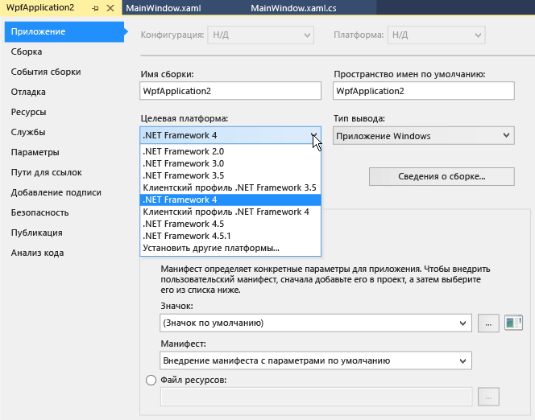

# Практическое руководство. Определение целевой версии .NET Framework
[!INCLUDE[vs2017banner](../code-quality/includes/vs2017banner.md)]

В этом документе описано, как выбрать целевую версию .NET Framework при создании проекта и как изменить целевую версию для существующего проекта Visual Basic, Visual C\# или Visual F\#.  
  
> [!IMPORTANT]
>  Сведения об изменении целевой версии для проектов C\+\+ см. в разделе [Практическое руководство. Изменение требуемой версии .NET Framework и набора средств платформы](../Topic/How%20to:%20Modify%20the%20Target%20Framework%20and%20Platform%20Toolset.md).  
  
 **Содержание раздела**  
  
-   [Выбор целевой версии при создании проекта](../ide/how-to-target-a-version-of-the-dotnet-framework.md#bkmk_new)  
  
-   [Изменение целевой версии](../ide/how-to-target-a-version-of-the-dotnet-framework.md#bkmk_existing)  
  
##   Выбор целевой версии при создании проекта  
 При создании проекта целевая версия платформы .NET Framework определяет, какие шаблоны можно использовать.  
  
> [!NOTE]
>  В выпусках Visual Studio Express необходимо сначала создать проект, после чего можно будет изменить целевую версию, как описано ниже в разделе [Изменение целевой версии](../ide/how-to-target-a-version-of-the-dotnet-framework.md#bkmk_existing).  
  
#### Выбор целевой версии при создании проекта  
  
1.  В строке меню выберите **Файл**, **Создать**, **Проект**.  
  
2.  В списке в верхней части диалогового окна **Новый проект** выберите версию .NET Framework, которая будет целевой для проекта.  
  
    > [!NOTE]
    >  Как правило, с Visual Studio устанавливается только одна версия .NET Framework.  Если требуется выбрать другую целевую версию, необходимо убедиться, что она установлена.  См. раздел [Обзор настройки для различных версий в Visual Studio](../ide/visual-studio-multi-targeting-overview.md).  
  
3.  Из списка установленных шаблонов выберите тип проекта, который необходимо создать, назовите проект, а затем нажмите кнопку **ОК**.  
  
     В списке шаблонов будут показаны только те проекты, которые поддерживаются выбранной версией .NET Framework.  
  
##   Изменение целевой версии  
 Целевую версию .NET Framework в проекте Visual Basic, Visual C\# или Visual F\# можно изменить, воспользовавшись следующей процедурой.  
  
#### Изменение целевой версии  
  
1.  В **Обозревателе решений** откройте контекстное меню проекта, для которого требуется изменить целевую платформу,, и выберите пункт **Свойства**.  
  
       
  
    > [!IMPORTANT]
    >  Сведения об изменении целевой версии для проектов C\+\+ см. в разделе [Практическое руководство. Изменение требуемой версии .NET Framework и набора средств платформы](../Topic/How%20to:%20Modify%20the%20Target%20Framework%20and%20Platform%20Toolset.md).  
  
2.  В левом столбце окна свойств перейдите на вкладку **Приложение**.  
  
       
  
    > [!NOTE]
    >  После создания приложения Магазина Windows невозможно изменить целевую версию Windows или .NET Framework.  
  
3.  В списке **Целевая рабочая среда** выберите требуемую версию.  
  
4.  В открывшемся диалоговом окне проверки нажмите кнопку **Да**.  
  
     Проект будет выгружен.  При его перезагрузке он будет предназначен для выбранной версии .NET Framework.  
  
    > [!NOTE]
    >  Если код содержит ссылки на другую версию .NET Framework, отличную от целевой, при компиляции и запуске кода могут появиться сообщения об ошибках.  Для устранения этих ошибок необходимо изменить ссылки.  См. раздел [Устранение неполадок, связанных с настройкой для определенных версий платформы .NET Framework](../msbuild/troubleshooting-dotnet-framework-targeting-errors.md).  
  
## См. также  
 [Обзор настройки для различных версий в Visual Studio](../ide/visual-studio-multi-targeting-overview.md)   
 [.NET Framework Multi\-Targeting for ASP.NET Web Projects](../Topic/.NET%20Framework%20Multi-Targeting%20for%20ASP.NET%20Web%20Projects.md)   
 [Устранение неполадок, связанных с настройкой для определенных версий платформы .NET Framework](../msbuild/troubleshooting-dotnet-framework-targeting-errors.md)   
 [Страница "Приложение" в конструкторе проектов \(C\#\)](../ide/reference/application-page-project-designer-csharp.md)   
 [Страница «Приложение» в конструкторе проектов \(Visual Basic\)](../ide/reference/application-page-project-designer-visual-basic.md)   
 [Настройка проектов](../Topic/Configuring%20Projects%20\(F%23\).md)   
 [Практическое руководство. Изменение требуемой версии .NET Framework и набора средств платформы](../Topic/How%20to:%20Modify%20the%20Target%20Framework%20and%20Platform%20Toolset.md)