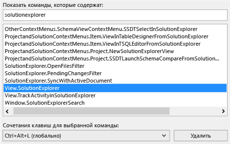
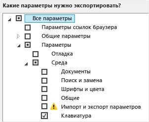
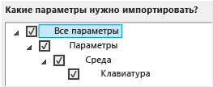

# Определение и настройка сочетаний клавиш в Visual Studio

Вы можете определить сочетания клавиш для команд Visual Studio, настроить эти сочетания клавиш и экспортировать их для других пользователей. Многие сочетания клавиш всегда вызывают одни и те же команды, в то время как поведение других сочетаний клавиш может быть различным в зависимости от следующих условий:

- параметры среды по умолчанию, которые были выбраны при первом запуске Visual Studio (например, "Обычные параметры среды разработки" или "Visual C#");

- настраивались ли сочетания клавиш пользователем;

- контекст в момент нажатия сочетания клавиш. Например, клавиша F2 вызывает команду Edit.EditCell при использовании конструктора параметров и команду File.Rename при использовании Team Explorer.

Независимо от настроенных параметров и контекста сочетания клавиш можно всегда найти и изменить в диалоговом окне **Параметры**. Кроме того, в разделе [Сочетания клавиш по умолчанию для часто используемых команд](../ide/default-keyboard-shortcuts-for-frequently-used-commands-in-visual-studio.md) можно найти сочетания клавиш по умолчанию для нескольких десятков команд, а полный список сочетаний клавиш по умолчанию (для режима "Обычные параметры разработки") приведен в разделе [Сочетания клавиш по умолчанию](../ide/default-keyboard-shortcuts-in-visual-studio.md).

Если сочетание клавиш назначено команде в глобальном контексте и ни в каких других контекстах, это сочетание будет всегда вызвать данную команду. Однако сочетание клавиш можно назначить одной команде в глобальном контексте и другой команде в более узком контексте. При использовании такого сочетания клавиш в конкретном контексте вызывается команда для данного контекста, а не для глобального контекста.

> [!NOTE]
> Имена и расположение команд меню и параметров в диалоговых окнах могут зависеть от пользовательских настроек и выпуска Visual Studio. Этот раздел основан на конфигурации **Обычные параметры разработки**.

## Определение сочетания клавиш

1. В строке меню выберите **Сервис**, **Параметры**.

2. Разверните пункт **Среда** и выберите элемент **Клавиатура**.

   

3. В поле **Показать команды, содержащие** введите полное имя команды без пробелов или его часть.

   Например, можно найти команды для `solutionexplorer`.

4. В списке выберите нужную команду.

    Например, можно выбрать **View.SolutionExplorer**.

5. Если команда имеет сочетание клавиш, оно отображается в списке **Сочетание клавиш для выбранной команды**.

   

## Настройка сочетания клавиш

1. В строке меню выберите **Сервис**, **Параметры**.

2. Разверните папку **Среда** и выберите элемент **Клавиатура**.

3. Необязательно. Отфильтруйте список команд, введя полное имя команды без пробелов или его часть в поле **Показать команды, содержащие**.

4. Выберите из списка команду, которой нужно назначить сочетание клавиш.

В списке **Область действия** выберите функциональную область, в которой будет использоваться данное сочетание клавиш.

    For example, you can choose **Global** if you want the shortcut to work in all contexts. You can use any shortcut that isn't mapped (as Global) in another editor. Otherwise, the editor overrides the shortcut.

    > [!NOTE]
    > You can't assign the following keys as part of a keyboard shortcut in **Global**: Print Scrn/Sys Rq, Scroll Lock, Pause/Break, Tab, Caps Lock, Insert, Home, End, Page Up, Page Down, the Windows logo key, the Application key, any of the Arrow keys, or Enter; Num Lock, Delete, or Clear on the numeric keypad; the Ctrl+Alt+Delete key combination.

6. В поле **Введите сочетание клавиш** введите требуемое сочетание клавиш.

    > [!NOTE]
    > Вы можете создать сочетание клавиш, состоящее из буквы и клавиши ALT, CTRL или из обеих этих клавиш. Кроме того, можно создать сочетание клавиш, состоящее из клавиши SHIFT и буквы с клавишей ALT, CTRL или обеими этими клавишами.

     Если сочетание клавиш уже назначено другой команде, оно отображается в поле **Сочетание клавиш в настоящий момент используется для**. В этом случае нажмите клавишу BACKSPACE, чтобы удалить сочетание клавиш, прежде чем пробовать другое сочетание.

    

7. Нажмите кнопку **Назначить**.

    > [!NOTE]
    > Если вы задали для команды другое сочетание клавиш, нажали кнопку **Назначить**, а затем кнопку **Отмена**, диалоговое окно закрывается, но изменение не отменяется.

## Совместное использование пользовательских сочетаний клавиш

Вы можете поделиться своими сочетаниями клавиш, экспортировав их в файл, а затем передав этот файл другим пользователям, чтобы они импортировали данные из него.

### Экспорт сочетаний клавиш

1. В строке меню выберите **Сервис**, **Импорт и экспорт параметров**.

2. Выберите команду **Экспортировать выбранные параметры среды** и нажмите кнопку **Далее**.

3. В области **Выберите параметры для экспорта** снимите флажок **Все параметры**, разверните узел **Параметры**, а затем узел **Среда**.

4. Установите флажок **Клавиатура** и нажмите кнопку **Далее**.

    

5. В полях **Выберите имя для файла параметров** и **Сохранить файл параметров в этом каталоге** оставьте значения по умолчанию или укажите другие значения, а затем нажмите кнопку **Готово**.

    По умолчанию сочетания клавиш сохраняются в файле в папке "%USERPROFILE%\Documents\Visual Studio 2017\Settings". Имя файла содержит дату экспорта параметров и имеет расширение .vssettings.

### Импорт сочетаний клавиш

1. В строке меню выберите **Сервис**, **Импорт и экспорт параметров**.

2. Выберите команду **Импортировать выбранные параметры среды** и нажмите кнопку **Далее**.

3. Выберите параметр **Нет, импортировать новые значения, перезаписав мои текущие параметры**, а затем нажмите кнопку **Далее**.

4. В окне **Мои параметры** выберите файл, содержащий нужные сочетания клавиш, или нажмите кнопку **Обзор**, чтобы найти нужный файл.

5. Нажмите кнопку **Далее**.

6.  В области **Выберите параметры для импорта** снимите флажок **Все параметры**, разверните узел **Параметры**, а затем узел **Среда**.

7. Установите флажок **Клавиатура** и нажмите кнопку **Готово**.

    

## См. также

[Специальные возможности Visual Studio](../ide/reference/accessibility-features-of-visual-studio.md)