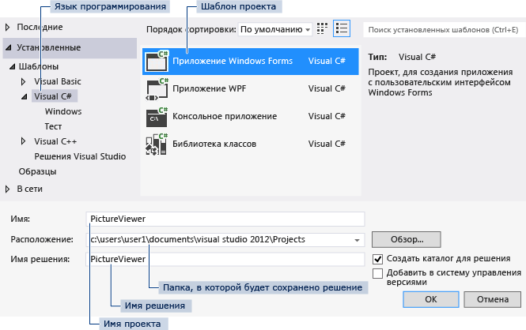

# Шаг 1. Создание проекта приложения Windows Forms
Первый шаг в создании программы для просмотра изображений — это создание проекта приложения Windows Forms.  
  
 Видеоверсию этой статьи см. на следующих страницах: [Tutorial 1: Create a Picture Viewer in Visual Basic - Video 1](http://go.microsoft.com/fwlink/?LinkId=205209) (Учебное руководство 1. Создание приложения для просмотра рисунков на Visual Basic — видео 1) или [Tutorial 1: Create a Picture Viewer in C# - Video 1](http://go.microsoft.com/fwlink/?LinkId=205199) (Учебное руководство 1. Создание приложения для просмотра рисунков на C# — видео 1). Эти видеоролики сняты с использованием более ранней версии Visual Studio, поэтому существуют небольшие различия в некоторых командах меню и других элементах пользовательского интерфейса. Однако концепции и процедуры аналогичны текущей версии Visual Studio.  
  
### Создание проекта приложения Windows Forms  
  
1.  В строке меню выберите **Файл**, **Создать**, **Проект**. Диалоговое окно должно выглядеть следующим образом.  
  
       
Диалоговое окно "Новый проект"  
  
2.  В списке **Установленные шаблоны** выберите **Visual C#** или **Visual Basic**.  
  
3.  В списке шаблонов выберите значок **Приложение Windows Forms**. Назовите новую форму **PictureViewer** и нажмите кнопку **ОК**.  
  
     Visual Studio создает решение для программы. Решение играет роль контейнера для всех проектов и файлов, необходимых программе. Более подробно эти термины поясняются далее в этом учебнике.  
  
4.  На следующем рисунке показано, как теперь должен выглядеть интерфейс Visual Studio.  
  
    > [!NOTE]
    >  В вашем случае макет окна может отличаться от показанного. Точный макет окна зависит от версии Visual Studio, используемого языка программирования и других факторов. Однако необходимо убедиться, что отображаются все три окна.  
  
       
Окно интегрированной среды разработки  
  
     Интерфейс содержит три окна: главное окно, **Обозреватель решений** и окно **Свойства**.  
  
     Если какое-либо из этих окон отсутствует, восстановите макет окон по умолчанию, выбрав в строке меню **Окно**, **Сбросить макет окна**. Можно также отобразить окна с помощью команд меню. В строке меню выберите **Вид**, **Окно "Свойства"** или **Обозреватель решений**. Если открыты какие-либо другие окна, закройте их с помощью кнопки **Закрыть** (x) в верхнем правом углу.  
  
5.  На рисунке показаны следующие окна (по часовой стрелке от левого верхнего угла):  
  
    -   **Главное окно**. В этом окне выполняется основная часть работы, например работа с формами и редактирование кода. На рисунке в окне показана форма в редакторе форм. В верхней части окна находятся две вкладки — вкладка **Начальная страница** и вкладка **Form1.cs [Design]**. (В Visual Basic имя вкладки заканчивается на .vb, а не на .cs.)  
  
    -   **Окно "Обозреватель решений"**. В этом окне можно просматривать все элементы, входящие в решение, и переходить к ним. Если выбрать файл, содержимое в окне **Свойства** изменится. Если открыть файл кода (с расширением .cs в Visual C# и .vb в Visual Basic), откроется файл кода или конструктор для файла кода. Конструктор — это визуальная поверхность, на которую можно добавлять элементы управления, такие как кнопки и списки. При работе с формами Visual Studio он называется конструктор Windows Forms.  
  
    -   **Окно "Свойства"**. В этом окне производится изменение свойств элементов, выбранных в других окнах. Например, выбрав форму Form1, можно изменить ее название путем задания свойства **Text**, а также изменить цвет фона путем задания свойства **Backcolor**.  
  
    > [!NOTE]
    >  В верхней строке в **обозревателе решений** отображается текст **Решение "PictureViewer" (1 проект)**. Это означает, что Visual Studio автоматически создала для вас решение. Решение может содержать несколько проектов, но пока что вы будете работать с решениями, которые содержат только один проект.  
  
6.  В строке меню выберите **Файл**, **Сохранить все**.  
  
     Другой вариант — нажать кнопку **Сохранить все** на панели инструментов, показанной на следующем рисунке.  
  
       
Кнопка "Сохранить все" на панели инструментов  
  
     Visual Studio автоматически заполняет имя папки и имя проекта, а затем сохраняет проект в папке проектов.  
  
### Продолжить или повторить пройденный материал  
  
-   Следующий шаг руководства см. в разделе [Step 2: Run Your Program](../ide/step-2-run-your-program.md) (Шаг 2. Запуск программы).  
  
-   Статью с общими сведениями см. на странице [Tutorial 1: Create a Picture Viewer](../ide/tutorial-1-create-a-picture-viewer.md) (Учебное руководство 1. Создание приложения для просмотра рисунков).