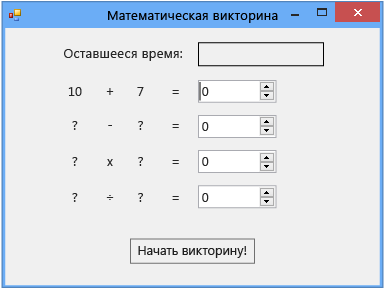

# Шаг 2. Создание задачи на сложение случайных чисел
Во второй части этого урока вам предстоит реализовать логику головоломки, добавив арифметические задачи на основе случайных чисел. Также необходимо будет создать метод с именем `StartTheQuiz()`, который проставляет числа для задач и запускает таймер обратного отсчета. Далее в этом уроке вы добавите задачи на вычитание, умножение и деление.

> [!NOTE]
>  Этот раздел входит в серию учебников, посвященных основам написания кода. Общие сведения об учебнике см. в разделе [Руководство 2. Создание ограниченной по времени математической головоломки](../ide/tutorial-2-create-a-timed-math-quiz.md).

## Создание задачи на сложение случайных чисел

1.  В конструкторе форм выберите форму (**Form1**).

2.  В строке меню выберите **Вид** > **Код**.

     Откроется файл *Form1.cs* или *Form1.vb* (в зависимости от того, на каком языке вы программируете), отображая код, стоящий за формой.

3.  Создайте объект <xref:System.Random>, добавив оператор `new` в начале кода следующим образом.

     [!code-csharp[VbExpressTutorial3Step2#1](../ide/codesnippet/CSharp/step-2-create-a-random-addition-problem_1.cs)]
     [!code-vb[VbExpressTutorial3Step2#1](../ide/codesnippet/VisualBasic/step-2-create-a-random-addition-problem_1.vb)]

     Вы добавили в форму объект Random и назвали этот объект **randomizer**.

     `Random` называется объектом. В следующем уроке мы подробно рассмотрим, что означает это слово применительно к программированию. Пока что просто запомните, что операторы `new` можно использовать для создания кнопок, меток, панелей, диалоговых окон открытия файлов, диалоговых окон выбора цвета, проигрывателей звука, генераторов случайных чисел и даже форм, и все они будут называться объектами. При выполнении программы форма запускается, и стоящий за ней код создает объект Random и присваивает ему имя **randomizer**.

     Вскоре вам предстоит создать метод для проверки ответов, поэтому в головоломке необходимо предусмотреть переменные для хранения случайных чисел, генерируемых для каждой задачи. См. статьи о [переменных](/dotnet/visual-basic/programming-guide/language-features/variables/index) или [типах](/dotnet/csharp/programming-guide/types/index). Для правильного использования переменных их необходимо объявить, т. е. указать их имена и типы данных.

4.  Добавьте в форму две целочисленные переменные и назовите их **addend1** и **addend2**.

    > [!NOTE]
    >  Целочисленная переменная в C# называется int, а в Visual Basic — Integer. В переменных этого типа можно хранить положительные и отрицательные числа в диапазоне от -2147483648 до 2147483647, причем это могут быть только целые числа, без десятичных знаков.

     Для добавления целочисленной переменной используется синтаксис, похожий на тот, с помощью которого вы добавили объект Random, как показано в следующем коде.

     [!code-csharp[VbExpressTutorial3Step2#2](../ide/codesnippet/CSharp/step-2-create-a-random-addition-problem_2.cs)]
     [!code-vb[VbExpressTutorial3Step2#2](../ide/codesnippet/VisualBasic/step-2-create-a-random-addition-problem_2.vb)]

5.  Добавьте метод с именем `StartTheQuiz()`, который использует метод <xref:System.Random.Next> объекта Random для отображения случайных чисел в метках. В конечном итоге метод `StartTheQuiz()` подставит числа для всех задач и затем запустит таймер, поэтому добавьте комментарий. Функция должна выглядеть следующим образом.

     [!code-csharp[VbExpressTutorial3Step2#3](../ide/codesnippet/CSharp/step-2-create-a-random-addition-problem_3.cs)]
     [!code-vb[VbExpressTutorial3Step2#3](../ide/codesnippet/VisualBasic/step-2-create-a-random-addition-problem_3.vb)]

     Обратите внимание, что при вводе точки (.) после слова `randomizer` в коде открывается окно IntelliSense, в котором отображаются все методы объекта Random, которые можно вызвать. Например, IntelliSense указывает метод `Next()`, как показано ниже.

      Метод Next

     При вводе точки после объекта IntelliSense отображает список членов объекта, таких как свойства, методы и события.

    > [!NOTE]
    >  При использовании метода `Next()` с объектом `Random`, например при вызове `randomizer.Next(50)`, возвращается случайное число, которое меньше 50 (от 0 до 49). В этом примере мы вызвали `randomizer.Next(51)`. Мы использовали число 51, а не 50, чтобы при сложении двух случайных чисел получился ответ, который находится в диапазоне от 0 до 100. Если методу `Next()` передать число 50, он выберет число из диапазона от 0 до 49, поэтому максимальный возможный ответ будет равен 98, а не 100. После выполнения первых двух операторов в методе каждая из двух целочисленных переменных — **addend1** и **addend2** — содержит случайное число в диапазоне от 0 до 50. На этом снимке экрана показан код на Visual C#, однако для Visual Basic IntelliSense работает точно так же.

     Более внимательно ознакомимся с этими операторами.

     [!code-csharp[VbExpressTutorial3Step2#18](../ide/codesnippet/CSharp/step-2-create-a-random-addition-problem_4.cs)]
     [!code-vb[VbExpressTutorial3Step2#18](../ide/codesnippet/VisualBasic/step-2-create-a-random-addition-problem_4.vb)]

     Операторы задают свойства **Text** двух меток — **plusLeftLabel** и **plusRightLabel** — так, чтобы они отображали два случайных числа. Для преобразования чисел в текст необходимо использовать метод `ToString()` целого числа. (В программировании под "строкой" понимается текст. Элементы управления Label могут отображать только текст, но не числа.

6.  В окне разработки либо двойным щелчком нажмите кнопку **Запуск**, либо выберите ее и нажмите клавишу **ВВОД**.

     Когда игрок нажимает эту кнопку, головоломка должна запуститься; вы только что добавили обработчик событий Click для реализации этого поведения.

7.  Добавьте следующие два оператора.

     [!code-csharp[VbExpressTutorial3Step2#4](../ide/codesnippet/CSharp/step-2-create-a-random-addition-problem_5.cs)]
     [!code-vb[VbExpressTutorial3Step2#4](../ide/codesnippet/VisualBasic/step-2-create-a-random-addition-problem_5.vb)]

     Первый оператор вызывает новый метод `StartTheQuiz()`. Второй оператор устанавливает свойству **Enabled** элемента управления **startButton** значение **False**, чтобы игрок не мог нажать кнопку в процессе работы головоломки.

8.  Сохраните код, запустите его и нажмите кнопку **Запуск**.

     Появляется задача на сложение случайных чисел, как показано на рисунке ниже.

      Задача на сложение случайных чисел

     В следующем шаге руководства вам предстоит добавить сумму.

## Продолжить или повторить пройденный материал

-   Следующий раздел руководства: [Шаг 3. Добавление таймера с обратным отсчетом](../ide/step-3-add-a-countdown-timer.md).

-   Предыдущий раздел руководства: [Шаг 1. Создание проекта и добавление в форму элементов управления Label](../ide/step-1-create-a-project-and-add-labels-to-your-form.md).
