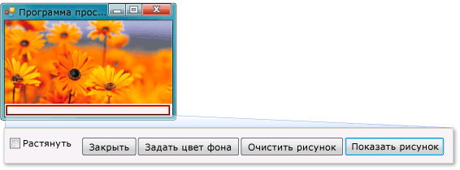

# Учебное руководство 1. Создание приложения для просмотра рисунков
В этом руководстве выполняется создание программы, которая загружает изображение из файла и отображает его в окне. Изучается процесс добавления в форму таких элементов управления, как кнопки, полей для изображений. Выполняется настройка свойств элементов управления. Изучается использование контейнеров для согласованного изменения размеров формы. Также начинается создание кода. Вы научитесь:  
  
-   Создайте новый проект.  
  
-   Тестировать (выполнить отладку) приложения.  
  
-   Добавлять в форму основные элементы управления, например, флажки и кнопки.  
  
-   Размещать элементы управления в форме с помощью разметки.  
  
-   Добавлять в форму диалоговые окна **Открыть файл** и **Цвет**.  
  
-   Создавать код с помощью IntelliSense и фрагментов кода.  
  
-   Создавать методы обработчика событий.  
  
 В результате ваша программа будет выглядеть так, как показано на следующем рисунке.  
  
   
Изображение результата, создаваемого в этом учебнике  
  
 Загрузить готовую версию примера можно на странице [Complete Picture Viewer tutorial sample](http://code.msdn.microsoft.com/Complete-Picture-Viewer-7d91d3a8) (Полный пример учебного руководства по созданию приложения для просмотра рисунков).  
  
 Видеоверсию этого раздела см. на следующих страницах: [How Do I: Create a Picture Viewer in Visual Basic?](http://go.microsoft.com/fwlink/?LinkId=205207) или [How Do I: Create a Picture Viewer in C#?](http://go.microsoft.com/fwlink/?LinkId=205198).  
  
> [!NOTE]
>  Эти видеоролики сняты с использованием более ранней версии Visual Studio, поэтому существуют небольшие различия в некоторых командах меню и других элементах пользовательского интерфейса. Однако концепции и процедуры аналогичны текущей версии Visual Studio. В этом руководстве приведены примеры как на Visual C#, так и на Visual Basic, поэтому обращайте внимание на информацию, которая относится к используемому вами языку программирования.  
>   
>  Чтобы просмотреть код на Visual Basic, перейдите на вкладку **VB** в верхней части блока кода; чтобы просмотреть код на Visual C#, перейдите на вкладку **C#**. Если вас интересует изучение Visual C++, см. раздел [Начало работы](../ide/getting-started-with-cpp-in-visual-studio.md) и [учебник по языку C++](http://www.cplusplus.com/doc/tutorial/).  
>   
>  Если вас интересует написание приложений для Магазина Windows на языках Visual C# или Visual Basic, см. раздел [Создание своего первого приложения Магазина Windows на C# или Visual Basic](http://msdn.microsoft.com/library/windows/apps/hh974581.aspx). Сведения о создании приложений для Магазина Windows на языке JavaScript см. в разделе [Создание вашего первого приложения Магазина Windows на JavaScript](http://msdn.microsoft.com/library/windows/apps/br211385.aspx).  
  
## Связанные разделы  
  
|Заголовок|Описание|  
|-----------|-----------------|  
|[Шаг 1. Создание проекта приложения Windows Forms](../ide/step-1-create-a-windows-forms-application-project.md)|Начало разработки программы с создания проекта приложения Windows Forms.|  
|[Шаг 2. Запуск программы](../ide/step-2-run-your-program.md)|Запуск программы приложения Windows Forms, которая была создана на предыдущем шаге.|  
|[Шаг 3. Настройка свойств формы](../ide/step-3-set-your-form-properties.md)|Изменение внешнего вида формы с помощью окна **Свойства**.|  
|[Шаг 4. Создание макета формы с помощью элемента управления TableLayoutPanel](../ide/step-4-lay-out-your-form-with-a-tablelayoutpanel-control.md)|Добавьте элемент управления `TableLayoutPanel` в форму.|  
|[Шаг 5. Добавление элементов управления в форму](../ide/step-5-add-controls-to-your-form.md)|Добавление в форму элемента управления `PictureBox` и элемента управления `CheckBox`. Добавление в форму кнопок.|  
|[Шаг 6. Присвоение имен элементам управления "Кнопка"](../ide/step-6-name-your-button-controls.md)|Назначение кнопкам понятных имен.|  
|[Шаг 7. Добавление компонентов диалогового окна в форму](../ide/step-7-add-dialog-components-to-your-form.md)|Добавление в форму компонента **OpenFileDialog** и компонента **ColorDialog**.|  
|[Шаг 8. Написание кода для обработчика событий кнопки "Показать рисунок"](../ide/step-8-write-code-for-the-show-a-picture-button-event-handler.md)|Создание кода с помощью средства IntelliSense.|  
|[Шаг 9. Проверка, комментирование и тестирование кода](../ide/step-9-review-comment-and-test-your-code.md)|Просмотр и тестирование кода. Добавление необходимых комментариев.|  
|[Шаг 10. Написание кода дополнительных кнопок и флажка](../ide/step-10-write-code-for-additional-buttons-and-a-check-box.md)|Создание кода с помощью IntelliSense для описания поведения кнопок и флажков.|  
|[Шаг 11. Запуск программы и изучение других возможностей](../ide/step-11-run-your-program-and-try-other-features.md)|Запуск программы и настройка цвета фона. Изучение других возможности, например, изменение цветов, шрифтов и границ.|
