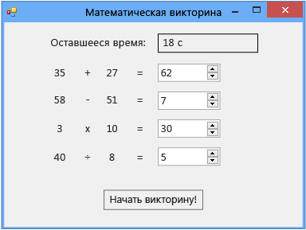

# Руководство 2. Создание ограниченной по времени математической головоломки
В этом учебнике вам предстоит создать головоломку, в которой игрок должен решить четыре арифметические задачи со случайными числами за определенное время. Вы научитесь:

-   Создавать случайные числа с помощью класса <xref:System.Random>.

-   Активировать события, чтобы они происходили в определенное время, с помощью элемента управления <xref:System.Windows.Forms.Timer>.

-   Управлять выполнением программы с помощью операторов `if else`.

-   Выполнять простые арифметические операции в коде.

 По завершении урока головоломка будет выглядеть так, как показано на следующем рисунке, но в ней будут использоваться другие числа.

  Головоломка, созданная в этом учебнике

## Ссылки на руководства

 Скачать готовую версию головоломки можно на странице с [полным примером руководства по созданию математической головоломки](http://code.msdn.microsoft.com/Complete-Math-Quiz-8581813c).

> [!NOTE]
>  В этом учебнике приведены примеры как на Visual C#, так и на Visual Basic, поэтому обращайте внимание на информацию, которая относится к используемому вами языку программирования.

## См. также

|Заголовок|Описание:|
|-----------|-----------------|
|[Шаг 1. Создание проекта и добавление в форму элементов управления Label](../ide/step-1-create-a-project-and-add-labels-to-your-form.md)|Начало работы: создание проекта, изменение свойств и добавление элементов управления `Label`.|
|[Шаг 2. Создание задачи на сложение случайных чисел](../ide/step-2-create-a-random-addition-problem.md)|Создание задачи на сложение с использованием класса `Random` для генерации случайных чисел.|
|[Шаг 3. Добавление таймера с обратным отсчетом](../ide/step-3-add-a-countdown-timer.md)|Добавление таймера обратного отсчета, чтобы головоломка была ограничена по времени.|
|[Шаг 4. Добавление метода CheckTheAnswer()](../ide/step-4-add-the-checktheanswer-parens-method.md)|Добавление метода для проверки того, правильный ли ответ на задачу ввел игрок.|
|[Шаг 5. Добавление обработчиков событий входа для элементов управления NumericUpDown](../ide/step-5-add-enter-event-handlers-for-the-numericupdown-controls.md)|Добавление обработчиков событий, чтобы сделать головоломку удобнее.|
|[Шаг 6. Добавление задачи на вычитание](../ide/step-6-add-a-subtraction-problem.md)|Добавление задачи на вычитание с генерацией случайных чисел, использованием таймера и проверкой правильности ответов.|
|[Шаг 7. Добавление задач на умножение и деление](../ide/step-7-add-multiplication-and-division-problems.md)|Добавление задач на умножение и деление с генерацией случайных чисел, использованием таймера и проверкой правильности ответов.|
|[Шаг 8. Настройка головоломки](../ide/step-8-customize-the-quiz.md)|Изучение других возможностей, например, изменение цветов и добавление подсказки.|
