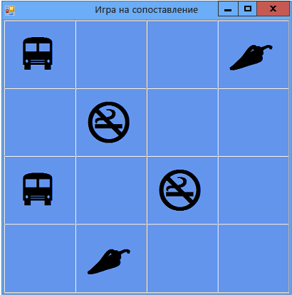

# Руководство 3. Создание соответствующей игры

В этом учебном руководстве вы создадите игру "Подбери пару!", в которой игрок должен подобрать пару скрытым значкам. Вы научитесь:

-   сохранять объекты, например значки, в объекте <xref:System.Collections.Generic.List%601>;

-   использовать цикл `foreach` в Visual C# или цикл `For Each` в Visual Basic для перебора элементов в списке;

-   отслеживать состояние формы с помощью ссылочных переменных;

-   создавать обработчик событий, который можно использовать для нескольких объектов;

-   создавать таймер, который отсчитывает время и вызывает событие ровно один раз после запуска.

После прохождения этого учебника ваша программа будет выглядеть так, как показано на следующем рисунке:

## Ссылки на руководства

Скачать готовую версию примера можно на странице с [полным примером руководства по созданию игры](http://code.msdn.microsoft.com/Complete-Matching-Game-4cffddba).

> [!NOTE]
> В этом учебном руководстве показаны примеры, как на Visual C#, так и на Visual Basic, поэтому обратите внимание на информацию, которая относится к используемому вами языку программирования.

Если у вас возникли затруднения или вопросы по программированию, попробуйте задать вопрос на одном из форумов MSDN. См. [форум по Visual Basic](http://social.msdn.microsoft.com/Forums/home?forum=vbgeneral) и [форум по Visual C#](http://social.msdn.microsoft.com/Forums/home?forum=csharpgeneral). Кроме того, вы можете найти отличные бесплатные учебные видеоматериалы. Дополнительные сведения о программировании на Visual Basic см. в руководстве по [разработке на Visual Basic для начинающих](http://channel9.msdn.com/Series/Visual-Basic-Development-for-Absolute-Beginners). Дополнительные сведения о программировании на Visual C# см. в руководстве по [разработке на Visual C# для начинающих](http://channel9.msdn.com/Series/C-Sharp-Fundamentals-Development-for-Absolute-Beginners).

## См. также

|Заголовок|Описание:|
|-----------|-----------------|
|[Шаг 1. Создание проекта и добавление таблицы в форму](../ide/step-1-create-a-project-and-add-a-table-to-your-form.md)|Начните с создания проекта и добавления элемента управления `TableLayoutPanel`, чтобы все элементы управления были правильно выровнены.|
|[Шаг 2. Добавление случайного объекта и списка значков](../ide/step-2-add-a-random-object-and-a-list-of-icons.md)|Добавление объектов `Random` и `List` для создания списка значков.|
|[Шаг 3. Назначение каждой метке случайного значка](../ide/step-3-assign-a-random-icon-to-each-label.md)|Случайным образом назначьте значки элементам управления `Label`, чтобы каждая игра отличалась от остальных.|
|[Шаг 4. Добавление к каждой метке обработчика событий щелчка мышью](../ide/step-4-add-a-click-event-handler-to-each-label.md)|Добавление обработчика события `Click`, изменяющего цвет метки, которую щелкнули.|
|[Шаг 5. Добавление ссылок на метки](../ide/step-5-add-label-references.md)|Добавление ссылочных переменных для отслеживания меток, которые щелкнули.|
|[Шаг 6. Добавление таймера](../ide/step-6-add-a-timer.md)|Добавьте таймер в форму, чтобы отслеживать время, прошедшее с начала игры.|
|[Шаг 7. Отображение пар значков](../ide/step-7-keep-pairs-visible.md)|Отмена исчезновения пар значков, если выбрана одинаковая пара.|
|[Шаг 8. Добавление метода для проверки выигрыша игрока](../ide/step-8-add-a-method-to-verify-whether-the-player-won.md)|Добавление метода `CheckForWinner()` для проверки, выиграл ли игрок.|
|[Шаг 9. Изучение других возможностей](../ide/step-9-try-other-features.md)|Изучение других возможностей, таких как изменение значков и цветов, добавление сетки и добавление звуков. Увеличение игрового поля и изменение настроек таймера.|
