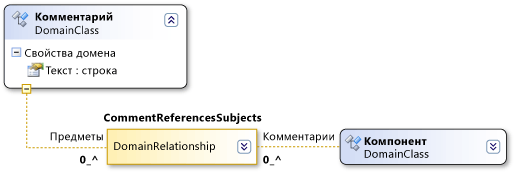

# Синтаксис пути домена
В определениях доменного языка для поиска определенных элементов в модели используется синтаксис типа XPath.

 Обычно работать с синтаксисом напрямую не нужно. Там, где он появляется в окне "Сведения" или "Свойства" доменного языка, можно щелкнуть стрелку вниз и использовать редактор пути. При этом путь появляется в поле формы только после того, как вы воспользуетесь редактором.

 Путь домена имеет следующий вид:

 *RelationshipName.PropertyName/! Роли*

 

 Синтаксис перебирает дерево модели. Например, доменная связь **CommentReferencesSubjects** на приведенной выше иллюстрации имеет **субъектов** роли. Сегмент пути **/! Subjectt** указывает, что путь заканчивается на элементах, доступных через **субъектов** роли.

 Каждый сегмент начинается с имени доменной связи. Если прохождение осуществляется от элемента к отношению, сегмент пути отображается как *Relationship.PropertyName*. Если переход проводится от связи к элементу, сегмент пути отображается как *связь /! RoleName*.

 Синтаксис пути разделяется косыми чертами. Каждый сегмент пути является переходом от элемента к связи (экземпляра отношения) или от связи к элементу. Сегменты пути часто отображаются в парах. Один сегмент пути представляет собой переход от элемента к связи, а следующий — от связи к элементу на другом конце. (Любая связь также может быть источником или целью самого отношения.)

 Имя, используемое для перехода от элемента к связи, является значением роли `Property Name`. Имя, используемое для перехода от связи к элементу, является именем целевой роли.

## См. также

- [Сведения о моделях, классах и отношениях](../modeling/understanding-models-classes-and-relationships.md)