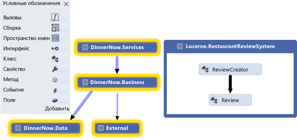
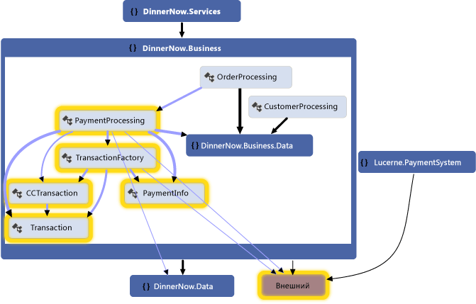
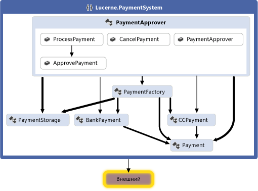
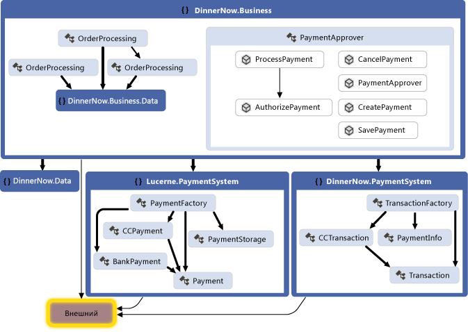
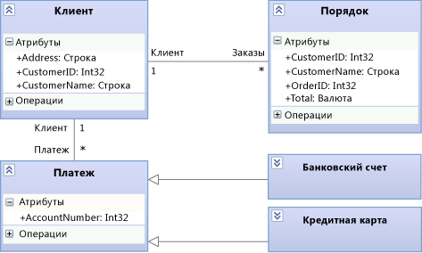

# Сценарий: изменение проекта с помощью визуализации и моделирования
Инструменты визуализации и моделирования в Visual Studio позволяют контролировать соответствие системы требованиям пользователей.
Используйте средства, такие как карты кода, схемы зависимостей и схемы классов, чтобы:

 Чтобы узнать, какие версии Visual Studio поддерживают каждую функцию, см. раздел [Поддержка версий для инструментов моделирования и архитектуры](../modeling/what-s-new-for-design-in-visual-studio.md#VersionSupport).

-   Уточнение требований пользователей и бизнес-процессов.

-   Визуализация и просмотр существующего кода.

-   Описание изменений в существующей системе.

-   Проверка соответствия системы требованиям.

-   Поддержание соответствия кода и структуры.

 Данное пошаговое руководство:

-   описывает, какую пользу эти инструменты могут принести проекту программного обеспечения;

-   показывает, как использовать эти инструменты независимо от подхода к разработке, и содержит пример сценария.

 Дополнительные сведения об этих инструментах и поддерживаемых ими сценариях см. в следующих разделах.

-   [Анализ и моделирование архитектуры](../modeling/analyze-and-model-your-architecture.md)

-   [Визуализация кода](../modeling/visualize-code.md)

##   Общие сведения о сценарии
 В этом сценарии описываются эпизоды из жизненных циклов разработки программного обеспечения для двух вымышленных компаний: Dinner Now и Lucerne Publishing. Dinner Now предоставляет услуги доставки еды по Сиэтлу с заказом через Интернет. Клиенты заказывают еду и производят оплату на веб-сайте компании Dinner Now, после чего заказы направляются в соответствующий местный ресторан для выполнения доставки. Нью-йоркская компания Lucerne Publishing работает в нескольких областях с использованием и без использования Интернета. Например, у нее есть веб-сайт, на котором клиенты могут размещать отзывы о ресторанах.

 Недавно компания Lucerne приобрела компанию Dinner Now и хочет произвести указанные ниже изменения.

-   Объединить веб-сайты, добавив на портал компании Dinner Now возможность просматривать отзывы о ресторанах.

-   Заменить платежную систему компании Dinner Now системой компании Lucerne.

-   Расширить сферу предоставления услуг компании Dinner Now на весь регион.

 В компании Dinner Now используются методологии SCRUM и экстремального программирования (XP). У них очень высокий объем протестированного кода и очень мало неподдерживаемого кода. Компания минимизирует риски, создавая небольшие, но работающие версии системы и постепенно добавляя функциональные возможности. Разработка кода выполняется путем коротких и частых итераций. Это позволяет уверенно вносить изменения, часто выполнять рефакторинг кода и избегать подхода с большими затратами на предварительное планирование структуры (BDUF).

 Компания Lucerne использует набор намного более масштабных и комплексных систем, некоторым из которых более 40 лет. Компания с большой осторожностью подходит к внесению изменений из-за сложности и большого объема кода прежних версий. Она придерживается более строгого процесса разработки, предпочитая создавать подробные решения и документировать структуру и изменения, вносимые в процессе разработки.

 Обе команды прибегают к схемам моделирования в Visual Studio, которые помогают им разрабатывать системы, соответствующие потребностям пользователей. Для планирования и организации, а также для управления своей работой они используют Team Foundation Server и другие инструменты.

 Дополнительные сведения о работе с Team Foundation Server см. в указанных ниже разделах.

-   [Планирование и отслеживание работы](#PlanningTracking)

-   [Тестирование, проверка и возврат в обновленного кода](#TestValidateCheckInCode)

##   Роли архитектуры и схем моделирования в разработке программного обеспечения
 В следующей таблице описываются роли, которые эти инструменты могут играть на различных стадиях жизненного цикла разработки программного обеспечения.

||**Моделирование требований пользователей**|**Моделирование бизнес-процессов**|**Архитектура и дизайн системы**|**Визуализация и просмотр кода**|**Проверка**|
|------|------------------------------------|-----------------------------------|--------------------------------------|------------------------------------------|----------------------|
|Схема доменного языка (DSL)|Да|Да|Да|||
|Диаграмма зависимостей, проверка слоев|||Да|Да|Да|
|Карта кода|||Да|Да|Да|
|Конструктор классов (на основе кода)||||Да||

Зависимость схем, необходимо создать проект моделирования в рамках существующего решения или создать новую. Эти схемы должны создаваться в проекте моделирования.
Элементы на схемах зависимостей, расположены в проекте моделирования, но они не хранятся в общей модели. Карты кода и схемы классов .NET, созданные на основе кода, обычно в проекте моделирования не размещаются.

 Пример

-   [Создание схем зависимостей на основе кода](../modeling/create-layer-diagrams-from-your-code.md)

-   [Сопоставление зависимостей во всех решениях](../modeling/map-dependencies-across-your-solutions.md)

-   [Практическое руководство. Добавление схем классов в проекты (конструктор классов)](../ide/how-to-add-class-diagrams-to-projects-class-designer.md)

-   [SDK моделирования для Visual Studio — доменные языки](../modeling/modeling-sdk-for-visual-studio-domain-specific-languages.md)

[!INCLUDE[modeling_sdk_info](includes/modeling_sdk_info.md)]

 Обе команды также используют проверку зависимостей позволяет контролировать соответствие разрабатываемого кода дизайну.

 Пример

-   [Поддержание соответствия кода и дизайна](#ValidatingCode)

-   [Описание логической архитектуры: схемы зависимостей](#DescribeLayers)

-   [Проверка кода по схемам зависимостей](../modeling/validate-code-with-layer-diagrams.md)

    > [!NOTE]
    >  Некоторые версии Visual Studio поддерживает проверку зависимостей и только для чтения версии карт кода для визуализации и моделирования. Чтобы узнать, какие версии Visual Studio поддерживают эту функцию, см. раздел [Поддержка версий для инструментов моделирования и архитектуры](../modeling/what-s-new-for-design-in-visual-studio.md#VersionSupport).

##   Выяснение и передача сведений о системе
 Схемы моделирования в Visual Studio можно использовать по мере необходимости или в соответствии с выбранным подходом к разработке, поскольку конкретный порядок их применения не установлен. Обычно за время работы над проектом команды обращаются к своим моделям итерационно и многократно. Каждая схема обеспечивает определенные средства, помогающие понять, описать и передать различные аспекты разрабатываемой системы.

 Компании Dinner Now и Lucerne используют схемы как общий язык для обмена данными друг с другом и с участниками проекта. Например, в компании Dinner Now схемы используются для выполнения следующих задач.

-   Визуализация существующего кода.

-   Обмен данными с компанией Lucerne о новых или обновленных пользовательских историях.

-   Выявление изменений, необходимых для поддержки новых или обновленных пользовательских историй.

 В компании Lucerne схемы используются для выполнения следующих задач:

-   ознакомление с бизнес-процессом компании Dinner Now;

-   понимание дизайна системы;

-   обмен данными о новых или обновленных пользовательских требованиях с компанией Dinner Now;

-   документирование обновлений системы.

 Схемы интегрируются в Team Foundation Server, что дает командам возможность легко планировать, выполнять и отслеживать свою работу. Например, с помощью моделей команды устанавливают тестовые случаи и оценивают свою работу. Чтобы контролировать прогресс и обеспечивать соответствие системы требованиям пользователей, компания Lucerne связывает рабочие элементы Team Foundation Server с элементами модели. Например, сопоставление вариантов использования с рабочими элементами тестовых случаев позволяет проследить за тем, чтобы варианты использования выполнялись после прохождения всех тестов.

 Перед тем как команд изменения, проверяют код по тестам и дизайну, запустив построения, проверки зависимостей и автоматическими тестами. Это помогает предотвратить противоречия между обновленным кодом и дизайном, а также нарушение работавших прежде функциональных возможностей.

 Пример

-   [Выявление изменений в существующей системе](#DeterminingChanges)

-   [Keeping code consistent with the design](#ValidatingCode)

-   [Общие рекомендации по созданию и использованию моделей](#GeneralTips)

-   [Планирование и отслеживание работы](#PlanningTracking)

-   [Тестирование, проверка и возврат в обновленного кода](#TestValidateCheckInCode)

###   Identifying Changes to the Existing System
 Компания Dinner Now должна оценить свои расходы на выполнение нового требования. Частично они зависят от того, как повлияет это изменение на другие части системы. Для этой цели один из разработчиков компании Dinner Now создает следующие карты кода и схемы из существующего кода.

|**Карта кода или схема**|**Что показывает**|
|------------------------|---------------|
|*Карта кода*   Пример   -   [Сопоставление зависимостей в решениях](../modeling/map-dependencies-across-your-solutions.md) -   [Просмотр и реорганизация карт кода](../modeling/browse-and-rearrange-code-maps.md) -   [Настройка карт кода путем редактирования DGML-файлов](../modeling/customize-code-maps-by-editing-the-dgml-files.md)|Зависимости и другие отношения в коде.   Например, для начала компания Dinner Now может изучить карты кода сборок и собрать общие сведения о сборках и их зависимостях, а также проанализировать карты и рассмотреть пространства имен и классы в этих сборках.   Кроме того, компания Dinner Now может создать карты для изучения конкретных областей и других видов отношений в коде. Для поиска и отбора соответствующих областей и отношений используется обозреватель решений.|
|*Схема классов на основе кода*   См. раздел [How to: Add Class Diagrams to Projects (Class Designer)](../ide/how-to-add-class-diagrams-to-projects-class-designer.md).|Существующие классы в коде|

 Предположим, разработчик создает карту кода и акцентирует внимание на тех областях, которые будут затронуты новым сценарием. Эти области выбираются и выделяются на карте.

 

 **Карта кода пространства имен**

 Разработчик разворачивает выбранные пространства имен, чтобы отобразить их классы, методы и отношения.

 

 **Развернутая карта кода пространства имен с показанными связями между группами**

 Разработчик изучает код и определяет, какие классы и методы будут затронуты. Чтобы увидеть последствия каждого изменения, сразу после него создайте карты кодов заново. В разделе [визуализация кода](../modeling/visualize-code.md).

 Чтобы описать изменения в других частях системы, таких как компоненты или взаимодействия, команда может нарисовать эти элементы на доске. Указанные ниже схемы в Visual Studio также позволят обеим командам фиксировать и изучать детали и управлять полученной информацией.

|**Схемы**|**Что описывает**|
|------------------|-------------------|
|*Схема классов на основе кода*   См. раздел [How to: Add Class Diagrams to Projects (Class Designer)](../ide/how-to-add-class-diagrams-to-projects-class-designer.md).|Существующие классы в коде.|

###   Поддержание соответствия кода и дизайна
 Компания Dinner Now должна удостовериться, что обновленный код соответствует дизайну. Она создает схемы зависимостей, описывающие слои функциональных возможностей в системе, указывает разрешенные зависимости между ними и связывает артефакты решения с этими слоями.

|**Схема**|**Что описывает**|
|-----------------|-------------------|
|*Диаграмма зависимостей*   Пример   -   [Создание схемы зависимостей в коде](../modeling/create-layer-diagrams-from-your-code.md) -   [Схемы зависимостей: Справочник](../modeling/layer-diagrams-reference.md) -   [Схемы зависимостей: рекомендации](../modeling/layer-diagrams-guidelines.md) -   [Проверка кода по схемам зависимостей](../modeling/validate-code-with-layer-diagrams.md)|Логическая архитектура кода.   Диаграмма зависимостей упорядочивает и сопоставляет артефакты в [!INCLUDE[vsprvs](../code-quality/includes/vsprvs_md.md)] решении в абстрактные группы, называемые *слои*. Эти слои описывают роли, задачи или функции, выполняемые этими артефактами в системе.   Схемы слоев позволяют описать целевой дизайн системы и проверить создаваемый код на соответствие этому дизайну.   Чтобы создать слои, перетащите элементы из обозревателя решений, карт кода, представления классов и обозревателя объектов. Чтобы нарисовать новые слои, используйте панель элементов или щелкните поверхность схемы правой кнопкой мыши.   Чтобы просмотреть существующие зависимости, щелкните правой кнопкой мыши поверхность схемы слоев и выберите пункт **Создать зависимости**. Чтобы указать целевые зависимости, нарисуйте новые зависимости.|

 Например на следующей диаграмме зависимостей описывает зависимости между слоями и количеством артефактов, связанных с каждым слоем:

 

 **Диаграмма зависимостей**

 Чтобы убедиться в том, что не возникает конфликтов с дизайном во время разработки кода, команды используют проверку зависимостей при сборках, выполняемым на Team Foundation Build. Они также создают пользовательскую задачу MSBuild, которая требует проверки зависимостей их при операциях возврата. Для сбора ошибок проверки используются отчеты о сборках.

 Пример

-   [Определите процесс сборки](http://msdn.microsoft.com/Library/61593e10-d24b-492f-b19a-af4d85abea6b)

-   [Использование процесса сборки с условным возвратом для проверки изменений](http://msdn.microsoft.com/Library/9cfc8b9c-1023-40fd-8ab5-1b1bd9c172ec)

-   [Настройка шаблона процесса сборки](http://msdn.microsoft.com/Library/b94c58f2-ae6f-4245-bedb-82cd114f6039)

###   General Tips for Creating and Using Models

-   Большинство схем состоит из узлов, соединенных линиями. Для каждого типа схемы области элементов предусмотрены различные виды узлов и линий.

     Чтобы открыть панель элементов, в меню **Вид** выберите пункт **Панель элементов**.

-   Чтобы создать узел, перетащите его с панели элементов на схему. Узлы некоторых видов необходимо перетаскивать на существующие узлы. Например, на схеме компонентов новый порт должен добавляться к существующему компоненту.

-   Чтобы создать строку или соединение, щелкните соответствующий элемент на панели элементов и выберите сначала исходный, а затем целевой узел. Некоторые линии можно создавать только между узлами определенных видов. Указатель мыши, наведенный на потенциальный исходный или целевой узел, показывает, можно ли создать соединение.

###   Planning and Tracking Work
 Схемы моделирования в Visual Studio интегрированы с Team Foundation Server, что упрощает планирование, управление и отслеживание работы. Обе команды используют модели для определения тестовых случаев и задач разработки, а также для оценки своей работы. Компания Lucerne создает и связывает рабочие элементы Team Foundation Server с элементами модели, такими как варианты использования или компоненты. Это позволяет контролировать процесс и выполнять трассировку работы вплоть до требований пользователей. Такой подход помогает следить за тем, чтобы изменения продолжали удовлетворять этим требованиям.

 В ходе работы команды обновляют свои рабочие элементы, указывая, какое время они затратили на выполнение своих задач. Кроме того, они контролируют состояние своей работы и сообщают о нем с помощью следующих функций Team Foundation Server.

-   Ежедневные *отчеты о выработке* , показывающие, будет ли запланированная работа завершена за ожидаемое время. Для контроля за ходом устранения ошибок они создают в Team Foundation Server и другие отчеты подобного рода.

-   *Лист итераций* , в котором для контроля и распределения рабочей нагрузки между членами команды используется Microsoft Excel. Этот лист связан с Team Foundation Server и служит основой для обсуждений во время регулярных совещаний по ходу выполнения работы.

-   *Панель мониторинга разработки* , в которой для предоставления команде важной информации о проекте используется Office Project.

 Пример

-   [Отслеживание работы с помощью Visual Studio Team Services или Team Foundation Server](http://msdn.microsoft.com/Library/52aa8bc9-fc7e-4fae-9946-2ab255ca7503)

-   [Диаграммы, панели мониторинга и отчеты для Visual Studio ALM](http://msdn.microsoft.com/Library/1f28ba6c-c5e5-46d3-9209-ede24ae78e48)

-   [Создание невыполненной работы и задач с помощью Project](http://msdn.microsoft.com/Library/be5cef4f-755f-4ffe-8dd7-876d1e02c330)

###   Тестирование, проверка и возврат кода
 Выполнив очередную задачу, команды возвращают свой код в систему управления версиями Team Foundation и получают от Team Foundation Server напоминания, если забудут это сделать. Прежде чем Team Foundation Server примет возвращенные результаты, команды должны провести модульные тесты и проверку зависимостей для проверки кода по тестовым случаям и на соответствие проекту. Они используют Team Foundation Server для выполнения сборок, автоматических модульных тестов и проверки зависимостей регулярно. Это позволяет им контролировать соответствие кода перечисленным ниже критериям.

-   Он работает.

-   Он не нарушает работу ранее работавшего кода.

-   Он не противоречит дизайну.

 Компания Dinner Now располагает большим набором автоматических тестов, которые могут использоваться компанией Lucerne, так как почти все эти тесты по-прежнему применимы. Кроме того, компания Lucerne может переработать эти тесты и добавить новые тесты для проверки добавленных функциональных возможностей. Обе компании используют также Visual Studio для выполнения ручных тестов.

 Чтобы обеспечить соответствие кода дизайну, команды настраивают свои сборки в Team Foundation Build, включая проверку зависимостей. Если возникают какие-либо конфликты, создается отчет с подробными сведениями.

 Пример

-   [Тестирование приложения](https://www.visualstudio.com/docs/test/overview)

-   [Проверка системы в ходе разработки](../modeling/validate-your-system-during-development.md)

-   [Использование управления версиями](http://go.microsoft.com/fwlink/?LinkID=525605)

-   [Сборка и выпуск](/vsts/build-release/index)

##   Updating the System Using Visualization and Modeling
 Компаниям Lucerne и Dinner Now необходимо объединить свои платежные системы. В следующих разделах показано, как схемы моделирования в Visual Studio помогают им выполнить эту задачу.

-   [Визуализация существующего кода: карты кода](#VisualizeCode)

-   [Определение глоссария типов: схемы классов](#DefineClasses)

-   [Описание логической архитектуры: схемы зависимостей](#DescribeLayers)

 Пример

-   [Визуализация кода](../modeling/visualize-code.md)

-   [Использование моделей в процессе разработки](../modeling/use-models-in-your-development-process.md)

-   [Моделирование архитектуры приложения](../modeling/model-your-app-s-architecture.md)

###   Визуализация существующего кода: карты кода
 Карты кода показывают текущую организацию и отношения в коде. Элементы отображаются на карте в виде *узлов* , а отношения — в виде *связей*. Карты кода помогают выполнять следующие виды задач:

-   изучение незнакомого кода;

-   понимание области и способа влияния предложенного изменения на имеющийся код;

-   Поиск проблемных областей, естественным зависимостей или шаблонов, а также других областей, которые может выиграть от улучшения.

 Например, компания Dinner Now должна оценить затраты на обновление компонента PaymentProcessing. Частично они зависят от того, как повлияет это изменение на другие части системы. Чтобы разобраться в этом вопросе, один из разработчиков компании Dinner Now создает карты кода и выделяет те области, которые могут быть затронуты данным изменением.

 На следующей карте кода показаны зависимости между классом PaymentProcessing и выделенными частями системы компании Dinner Now.

 

 **Карта кода для платежной системы компании Dinner Now**

 Разработчик изучает карту, развернув класс PaymentProcessing и выбрав его члены для просмотра потенциально затрагиваемых областей.

 

 **Методы внутри класса PaymentProcessing и их зависимости**

 Для изучения классов, методов и зависимостей платежной системы компании Lucerne создается карта кода, представленная ниже. Команда выясняет, что для взаимодействия с другими частями компании Dinner Now система компании Lucerne может потребовать доработки.

 

 **Карта кода для платежной системы компании Lucerne**

 Команды совместно определяют, какие изменения необходимы для интеграции двух систем. Они решают произвести рефакторинг части кода, чтобы упростить его обновление. Класс PaymentApprover будет перемещен в пространство имен DinnerNow.Business и потребует несколько новых методов. Классы Dinner Now, обрабатывающие транзакции, будут иметь собственное пространство имен. Команды создают и используют рабочие элементы для планирования, упорядочивания и отслеживания своей работы. Там, где это полезно, они связывают рабочие элементы с элементами модели.

 После реорганизации кода команды создают новую карту кода для просмотра обновленной структуры и отношений.

 

 **Карта кода после реорганизации**

 Карта кода показывает, что класс PaymentApprover теперь перемещен в пространство имен DinnerNow.Business и имеет несколько новых методов. Классы транзакций компании Dinner Now теперь имеют собственное пространство имен PaymentSystem, что упрощает последующую работу с кодом.

#### Создание карты кода

-   Для быстрого обзора исходного кода создайте карту кода, выполнив следующие действия.

     В меню **Архитектура** выберите пункт **Сформировать карту кода для решения**.

     Для быстрого обзора скомпилированного кода создайте пустую карту кода и перетащите на нее файлы сборок или двоичные файлы.

-   Чтобы изучить определенный код или элементы решения, выберите элементы и отношения, которые нужно визуализировать, в обозревателе решений. После этого можно добавить выбранные элементы в существующую карту кода или создать новую. В разделе [сопоставление зависимостей в решениях](../modeling/map-dependencies-across-your-solutions.md).

-   Чтобы было удобнее работать с картой кода, измените ее макет в соответствии с видами задач, которые нужно выполнить.

     Например, для визуализации слоев в коде выберите древовидную структуру. В разделе [Просмотр и переупорядочение карт кода](../modeling/browse-and-rearrange-code-maps.md).

#### Сводка. Преимущества карт кода
 Карты кода помогают в выполнении следующих задач:

-   изучение организации и отношений в имеющемся коде;

-   выявление областей, на которые может повлиять предложенное изменение;

-   поиск проблемных областей, шаблонов, слоев или других областей, которые можно улучшить, сделав код удобнее для обслуживания, изменения и повторного использования.

#### Отношение к другим схемам

|**Схема**|**Что описывает**|
|-----------------|-------------------|
|Диаграмма зависимостей|Логическая архитектура системы. Используйте проверку зависимостей, чтобы убедиться в том, что кода дизайну.   Помогают определить существующие dependencys или предполагаемого dependencys, создайте карту кода и сгруппируйте связанные элементы. Чтобы создать диаграмму зависимостей, см.:   -   [Создание схемы зависимостей в коде](../modeling/create-layer-diagrams-from-your-code.md) -   [Схемы зависимостей: рекомендации](../modeling/layer-diagrams-guidelines.md)|
|Схема классов на основе кода|Существующие в коде классы для конкретного проекта.   Для визуализации и изменения существующего в коде класса используйте конструктор классов.   См. раздел [How to: Add Class Diagrams to Projects (Class Designer)](../ide/how-to-add-class-diagrams-to-projects-class-designer.md).|

###   Определение глоссария типов: схемы классов
 Схемы классов определяют участвующие в системе сущности, условия или концепции, а также их отношения друг с другом. Например, в процессе разработки эти схемы позволяют описать атрибуты и операции для каждого класса, независимо от языка или стиля его реализации.

 Чтобы помочь компании Lucerne описать и обсудить сущности, участвующие в варианте использования «Обработка платежа», была создана следующая схема классов.

 

 **Сущности обработки платежа на схеме классов**

 Эта схема показывает, что у клиента может быть много заказов и много способов оплаты. BankAccount и CreditCard наследуют от класса Payment.

 В процессе разработки компания Lucerne использует следующую схему классов для описания и обсуждения деталей каждого класса.

 

 **Подробности обработки платежа на схеме классов**

#### Создание схемы классов
 Схема классов имеет следующие основные составляющие:

-   типы, такие как классы, интерфейсы и перечисления.

    -   *Класс* — это определение объектов, совместно обладающих определенными характеристиками структуры и поведения.

    -   *Интерфейс* — это определение части видимого внешне поведения объекта.

    -   *Перечисление* — это классификатор, содержащий список литеральных значений.

-   *Атрибуты* — это значения определенного типа, которые описывают каждый экземпляр *классификатора*. Классификатор — это общее имя для типов, компонентов, вариантов использования и даже субъектов.

-   *Операции* — это методы или функции, которые могут выполняться экземплярами классификатора.

-   *Ассоциация* — это обозначение отношения между двумя классификаторами.

    -   *Агрегат* — это ассоциация, указывающая на общее владение между классификаторами.

    -   *Композиция* — это ассоциация, указывающая на отношение целого и части между классификаторами.

     Чтобы показать агрегаты или композиции, задайте для ассоциации свойство **Агрегат** . **Общий** указывает на агрегаты, а **Составной** — на композиции.

-   *Зависимость* указывает, что изменение определения одного классификатора может привести к изменению определения другого классификатора.

-   *Обобщение* указывает, что определенный классификатор наследует часть своего определения от общего классификатора. *Реализация* указывает, что класс реализует операции и атрибуты, предоставляемые интерфейсом.

     Для создания таких отношений используется инструмент **Наследование** . Реализация может быть также представлена как *интерфейс без описания операций*.

-   *Пакеты* — это группы классификаторов, ассоциаций, линий жизни, компонентов и других пакетов. Отношения типа*Импорт* указывают, что один пакет включает все определения другого пакета.

 В качестве отправной точки для изучения и обсуждения существующих классов можно в конструкторе классов создать схему классов на основе кода.

-   [Практическое руководство. Добавление схем классов в проекты (конструктор классов)](../ide/how-to-add-class-diagrams-to-projects-class-designer.md)

#### Сводка. Преимущества схем классов
 Схемы классов помогают определить следующее:

-   общий глоссарий терминов, используемых при обсуждении потребностей пользователей и сущностей, участвующих в системе; В разделе [моделирование требований пользователей](../modeling/model-user-requirements.md).

-   типы, используемые частями системы (например, компонентами), независимо от их реализации; В разделе [модели архитектуры приложения](../modeling/model-your-app-s-architecture.md).

-   отношения между типами (такие как зависимости). Например, можно показать, что один тип может быть связан с несколькими экземплярами другого типа.

#### Отношение к другим схемам

|**Схема**|**Описание**|
|-----------------|---------------------|
|Диаграмма зависимостей|Определение логической архитектуры системы относительно классов.   Используйте проверку зависимостей, чтобы убедиться в том, что кода дизайну.   Пример   -   [Создание схемы зависимостей в коде](../modeling/create-layer-diagrams-from-your-code.md) -   [Схемы зависимостей: Справочник](../modeling/layer-diagrams-reference.md) -   [Схемы зависимостей: рекомендации](../modeling/layer-diagrams-guidelines.md) -   [Проверка кода по схемам зависимостей](../modeling/validate-code-with-layer-diagrams.md)|
|Карта кода|Визуализация организации и отношений в имеющемся коде.   Для идентификации классов, их отношений и методов создайте карту кода, показывающую эти элементы.   Пример   -   [Сопоставление зависимостей в решениях](../modeling/map-dependencies-across-your-solutions.md)|

###   Описание логической архитектуры: схемы зависимостей
 Схемы зависимостей описывают логическую архитектуру системы, упорядочивая артефакты в решении в абстрактные группы или *слои*. Артефактами могут быть различные сущности, такие как пространства имен, проекты, методы и т. п. Слои представляют и описывают роли или задачи, выполняемые артефактами в системе. Включив проверку слоев в операции построения и возврата, можно обеспечить соответствие кода его дизайну.

 Чтобы обеспечить соответствие кода дизайну, компании Dinner Now и Lucerne используйте на следующей диаграмме зависимостей для проверки кода по мере его разработки:

 

 **Интегрированные диаграмму зависимостей для компании Dinner Now с компанией Lucerne**

 Слои на этой схеме связаны с соответствующими артефактами решений компаний Dinner Now и Lucerne. Например, слой «Бизнес» связан с пространством имен DinnerNow.Business и его членами, в число которых теперь входит класс PaymentApprover. Слой «Доступ к ресурсам» связан с пространством имен DinnerNow.Data. Стрелки, или *зависимости*, указывают, что функциональность слоя «Доступ к ресурсам» может использоваться только слоем «Бизнес». По мере того как команды обновляют свой код, регулярно выполняется проверка слоев для выявления возникающих конфликтов и их быстрого устранения командами.

 Команды совместно осуществляют пошаговую интеграцию и тестирование двух систем. Прежде чем начинать работать с PaymentProcessing, команды убеждаются, что класс PaymentApprover и остальная часть системы Dinner Now успешно работают друг с другом.

 На следующей карте кода показаны новые вызовы между системой компании Dinner Now и классом PaymentApprover.

 

 **Карта кода с обновленными вызовами методов**

 Убедившись в правильности работы системы, команда Dinner Now исключает код PaymentProcessing, переводя его в комментарии. Отчеты о проверке слоев не содержат ошибок, полученная карта кода показывает, что зависимостей от PaymentProcessing больше нет.

 

 **Карта кода без класса PaymentProcessing**

#### Создание схемы зависимостей
 Диаграмма зависимостей имеет следующие основные составляющие:

-   *Слои* описывают логические группы артефактов.

-   *Связь* — это ассоциация между слоем и артефактом.

     Чтобы создать слои из артефактов, перетащите элементы из обозревателя решений, карт кода, представления классов или обозревателя объектов. Чтобы создать новые слои, а затем связать их с артефактами, воспользуйтесь панелью элементов или щелкните поверхность системы правой кнопкой мыши, чтобы создать слои, и перетащите элементы на эти слои.

     Число на слое обозначает количество связанных с этим слоем артефактов. Артефактами могут быть пространства имен, проекты, классы, методы и т. п. Число артефактов в слое следует интерпретировать с учетом следующих факторов.

    -   Если слой связан с артефактом, содержащим другие артефакты, но слой не связан с другими артефактами напрямую, то число включает только связанный артефакт. Однако для анализа в ходе проверки слоя включаются другие артефакты.

         Например, если слой связан с одним пространством имен, то число связанных артефактов равно 1, даже если пространство имен содержит классы. Если слой также связан с каждым классом в пространстве имен, то число будет включать эти связанные классы.

    -   Если слой содержит другие слои, связанные с артефактами, то слой-контейнер также связан с этими артефактами, даже если число в слое-контейнере не включает эти артефакты.

     Для просмотра связанных со слоем артефактов, щелкните правой кнопкой мыши зависимость и нажмите кнопку **Просмотр ссылок** Открытие **обозреватель слоев**.

-   *Зависимость* указывает, что один слой может использовать функции другого слоя, но не наоборот. *Двунаправленная зависимость* указывает, что один слой может использовать функции другого слоя и наоборот.

     Чтобы отобразить существующие зависимости на схеме зависимостей, щелкните правой кнопкой мыши поверхность схемы и нажмите кнопку **создать зависимости**. Чтобы описать требуемые зависимости, создайте новые зависимости.

 Пример

-   [Создание схем зависимостей на основе кода](../modeling/create-layer-diagrams-from-your-code.md)

-   [Схемы зависимостей: справочные материалы](../modeling/layer-diagrams-reference.md)

-   [Схемы зависимостей: рекомендации](../modeling/layer-diagrams-guidelines.md)

-   [Проверка кода по схемам зависимостей](../modeling/validate-code-with-layer-diagrams.md)

#### Сводка: Преимущества схем зависимостей
 Схемы зависимостей, чтобы:

-   Описание логической архитектуры системы в соответствии с функциональными возможностями ее артефактов.

-   Обеспечение соответствия разрабатываемого кода указанному дизайну.

#### Отношение к другим схемам

|**Схема**|**Описание**|
|-----------------|---------------------|
|Карта кода|Визуализация организации и отношений в имеющемся коде.   Чтобы создать слои, сформируйте карту кода, а затем сгруппируйте элементы на карте как потенциальные слои. Перетащите группы с карты к схеме зависимостей.   Пример   -   [Сопоставление зависимостей в решениях](../modeling/map-dependencies-across-your-solutions.md) -   [Просмотр и реорганизация карт кода](../modeling/browse-and-rearrange-code-maps.md)|

## Внешние ресурсы

|**Категория**|**Links**|
|------------------|---------------|
|**Форумы**|-   [Средства моделирования и визуализации Visual Studio](http://go.microsoft.com/fwlink/?LinkId=184720) -   [Пакет SDK для моделирования и визуализации в Visual Studio (инструменты DSL)](http://go.microsoft.com/fwlink/?LinkId=184721)|

## См. также

- [Визуализация кода](../modeling/visualize-code.md)
- [Использование моделей в процессе разработки](../modeling/use-models-in-your-development-process.md)
- [Использование моделей в гибкой разработки](http://msdn.microsoft.com/592ac27c-3d3e-454a-9c38-b76658ed137f)
- [Проверка системы в ходе разработки](../modeling/validate-your-system-during-development.md)
