# Использование карт кода для отладки приложений
[!INCLUDE[vs2017banner](../code-quality/includes/vs2017banner.md)]

Карты кода помогают не запутаться в больших базах кода, малознакомом или устаревшем коде.  Например, при отладке может потребоваться просмотреть код во множестве файлов и проектов.  Используйте карты кода для перехода между частями кода и просмотра связей между ними.  Таким образом, вам не нужно держать весь этот код у себя в голове или рисовать отдельную схему.  Карты кода помогут вспомнить особенности кода в случае перерыва в работе.  
  
 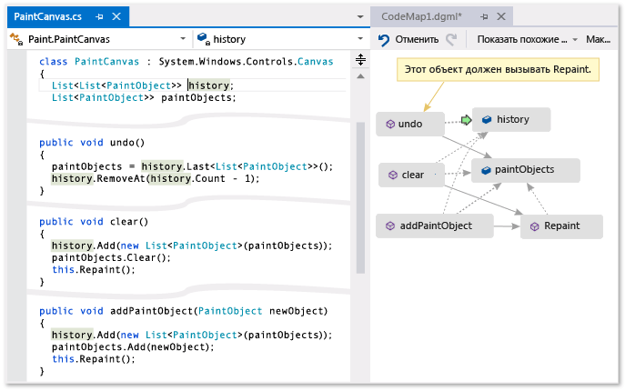  
  
 **Зеленая стрелка показывает нахождение курсора в редакторе.**  
  
 Сведения о командах и действиях, которые можно использовать при работе с картами кода, см. в разделе [Просмотр и реорганизация карт кода](../modeling/browse-and-rearrange-code-maps.md).  
  
## Определение проблемы  
 Предположим, что возникла ошибка в программе рисования, над которой вы работаете.  Чтобы воспроизвести ошибку, необходимо открыть решение в Visual Studio и нажать клавишу **F5** для начала отладки.  
  
 При рисовании линии и выборе команды **Отменить последнюю линию** ничего не происходит, пока не будет нарисована следующая линия.  
  
 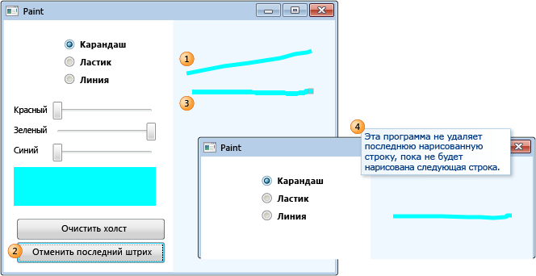  
  
 Таким образом, вы начинаете поиск ошибки с поиска метода `Undo`.  Он находится в классе `PaintCanvas`.  
  
   
  
## Запуск сопоставления кода  
 Теперь можно начинать сопоставление метода `undo` и его отношений.  В редакторе кода добавьте метод `undo` и поля, на которые он ссылается, в новую карту кода.  При создании новой карты потребуется какое\-то время на индексацию кода.  Благодаря этому последующие операции выполняются быстрее.  
  
   
  
> [!TIP]
>  Зеленым цветом выделены последние элементы, добавленные на карту.  Зеленая стрелка указывает положение курсора в коде.  Стрелки между элементами представляют различные отношения.  Можно получить дополнительные сведения об элементах на карте, наведя на них указатель мыши и изучив подсказки.  
  
 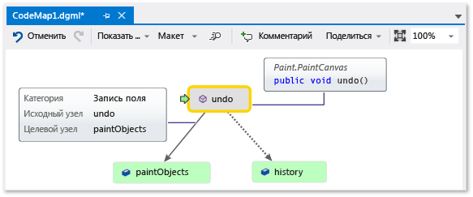  
  
## Навигация и просмотр кода из сопоставления  
 Чтобы просмотреть определение кода для каждого поля, дважды щелкните поле на карте или выберите поле и нажмите клавишу **F12**.  Зеленая стрелка перемещается между элементами на карте.  Курсор в редакторе кода также перемещается автоматически.  
  
   
  
 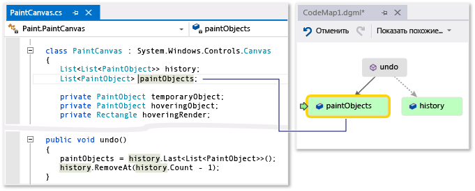  
  
> [!TIP]
>  Кроме того, для перемещения зеленой стрелки на карте можно перемещать курсор в редакторе кода.  
  
## Отношения между частями кода  
 Теперь необходимо узнать, какой другой код взаимодействует с полями `history` и `paintObjects`.  Можно добавить все методы, которые ссылаются на эти поля, на карту.  Это можно сделать из карты или из редактора кода.  
  
 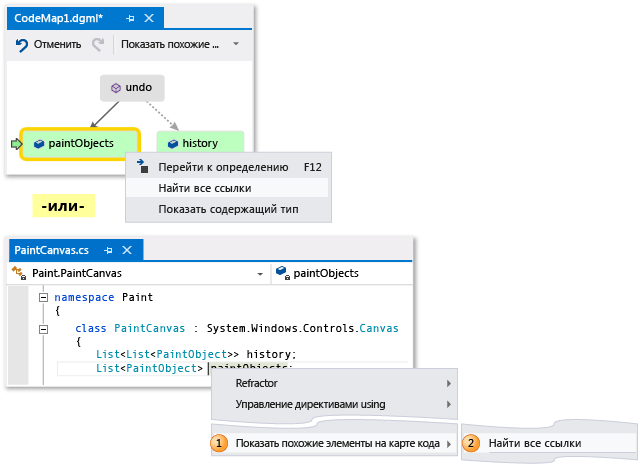  
  
   
  
> [!NOTE]
>  Если вы добавляете элементы из проекта, который совместно используется несколькими приложениями, такими как приложения Windows Phone или Магазина Windows, эти элементы всегда отображаются вместе с текущим активным проектом приложения на карте.  Таким образом, при изменении контекста на другой проект приложения контекст на карте для вновь добавленных элементов из общего проекта также изменяется.  Операции, выполняемые с элементом в сопоставлении, применяются только к тем элементам, которые используют тот же контекст.  
  
 Измените макет, чтобы изменить поток отношений и упростить чтение карты.  Также можно перемещать элементы по карте, перетаскивая их.  
  
 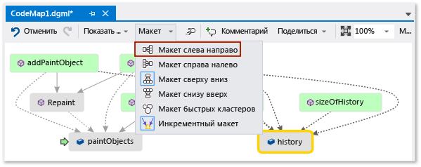  
  
> [!TIP]
>  По умолчанию включен параметр **Последовательный макет**.  Это значит, что изменение макета карты будет минимальным при добавлении новых элементов.  Чтобы макет всей карты изменялся при каждом добавлении новых элементов, отключите параметр **Последовательный макет**.  
  
 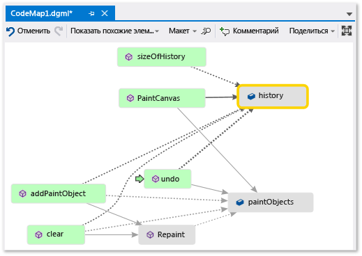  
  
 Рассмотрим эти методы.  На карте дважды щелкните метод **PaintCanvas** или выберите этот метод и нажмите клавишу **F12**.  Этот метод создаст `history` и `paintObjects` как пустые списки.  
  
   
  
 Теперь повторите эти же шаги, чтобы просмотреть определение метода `clear`.  Метод `clear` выполнит некоторые задачи с `paintObjects` и `history`.  Затем он вызовет метод `Repaint`.  
  
 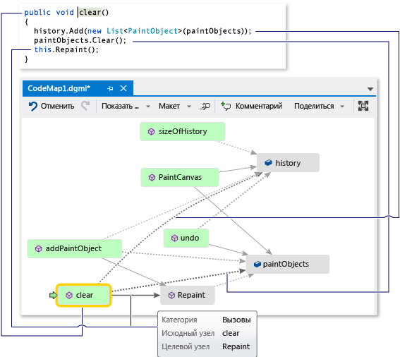  
  
 Теперь просмотрите определение метода `addPaintObject`.  Он также выполнит некоторые задачи с `history` и `paintObjects`.  Он также вызовет `Repaint`.  
  
 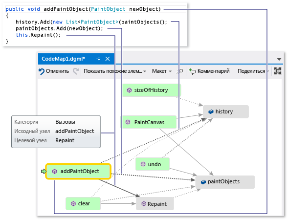  
  
## Поиск проблемы путем анализа сопоставления  
 Кажется, что все методы, изменяющие `history` и `paintObjects`, вызывают `Repaint`.  Однако метод `undo` не вызывает `Repaint`, даже если `undo` изменяет те же поля.  Поэтому эту проблему можно решить, вызвав метод `Repaint` из `undo`.  
  
 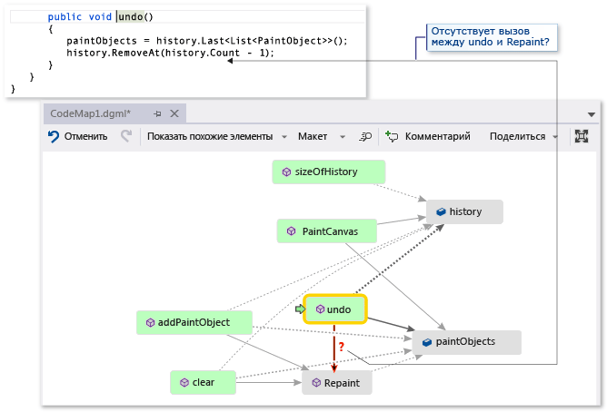  
  
 Если бы не было карты, на которой можно проверить этот отсутствующий вызов, найти эту проблему было бы сложнее, особенно в более сложном коде.  
  
## Совместное использование обнаружения и следующие действия  
 Прежде чем вы или кто\-то другой исправит эту ошибку, можно оставить на карте примечания о проблеме и о том, как ее исправить.  
  
 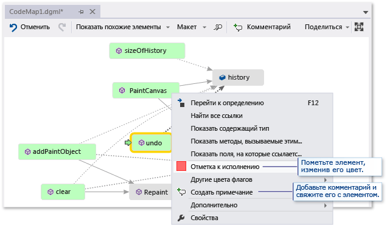  
  
 Например, можно добавить комментарии на карту и отметить элементы с помощью цветов.  
  
 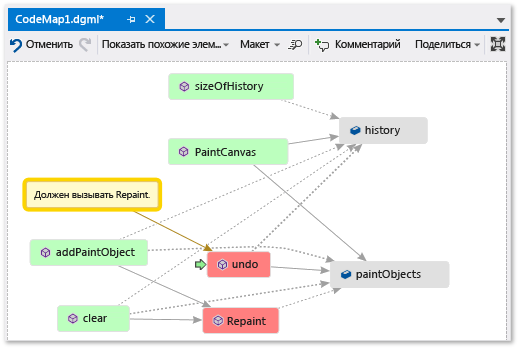  
  
 Если установлена программа Microsoft Outlook, можно отправить карту другим пользователям по электронной почте.  Можно также экспортировать карту в виде изображения или в другом формате.  
  
 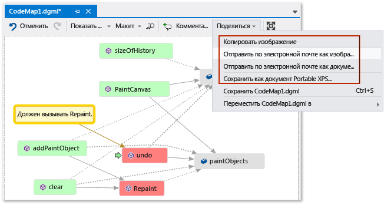  
  
## Устранение проблемы и отображение сделанного  
 Чтобы исправить ошибку, добавьте вызов `Repaint` в `undo`.  
  
 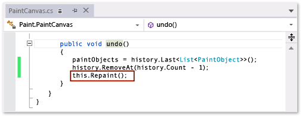  
  
 Чтобы убедиться, что ошибка исправлена, перезапустите сеанс отладки и попробуйте воспроизвести ошибку.  Теперь команда **Отменить последнюю линию** работает как ожидалось, то есть ошибка исправлена.  
  
 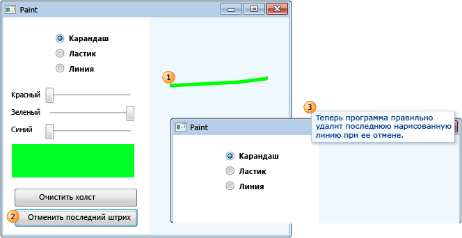  
  
 Можно обновить карту для отображения внесенного исправления.  
  
 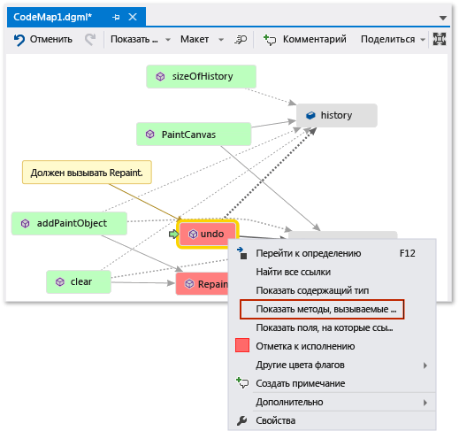  
  
 Теперь на карте отображается связь между **undo** и **Repaint**.  
  
   
  
> [!NOTE]
>  При обновлении карты можно увидеть сообщение об обновлении индекса кода, используемого для создания карты.  Это значит, что кто\-то изменил код, в результате чего ваша карта не соответствует текущему коду.  Это не помешает обновить карту, однако может потребоваться заново создать карту, чтобы убедиться, что она соответствует коду.  
  
 Расследование закончено.  Вы успешно нашли и устранили проблему путем сопоставления кода.  Также у вас есть карта, с помощью которой можно переходить по коду, вспоминать предыдущие действия и просматривать действия, предпринятые для решения проблемы.  
  
## См. также  
 [Сопоставление методов в визуализации стека вызовов при отладке](../debugger/map-methods-on-the-call-stack-while-debugging-in-visual-studio.md)   
 [Визуализация кода](../modeling/visualize-code.md)