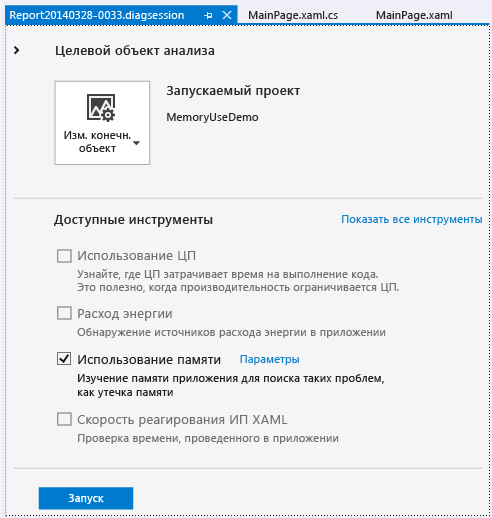
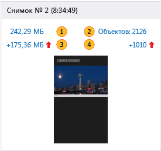
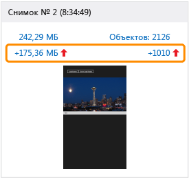

# Анализ использования памяти без отладчика

Средство **Использование памяти** отслеживает использование памяти в приложении. Вы можете использовать его для изучения воздействия сценариев, разрабатываемых в Visual Studio, на память в режиме реального времени. Можно создавать подробные моментальные снимки состояния памяти приложения и сравнивать их для выявления первопричин проблем с памятью.  
  
Средство **Использование памяти** можно запускать с отладчиком или без него. Ниже показано, как использовать средство **Использование памяти** без отладчика, используя **Профилировщик производительности** Visual Studio. 

>[!NOTE]
>- Чтобы измерить использование памяти для приложения .NET Core, нужно средство **Использование памяти** с отладчиком. Инструкции см. в разделе [Профилирование использования памяти в Visual Studio](memory-usage.md). 
>- Чтобы проанализировать использование памяти в приложениях UWP JavaScript или HTML, используйте средство [Память JavaScript](../profiling/javascript-memory.md) в **профилировщике производительности**.
  
## Диагностические сеансы по использованию памяти  

**Запуск диагностического сеанса по использованию памяти:**

1. Откройте универсальный проект Windows (UWP) на C# в Visual Studio.  
   
1. В строке меню выберите **Отладка** >  **Профилировщик производительности**.  
   
1. Выберите **Использование памяти**, а затем **Запуск**.  
   
     
  
### Мониторинг использования памяти 

При запуске диагностического сеанса запускается ваше приложение, а в окне **Средства диагностики** отображается график использования памяти приложением.  

  

График временной шкалы показывает колебания объема памяти по мере выполнения приложения. Пики на графике обычно указывают на то, что некоторый код собирает или создает данные, а после обработки удаляет их. Крупные пики обозначают области, которые вы, вероятно, сможете оптимизировать. Особое внимание следует уделять использованию памяти без ее возвращения, так как это может указывать на неэффективное использование памяти и даже ее утечку.  
  
### Создание моментальных снимков с состояний памяти приложения 

Приложение использует большое количество объектов, поэтому вам может потребоваться сосредоточить анализ на одном сценарии. Либо вы можете найти проблемы с памятью для дальнейшего изучения. Вы можете создать моментальные снимки во время диагностического сеанса, чтобы зафиксировать использование памяти в определенный момент времени. Рекомендуется получить базовый снимок приложения до возникновения проблем с памятью, другой снимок — при первом возникновении проблемы, а также дополнительные снимки, если вы в состоянии повторить этот сценарий.  

Чтобы сделать моментальные снимки, когда вы захотите зафиксировать данные о памяти, выберите **Сделать снимок**.  

###   Закрытие диагностического сеанса  

Чтобы остановить сеанс мониторинга без создания отчета, просто закройте окно диагностики. Чтобы создать отчет после сбора данных или создания моментальных снимков, выберите **Остановить сбор данных**.  

  

##  Отчеты об использовании памяти 

После остановки сбора данных инструмент **Использование памяти** останавливает приложение и отображает обзорную страницу **Использование памяти**.  

  

###  Моментальные снимки использования памяти 

Числа на панелях **Моментальный снимок** показывают байты и объекты в памяти при создании каждого моментального снимка, а также разницу между данным и предыдущим снимками. 

Эти числа являются ссылками, открывающими подробные представления отчетов **Использование памяти** в новых окнах Visual Studio. [Подробный отчет о снимках](#snapshot-details-report) отображает типы и экземпляры в одном моментальном снимке. [Разностный отчет по снимкам (diff)](#snapshot-difference-diff-reports) показывает сравнение типов и экземпляров на двух моментальных снимках.  
  
    
  
|||  
|-|-|  
||Общее число байт в памяти на момент получения снимка.   Выберите эту ссылку, чтобы отобразить подробный отчет о снимках с сортировкой по общему размеру экземпляров типов.|  
||Общее число объектов в памяти на момент получения снимка.   Выберите эту ссылку, чтобы отобразить подробный отчет о снимках с сортировкой по числу экземпляров типов.|  
||Разница между общим размером объектов в памяти для данного и предыдущего снимков.    Положительное число означает, что размер памяти этого снимка больше размера памяти предыдущего снимка, если же первый размер меньше второго, отображается отрицательное число. **Базовый** означает, что моментальный снимок является первым в диагностическом сеансе. **Нет различий** означает, что разница равна нулю.   Выберите эту ссылку, чтобы отобразить разностный отчет о снимках с сортировкой по разности общих размеров экземпляров типов.|  
||Разница между общим числом объектов в памяти для данного и предыдущего снимков.   Выберите эту ссылку, чтобы отобразить разностный отчет о снимках с сортировкой по разности общих количеств экземпляров типов.|  
  
## Отчеты о снимках "Использование памяти" 

 Если выбрать одну из ссылок моментального снимка на обзорной странице **Использование памяти**, на новой странице открывается отчет о снимках. 

  
  
В отчете о снимках можно развернуть записи **Тип объекта**, чтобы отобразить дочерние записи. В качестве имен экземпляров используются уникальные идентификаторы, создаваемые инструментом "Использование памяти". 

Если текст **Тип объекта** выделен голубым цветом, его можно выбрать для перехода к соответствующему объекту в исходном коде в отдельном окне.  

Если вы не можете идентифицировать какие-либо типы или не понимаете, для чего они используются в коде, вероятно, что они относятся к объектам .NET Framework, операционной системы или компилятора. Средство **Использование памяти** отображает эти объекты, если они входят в состав цепочек владения ваших объектов.  

В отчете о снимках: 

- Дерево **Управляемая куча** показывает типы и экземпляры в отчете. При выборе типа или экземпляра отображаются деревья **Пути к корню** и **Объекты, на которые указывает ссылка** для выбранного элемента.  
  
- Дерево **Пути к корню** показывает цепочку объектов, ссылающихся на тип или экземпляр. Сборщик мусора .NET Framework очищает память для объекта только после освобождения всех ссылок на него.  
  
- Дерево **Типы, на которые указывает ссылка** или **Объекты, на которые указывает ссылка** показывает объекты, на которые ссылается выбранный тип или экземпляр.  
  
###   Фильтры деревьев отчетов  

Многие типы в приложениях мало интересуют разработчиков приложений. Фильтры отчетов о снимках позволяют скрыть большинство таких типов в деревьях **Управляемая куча** и **Пути к корню**.   

  

-  Чтобы отфильтровать дерево по имени типа, введите имя в поле **Фильтр**. Этот фильтр не учитывает регистр и распознает введенную строку в любой части имени типа.  
  
-  Выберите **Свернуть маленькие объекты** в раскрывающемся списке **Фильтр**, чтобы скрыть все типы, у которых **Размер (байт)** меньше 0,5 процента от общего объема памяти.  
  
-  Выберите **Только мой код** в раскрывающемся списке **Фильтр**, чтобы скрыть большинство экземпляров, созданных внешним кодом. Внешние типы принадлежат операционной системе или компонентам платформы либо создаются компилятором.  
  
## Подробные отчеты о снимках  

 Подробный отчет о снимках описывает один снимок из диагностического сеанса. Чтобы открыть отчет, выберите ссылку размера или объектов в области моментального снимка. 

   
  
Обе ссылки открывают один и тот же отчет. Единственное различие заключается в начальном порядке сортировки дерева **Управляемая куча**. Ссылка размера сортирует отчет по столбцу **Инклюзивный размер (байт)**. Ссылка объектов сортирует отчет по столбцу **Количество**. Вы можете изменить порядок или столбец сортировки после открытия отчета.  
  
###   Дерево "Управляемая куча" (подробные отчеты о снимках)  
 Дерево **Управляемая куча** перечисляет типы объектов, которые хранятся в памяти. Вы можете развернуть имя типа, чтобы просмотреть десять самых крупных экземпляров этого типа, отсортированных по размеру. При выборе типа или экземпляра отображаются деревья **Пути к корню** и **Объекты, на которые указывает ссылка** для выбранного элемента.  
  
   
  
Дерево **Управляемая куча** в подробном отчете о снимках содержит следующие столбцы:

|||  
|-|-|  
|**Тип объекта**|Имя типа или экземпляра объекта.|  
|**Количество**|Число экземпляров объекта типа. Для экземпляра **Количество** всегда равно 1.|  
|**Размер (байт)**|Для типа — это размер всех экземпляров типа в снимке без учета размера объектов, содержащихся в этих экземплярах.   Для экземпляра — это размер объекта без учета размера объектов, содержащихся в экземпляре. |  
|**Инклюзивный размер (байт)**|Размер экземпляров типа или размер отдельного экземпляра, включая размер содержащихся внутри объектов.|  
|**Модуль**|Модуль, содержащий объект.|  
  
###   Дерево "Пути к корню" (подробные отчеты о снимках)  
Дерево **Пути к корню** показывает цепочку объектов, ссылающихся на тип или экземпляр. Сборщик мусора .NET Framework очищает память для объекта только после освобождения всех ссылок на него.  
  
Для типа в дереве **Пути к корню** число объектов, которые содержат ссылки на этот тип, отображается в столбце **Количество ссылок**. 

  
  
###   Дерево "Типы, на которые указывает ссылка" или "Объекты, на которые указывает ссылка" (подробные отчеты о снимках)  
Дерево **Типы, на которые указывает ссылка** или **Объекты, на которые указывает ссылка** показывает объекты, на которые ссылается выбранный тип или экземпляр.  
  
  
  
Дерево **Типы, на которые указывает ссылка** в подробном отчете о снимках содержит следующие столбцы: Дерево **Объекты, на которые указывает ссылка** не содержит столбец **Количество ссылок**.

|||  
|-|-|  
|**Тип объекта** или **Экземпляр**|Имя типа или экземпляра.|  
|**Количество ссылок**|Для типов это число экземпляров объекта типа.|  
|**Размер (байт)**|Для типа — это размер всех экземпляров типа без учета размера объектов, содержащихся в этом типе.   Для экземпляра — это размер объекта без учета размера объектов, содержащихся в объекте.|  
|**Инклюзивный размер (байт)**|Размер экземпляров типа или размер экземпляра, включая размер содержащихся внутри объектов.|  
|**Модуль**|Модуль, содержащий объект.|  
  
## Разностные отчеты по снимкам  

Разностный отчет по снимкам (diff) показывает изменения между основным и предыдущим снимками. Чтобы открыть разностный отчет, выберите одну из ссылок различия в области снимка. 

Обе ссылки открывают один и тот же отчет. Единственное различие заключается в начальном порядке сортировки дерева **Управляемая куча** в этом отчете. Ссылка размера сортирует отчет по столбцу **Разница инклюзивного размера (байт)**. Ссылка объектов сортирует отчет по столбцу **Разница по количеству**. Вы можете изменить порядок или столбец сортировки после открытия отчета.  
  
   
  
###   Дерево "Управляемая куча" (отчеты о разнице между снимками) 

 Дерево **Управляемая куча** перечисляет типы объектов, которые хранятся в памяти. Вы можете развернуть имя типа, чтобы просмотреть десять самых крупных экземпляров этого типа, отсортированных по размеру. При выборе типа или экземпляра отображаются деревья **Пути к корню** и **Объекты, на которые указывает ссылка** для выбранного элемента.  
  
   
  
Дерево **Управляемая куча** в отчете о различиях снимков содержит следующие столбцы:

|||  
|-|-|  
|**Тип объекта**|Имя типа или экземпляра объекта.|  
|**Количество**|Число экземпляров типа в основном снимке. Для экземпляра **Количество** всегда равно 1.|  
|**Разница количества**|Для типа разница в количестве экземпляров типа между основным и предыдущим снимками. Для экземпляра это поле отображается пустым.|  
|**Размер (байт)**|Размер объектов в основном снимке без учета размера объектов, содержащихся в этих объектах. Для типа **Размер (байт)** и **Инклюзивный размер (байт)**  — это общие размеры экземпляров типа.|  
|**Разница общего размера (байт)**|Для типа — это разница в общем размере экземпляров типа между основным снимком и предыдущим снимком без учета размера объектов, содержащихся в этих экземплярах. Для экземпляра это поле отображается пустым.|  
|**Инклюзивный размер (байт)**|Размер объектов в основном снимке без учета размера объектов, содержащихся в этих объектах.|  
|**Разница инклюзивного размера (байт)**|Для типа — это разница в размере всех экземпляров типа между основным снимком и предыдущим снимком с учетом размера объектов, содержащихся в этих объектах. Для экземпляра это поле отображается пустым.|  
|**Модуль**|Модуль, содержащий объект.|  
  
###   Дерево "Пути к корню" (отчеты о разнице между снимками)  

Дерево **Пути к корню** показывает цепочку объектов, ссылающихся на тип или экземпляр. Сборщик мусора .NET Framework очищает память для объекта только после освобождения всех ссылок на него. 

Для типа в дереве **Пути к корню** число объектов, которые содержат ссылки на этот тип, отображается в столбце **Количество ссылок**. Разница по количеству от предыдущего снимка указана в столбце в **Reference Diff** (Разница по ссылкам). 

   
  
###   Дерево "Типы, на которые указывает ссылка" или "Объекты, на которые указывает ссылка" (отчеты о различиях снимков)  

Дерево **Типы, на которые указывает ссылка** или **Объекты, на которые указывает ссылка** показывает объекты, на которые ссылается выбранный тип или экземпляр.  

  

Дерево **Типы, на которые указывает ссылка** в отчете о различиях снимков содержит следующие столбцы: Дерево **Объекты, на которые указывает ссылка** имеет столбцы **Экземпляр**, **Размер (байт)**, **Инклюзивный размер (байт)** и **Модуль**.

|||  
|-|-|  
|**Тип объекта** или **Экземпляр**|Имя типа или экземпляра объекта.|  
|**Количество ссылок**|Число экземпляров типа в основном снимке.|  
|**Разница числа ссылок**|Для типа разница в количестве экземпляров типа между основным и предыдущим снимками.|  
|**Размер (байт)**|Размер объектов в основном снимке без учета размера объектов, содержащихся в этих объектах. Для типа **Размер (байт)** и **Инклюзивный размер (байт)**  — это общие размеры экземпляров типа.|  
|**Разница общего размера (байт)**|Для типа — это разница в общем размере экземпляров типа между основным снимком и предыдущим снимком без учета размера объектов, содержащихся в этих экземплярах. |  
|**Инклюзивный размер (байт)**|Размер объектов в основном снимке без учета размера объектов, содержащихся в этих объектах.|  
|**Разница инклюзивного размера (байт)**|Для типа — это разница в размере всех экземпляров типа между основным снимком и предыдущим снимком с учетом размера объектов, содержащихся в этих объектах.|  
|**Модуль**|Модуль, содержащий объект.|  

## См. также  
 [Память JavaScript](../profiling/javascript-memory.md)  
 [Профилирование в Visual Studio](../profiling/index.md)  
 [Первое знакомство со средствами профилирования](../profiling/profiling-feature-tour.md)  
 [Рекомендации по повышению производительности для приложений универсальной платформы Windows на C++, C# и Visual Basic](/previous-versions/windows/apps/hh750313\(v\=win.10\))   
 [Диагностика проблем, связанных с памятью, с помощью нового средства "Использование памяти" в Visual Studio](http://go.microsoft.com/fwlink/p/?LinkId=394706)