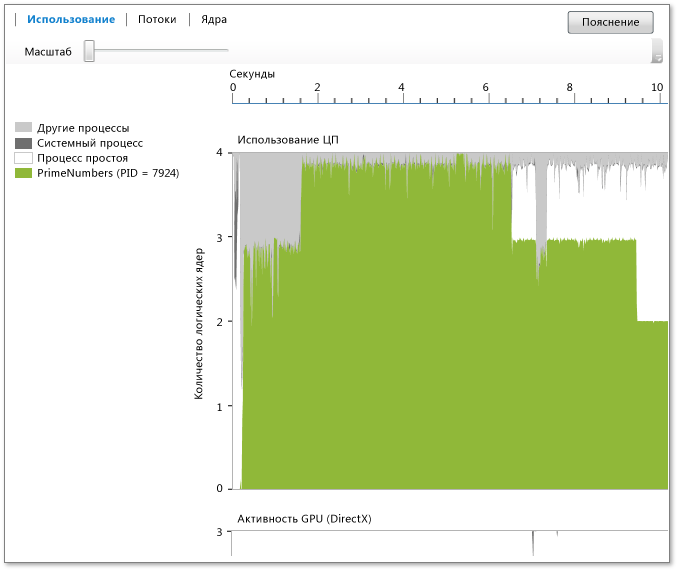

# Представление использования
**Представление использования** содержит информацию о ЦП, GPU и других системных ресурсах, которые используются текущим процессом. Выберите **Анализ** > **Визуализатор параллелизма**, чтобы запустить визуализатор. В нем показана средняя интенсивность использования ядра во времени анализируемым процессом, процессом бездействия системы, системным процессом и другими процессами, запущенными в системе. Оно не показывает, какое из ядер активно в заданный момент времени. Например, если два ядра были загружены на 50 процентов производительности в течение заданного периода времени, представление показывает, что использовалось одно логическое ядро. Представление создается путем разделения времени профилирования на короткие временные сегменты. Для каждого сегмента на графике показано среднее количество потоков процесса, выполняемых в логических ядрах в течение этого интервала.  
  
   
  
 Граф показывает время (по оси x) и среднее количество логических ядер, которые используются целевым процессом, процессом бездействия системы и системным процессом. (Процесс бездействия системы показывает простаивающие ядра. Системный процесс является процессом Windows, который может выполнять работу от имени других процессов.) Для остальных процессов, которые запущены в системе, определяется использование остальных ядер.  
  
 Количество логических ядер показано по оси y. Windows рассматривает одновременную поддержку многопоточности как логические ядра (например, технологию Hyper-Threading). Следовательно, система с четырехъядерным процессором, поддерживая два потока на ядро, будет выглядеть как восьмиядерная. Это также применимо к представлению ядер. Дополнительные сведения см. в разделе [Представление "Ядра"](../profiling/cores-view.md).  
  
 Диаграмма активности GPU показывает число модулей DirectX во времени.  Модуль используется, если он обрабатывает пакет прямого доступа к памяти.  На диаграмме не показан определенный модуль DirectX (например, модуль 3D, модуль видео и др.).  
  
## Цель  
 Мы рекомендуем представление использования в качестве отправной точки анализа производительности при использовании визуализатора параллелизма. Так как оно предоставляет общие сведения о степени параллелизма в приложении в течение времени, его можно использовать, чтобы быстро определить области, для которых необходима настройка производительности или распараллеливание.  
  
 Если вы заинтересованы в настройке производительности, вы можете попробовать обнаружить поведение, расходящееся с ожиданиями. Также можно обнаружить наличие и причину областей малой загрузки логических ядер ЦП. Можно также обнаружить шаблоны использования между ЦП и GPU.  
  
 Если вам нужно распараллелить приложение, можно выполнить поиск областей выполнения, ограниченных производительностью ЦП, или областей, где ЦП не загружается.  
  
 Области, ограниченные производительностью ЦП, выделены зеленым цветом. На графе показано одно используемое ядро, если приложение является последовательным.  
  
 Области, где процессор не загружен, выделены серым цветом. Таким образом могут быть представлены области, где приложение простаивает или выполняет блокирующие запросы ввода-вывода, что предоставляет возможность для использования параллелизма путем перекрытия с другими операциями, ограниченными производительностью ЦП.  
  
 Если найдено интересующее вас поведение, можно увеличить масштаб этой области, выбрав ее. После увеличения можно перейти к представлению "Потоки" или "Ядра" для более тщательного анализа.  
  
 Если использовать GPU с C++ AMP или DirectX, можно задать число используемых модулей GPU или области, где GPU бездействует.  
  
## Масштабирование  
 Для увеличения диаграммы использования ЦП или диаграммы активности GPU выберите раздел или воспользуйтесь ползунком масштаба над диаграммой. Масштаб сохраняется при переходе к другим представлениям. Для уменьшения масштаба воспользуйтесь ползунком масштаба. Кроме того, чтобы изменить масштаб, можно прокрутить колесико мыши, нажав и удерживая клавишу CTRL.  
  
## См. также  
 [Визуализатор параллелизма](../profiling/concurrency-visualizer.md)   
 [Представление "Ядра"](../profiling/cores-view.md)