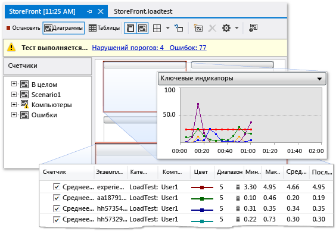

# Профилирование производительности приложений SharePoint
  Если приложения SharePoint выполняются медленно или неэффективно, можно использовать функции профилирования в Visual Studio, чтобы выявить проблемный код и другие элементы.  С помощью функции нагрузочного тестирования можно определить, как приложение SharePoint ведет себя в стрессовых условиях, например, когда к приложению одновременно обращается множество пользователей.  С помощью веб\-тестов производительности можно измерить, как приложение работает в Интернете.  Используя кодированные тесты ИП, можно проверить правильность функционирования всего приложения SharePoint, включая его пользовательский интерфейс.  При совместном использовании этих тестов они помогают обнаружить проблемы производительности перед развертыванием приложения.  
  
## Обзор средств профилирования  
 Профилирование — это процесс отслеживания и записи расширением функциональности производительности приложения, как оно выполняется.  Профилирование приложения позволяет выявить такие проблемы, как узкие места, неэффективный код и проблемы выделения памяти, которые приводят к медленной работе приложения или использованию им слишком большого объема памяти.  Например, профилирование можно использовать для определения гиперобъектов в коде, представляющих собой сегменты кода, которые часто вызываются и могут снизить общую производительность приложения.  После выявления гиперобъектов их можно оптимизировать или исключить их.  
  
 Для идентификации и локализации проблем производительности этих типов можно использовать несколько средств профилирования в интегрированной среде разработки \(IDE\).  Эти инструменты работают так же в проектах SharePoint, как и в других проектах Visual Studio.  Откроется мастер производительности средств профилирования, который проведет вас по созданию сеанса производительности, который использует заданные тесты.  Сеанс анализа производительности — это набор данных конфигурации, который используется для сбора сведений о производительности из приложения вместе с результатами одного или нескольких запусков профилирования.  Сеансы анализа производительности хранятся в папке проекта и можно просмотреть их в **Обозреватель производительности**.  Для получения дополнительной информации см. [Общее представление о способах профилирования](../profiling/understanding-performance-collection-methods.md).  
  
 После создания и выполнение анализа профилирования в приложении отчет содержит сведения о его производительности.  Этот отчет может включать такие элементы, как граф использования ЦП в зависимости от времени, иерархический стек вызова функций или дерево вызовов.  Явные содержимое отчетов могут меняться в зависимости от типа теста, который выполняется, например выборки или инструментирования.  Дополнительные сведения см. в разделе [Обзор средств профилирования](http://go.microsoft.com/fwlink/?LinkId=224689).  
  
## Процесс сеанса производительности  
 Для профилирования приложения сначала с помощью мастера производительности средств профилирования следует создать сеанс профилирования.  В меню **Анализ** выберите **Запустить мастер производительности**.  Работая с мастером, следует ввести необходимые сведения для данного сеанса анализа производительности, например метод профилирования, который требуется использовать, и приложение, которое необходимо профилировать.  Дополнительные сведения см. в разделе [Практическое руководство. Профилирование веб\-сайта или веб\-приложения с помощью мастера производительности](http://go.microsoft.com/fwlink/?LinkId=224692).  В качестве альтернативы можно использовать параметры командной строки для настройки и запуска сеанса анализа производительности.  Дополнительные сведения см. в разделе [Использование средств профилирования из командной строки](http://go.microsoft.com/fwlink/?LinkId=224703).  Если требуется настроить все аспекты сеанса анализа производительности вручную, см. раздел [Практическое руководство. Создание сеансов анализа производительности с помощью средств профилирования вручную](http://go.microsoft.com/fwlink/?LinkId=224691) Можно также создать сеанс анализа производительности из модульного теста в окне **Результаты теста**, открыв контекстное меню для модульного теста и выбрав **Создать сеанс производительности**.  
  
 После настройки сеанса анализа производительности конфигурация сеанса сохраняется, сервер настраивается для предоставления данных профилирования, и приложение выполняется.  В процессе работы с приложением данные о производительности записываются в файл журнала.  Сеансы анализа производительности перечислены в **Обозреватель производительности** в папке **Целевые объекты**.  После завершения сеанса анализа производительности отчет о нем появляется в папке **Отчеты** в **Обозревателе производительности**.  Для отображения отчета откройте его в средстве **Обозреватель производительности**.  Чтобы просмотреть или настроить свойства сеанса анализа производительности, откройте его контекстное меню в окне **Обозреватель производительности** и выберите пункт **Свойства**.  Дополнительные сведения о конкретных свойствах сеанса анализа производительности см. в разделе [Настройка сеансов анализа производительности средств профилирования](http://go.microsoft.com/fwlink/?LinkId=224694).  Дополнительные сведения об интерпретации результатов сеанса анализа производительности см. в разделе [Анализ данных средств профилирования](http://go.microsoft.com/fwlink/?LinkId=224704)  
  
## Нагрузочное тестирование  
 Можно анализировать работу приложений под нагрузкой, создав нагрузочные тесты и тесты производительности веб\-сайта в Visual Studio Ultimate.  При создании нагрузочного теста в Visual Studio необходимо указать сочетание факторов, называемое сценарием, в соответствии с которыми требуется тестировать приложение.  Эти факторы включают шаблон загрузки, модель тестового ассортимента, тестовый ассортимент, сетевой ассортимент и ассортимент веб\-браузеров.  В сценариях нагрузочных тестов могут содержаться модульные тесты и веб\-тесты производительности.  
  
 Рисунок 1. Пример результатов нагрузочного тестирования  
  
   
  
 Веб\-тесты производительности моделируют взаимодействие конечного пользователя с приложением SharePoint.  Веб\-тесты производительности создаются путем записи HTTP\-запросов в сеансе браузера с помощью средства **записи веб\-тестов производительности**.  Веб\-запросы отображаются в **редакторе веб\-тестов производительности** после завершения сеанса браузера.  После этого можно отладить результаты **в средстве просмотра результатов веб\-тестов производительности**.  Для сборки веб\-тестов производительности вручную можно использовать **редактор веб\-тестов производительности**.  
  
## Тестирование пользовательских интерфейсов  
 Кодированные тесты ИП автоматически прогоняют приложение SharePoint через его интерфейс пользователя \(ИП\).  Эти тесты охватывают управления пользовательского интерфейса, такие как кнопки и меню, чтобы убедиться, что они правильно функционируют.  Этот тип тестирования особенно полезен, если проверка или другая логика выполняется в пользовательском интерфейсе, например на веб\-странице.  Можно также использовать кодированные тесты пользовательского интерфейса для автоматизации ручных тестов.  Кодированные тесты пользовательского интерфейса для приложений SharePoint создаются так же, как тесты для приложений других типов.  Для получения дополнительной информации см. [Тестирование приложений SharePoint 2010 с помощью закодированных тестов пользовательского интерфейса](../test/testing-sharepoint-2010-applications-with-coded-ui-tests.md).  
  
## Связанные разделы  
  
|Название|Описание|  
|--------------|--------------|  
|[Пошаговое руководство. Профилирование приложения SharePoint](../sharepoint/walkthrough-profiling-a-sharepoint-application.md)|Демонстрирует проведение анализа профиля выборки для приложения SharePoint.|  
|[Create and run a load test](http://msdn.microsoft.com/ru-ru/7041cbcf-9ab1-4579-98ff-8f296aeaded4)|Описывает, как создавать нагрузочные тесты, позволяющие проводить стресс\-тестирование приложений SharePoint.|  
|[Creating and Editing Web Performance Tests](http://msdn.microsoft.com/ru-ru/8bf5f2a7-c693-47d6-9282-5946480151dc)|Описывает, как создавать веб\-тесты производительности, которые помогают имитировать взаимодействие пользователя с сайтом SharePoint в Интернете.|  
|[Модульное тестирование кода](../test/unit-test-your-code.md)|Описывает, как находить логические ошибки в коде с помощью модульных тестов.|  
|[Тестирование приложений SharePoint 2010 с помощью закодированных тестов пользовательского интерфейса](../test/testing-sharepoint-2010-applications-with-coded-ui-tests.md)|Описывается тестирование пользовательского интерфейса приложений SharePoint.|  
  
## См. также  
 [Построение и отладка решений SharePoint](../sharepoint/building-and-debugging-sharepoint-solutions.md)   
 [Тестирование приложения](../Topic/Test%20apps%20early%20and%20often.md)   
 [Улучшение качества кода](../test/improve-code-quality.md)  
  
  