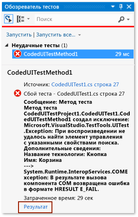

# <a name="analyzing-coded-ui-tests-using-coded-ui-test-logs"></a>Анализ закодированных тестов пользовательского интерфейса с помощью журналов закодированных тестов пользовательского интерфейса

Журналы закодированных тестов ИП фильтруют и записывают важную информацию о запуске тестов. Журналы представлены в формате, который облегчает устранение проблем.

## <a name="step-1-enable-logging"></a>Шаг 1. Включение ведения журнала

В зависимости от сценария используйте один из указанных ниже методов, чтобы включить ведение журнала.

- Целевая версия .NET Framework 4 без файла *App.config* присутствует в тестовом проекте.

   1. Откройте файл **QTAgent32_40.exe.config**. По умолчанию этот файл находится в папке *%ProgramFiles(x86)%\Microsoft Visual Studio\2017\Enterprise\Common7\IDE*.

   2. Задайте требуемый уровень журнала в значении EqtTraceLevel.

   3. Сохраните файл.

- Целевая версия .NET Framework 4.5 без файла *App.config* присутствует в тестовом проекте.

   1. Откройте файл **QTAgent32.exe.config**. По умолчанию этот файл находится в папке *%ProgramFiles(x86)%\Microsoft Visual Studio\2017\Enterprise\Common7\IDE*.

   2. Задайте требуемый уровень журнала в значении EqtTraceLevel.

   3. Сохраните файл.

- Файл *App.config* присутствует в тестовом проекте.

    - Откройте файл *App.config* проекта и добавьте следующий код в узле конфигурации:

      ```xml
      <system.diagnostics>
        <switches>
          <add name="EqtTraceLevel" value="4" />
        </switches>
      </system.diagnostics>`
      ```

- Включение ведения журнала в коде теста:

   <xref:Microsoft.VisualStudio.TestTools.UITesting.PlaybackSettings.LoggerOverrideState%2A> = HtmlLoggerState.AllActionSnapshot;

## <a name="step-2-run-your-coded-ui-test-and-view-the-log"></a>Шаг 2. Запуск кодированного теста пользовательского интерфейса и просмотр журнала

При запуске закодированного теста пользовательского интерфейса после внесения изменений в файл **QTAgent32.exe.config** вы увидите выходную ссылку в результатах обозревателя тестов. Если выбран подробный уровень трассировки (verbose), файлы журнала создаются не только при ошибке теста, но и при успешном выполнении теста.

1.  В меню **Тест** выберите **Окна** и щелкните **Обозреватель тестов**.

2.  В меню **Построение** выберите **Построить решение**.

3.  В обозревателе тестов выберите закодированный тест пользовательского интерфейса, который необходимо выполнить, откройте его контекстное меню и выберите пункт **Выполнить выбранные тесты**.

     Автоматизированные тесты будут выполнены, и будет предоставлена информация об их успешном выполнении или выполнении с ошибками.

    > [!TIP]
    > Для просмотра обозревателя тестов выберите **Тест** > **Окна**, а затем пункт **Обозреватель тестов**.

4.  В результатах обозревателя тестов щелкните ссылку **Выходные данные**.

     

     Здесь отображаются результаты теста, содержащие ссылку на журнал действий.

     

5.  Выберите ссылку *UITestActionLog.html*.

     Журнал появится в браузере.

     

## <a name="see-also"></a>См. также

- [Использование модели автоматизации пользовательского интерфейса для тестирования кода](../test/use-ui-automation-to-test-your-code.md)
- [Практическое руководство. Запуск тестов из Microsoft Visual Studio](http://msdn.microsoft.com/Library/1a1207a9-2a33-4a1e-a1e3-ddf0181b1046)