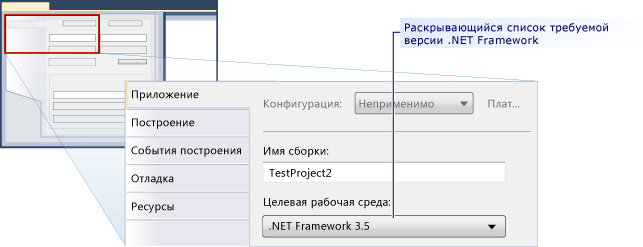

# Практическое руководство. Настройка модульных тестов для более ранней версии .NET Framework
[!INCLUDE[vs2017banner](../code-quality/includes/vs2017banner.md)]

При создании тестового проекта в Microsoft Visual Studio, последняя версия платформы .NET Framework устанавливается по умолчанию.  Кроме того, при обновлении тестовых проектов, созданных в предыдущих версиях Visual Studio, они обновляются до последней версии платформы .NET Framework.  С помощью изменения свойств проекта можно явно изменить версию проекта .NET Framework на более раннюю.  
  
 Можно создать тестовый модуль, версия которого является определенной версией .NET Framework.  Версия может быть 3.5 или более поздней версии и не может быть версией клиента.  Visual Studio включает следующую базовую поддержку для модульных тестов, которые предназначены для определенных версий:  
  
-   Можно создать проекты модульных тестов и установить для них определенную версию платформы .NET Framework.  
  
-   Можно запустить модульные тесты, которые предназначены для определенной версии платформы .NET Framework в Visual Studio на локальном компьютере.  
  
-   Можно запустить модульные тесты, которые предназначены для определенной версии платформы .NET Framework с помощью MSTest.exe, запущенной из командной строки.  
  
-   можно выполнять модульные тесты на агенте построения в рамках построения.  
  
 **Тестирование приложений SharePoint**  
  
 Перечисленные выше возможности также позволяют с помощью Visual Studio создавать модульные тесты и тесты интеграции для SharePoint 2010.  [!INCLUDE[crabout](../test/includes/crabout_md.md)] способ разработки приложений SharePoint в Visual Studio см. в разделе [Создание решений SharePoint](/office-dev/office-dev/create-sharepoint-solutions), [Построение и отладка решений SharePoint](/office-dev/office-dev/building-and-debugging-sharepoint-solutions) и [Проверка и отладка кода SharePoint](/office-dev/office-dev/verifying-and-debugging-sharepoint-code).  
  
 **Ограничения**  
  
 При изменении требуемой версии тестовых проектов на более раннюю версию .NET Framework действуют следующие ограничения:  
  
-   В .NET Framework 3.5 настройка для различных версий поддерживается для тестовых проектов, содержащих только модульные тесты.  Версия .NET Framework 3.5 не поддерживает какие\-либо другие типы тестов, например закодированные тесты пользовательского интерфейса или нагрузочные тесты.  Изменение требуемой версии .NET Framework заблокировано для всех типов тестов, кроме модульных тестов;  
  
-   Выполнение тестов, которые предназначены для более ранних версий платформы .NET Framework поддерживаются только в адаптере по умолчанию.  Оно не поддерживается для адаптера ASP.NET.  Приложения ASP.NET, которые должны выполняться в контексте сервера ASP.NET Development Server, должны быть совместимы с текущей версией .NET Framework.  
  
-   поддержка сбора данных отключена при запуске тестов, поддерживающих настройку для различных версий, включая .NET Framework 3.5.  Покрытие кода можно обеспечить с помощью средств командной строки Visual Studio;  
  
-   модульные тесты, использующие .NET Framework 3.5, нельзя выполнять на удаленном компьютере.  
  
-   Невозможно назначить модульные тесты для более ранних клиентских версий платформы.  
  
### Изменение определенной версии платформы .NET Framework для проектов модульных тестов Visual Basic  
  
1.  Создайте новый проект модульного тестирования Visual Basic.  В меню **Файл** выберите команду **Создать**, затем пункт **Проект**.  
  
     Откроется диалоговое окно **Новый проект**.  
  
2.  В области **Установленные шаблоны** разверните узел **Visual Basic**.  Выберите **Тест**, а затем выберите шаблон **Тестовый проект**.  
  
3.  В текстовом поле **Имя** введите имя тестового проекта Visual Basic и нажмите кнопку **ОК**.  
  
4.  В Обозревателе решений, выберите **Свойства** в контекстном меню нового тестового проекта Visual Basic.  
  
     Будут показаны свойства тестового проекта Visual Basic.  
  
5.  На вкладке **Компилировать** выберите **Дополнительные параметры компиляции** как показано на следующей иллюстрации.  
  
       
  
6.  С помощью раскрывающегося списка **Заданная исполняющая среда \(все конфигурации\)** измените требуемую версию на **.NET Framework 3.5** или на более позднюю версию, как показано в выноске В на следующем рисунке.  Не следует определять версию клиента.  
  
       
  
### Изменение определенной версии платформы .NET Framework для Visual C\# для проектов модульных тестов  
  
1.  Создайте новый проект модульного тестирования C\#.  В меню **Файл** выберите команду **Создать**, затем пункт **Проект**.  
  
     Откроется диалоговое окно **Новый проект**.  
  
2.  В области **Установленные шаблоны** разверните узел **Visual C\#**.  Выберите **Тест**, а затем выберите шаблон **Тестовый проект**.  
  
3.  В текстовом поле **Имя** введите имя тестового проекта Visual C\# и нажмите кнопку **ОК**.  
  
4.  В Обозревателе решений, выберите **Свойства** в контекстном меню нового тестового проекта Visual C\#.  
  
     Будут показаны свойства тестового проекта Visual C\#.  
  
5.  На вкладке **Приложение** выберите **Целевая рабочая среда**, а затем выберите **.NET Framework 3.5** или более позднюю версию из раскрывающегося списка, чтобы изменить целевой объект framework.as, как показано на следующем рисунке.  Не следует определять версию клиента.  
  
       
  
### Перенацеливание на определенную версию платформы .NET Framework для проектов модульного теста C\+\+\/CLI.  
  
1.  Создайте новый проект модульного тестирования для управляемого кода C\+\+\/CLI.  В меню **Файл** выберите команду **Создать** и щелкните **Проект**.  
  
     Откроется диалоговое окно **Новый проект**.  
  
    > [!WARNING]
    >  Для построения модульных тестов C\+\+\/CLI для предыдущей версии платформы .NET Framework для Visual C\+\+, следует использовать соответствующую версию Visual Studio.  Например, чтобы установить .NET Framework 3.5, необходимо задать [!INCLUDE[vs_orcas_long](../debugger/includes/vs_orcas_long_md.md)] и пакет обновления 1 \(SP1\) [!INCLUDE[vs_orcas_long](../debugger/includes/vs_orcas_long_md.md)].  
  
2.  В области **Установленные шаблоны** разверните узел **Visual C\+\+**.  Выберите **Тест**, а затем выберите шаблон **Тестовый проект**.  
  
3.  В текстовом поле **Имя** введите имя тестового проекта Visual C\+\+ и нажмите кнопку **ОК**.  
  
4.  В Обозревателе решений выберите **Выгрузить проект** из нового тестового проекта Visual C\+\+.  
  
5.  В Обозревателе решений выберите выгруженный тестовый проект Visual C\+\+, а затем выберите **Изменить \<имя проекта\>.vcxproj**.  
  
     VCXPROJ\-файл будет открыт в редакторе.  
  
6.  Задайте для `TargetFrameworkVersion` версию 3.5 или более позднюю версию в `PropertyGroup`, обозначенный `"Globals"`.  Не следует определять версию клиента:  
  
    ```  
    <PropertyGroup Label="Globals">  
        <TargetName>DefaultTest</TargetName>  
        <ProjectTypes>{3AC096D0-A1C2-E12C-1390-A8335801FDAB};{8BC9CEB8-8B4A-11D0-8D11-00A0C91BC942}</ProjectTypes>  
        <ProjectGUID>{CE16D77A-E364-4ACD-948B-1EB6218B0EA3}</ProjectGUID>  
        <TargetFrameworkVersion>3.5</TargetFrameworkVersion>  
        <Keyword>ManagedCProj</Keyword>  
        <RootNamespace>CPP_Test</RootNamespace>  
      </PropertyGroup>  
  
    ```  
  
7.  Сохраните и закройте VCXPROJ\-файл.  
  
8.  В Обозревателе решений, выберите в контекстном меню **Перезагрузить проект** в контекстном меню нового тестового проекта Visual C\+\+.  
  
## См. также  
 [Создание и запуск модульных тестов для существующего кода](http://msdn.microsoft.com/ru-ru/e8370b93-085b-41c9-8dec-655bd886f173)   
 [Создание решений SharePoint](/office-dev/office-dev/create-sharepoint-solutions)   
 [Построение и отладка решений SharePoint](/office-dev/office-dev/building-and-debugging-sharepoint-solutions)   
 [Диалоговое окно "Дополнительные параметры компилятора" \(Visual Basic\)](../ide/reference/advanced-compiler-settings-dialog-box-visual-basic.md)