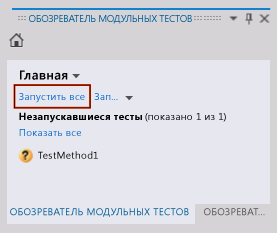

# Пошаговое руководство. Создание и выполнение модульных тестов для приложений универсальной платформы Windows

Visual Studio поддерживает модульное тестирование приложений универсальной платформы Windows (UWP). Это решение включает шаблоны проектов модульных тестов для Visual C#, Visual Basic и Visual C++.

> [!TIP]
> Дополнительные сведения о разработке приложений универсальной платформы Windows см. в разделе [Начало работы с приложениями универсальной платформы Windows](/windows/uwp/get-started/).

В следующих процедурах описаны этапы создания, выполнения и отладки модульных тестов для приложения универсальной платформы Windows.

## Создание проекта модульного теста для приложения универсальной платформы Windows

1.  В меню **Файл** выберите пункт **Создать проект**.

     Откроется диалоговое окно "Создать проект".

2.  В разделе "Шаблоны" выберите язык программирования, на котором требуется создать модульный тест, а затем выберите связанную библиотеку модульных тестов универсальной платформы Windows. Например, выберите **Visual C#**, затем выберите **Универсальные приложения**, а затем — **Библиотека модульных тестов (универсальные приложения Windows)**.

3.  В текстовом поле **Имя** введите имя, которое будет использоваться для проекта (необязательно).

4.  Измените путь, по которому нужно создать проект, введя его в текстовом поле **Расположение** или с помощью кнопки **Обзор** (необязательно).

5.  (Необязательно) В текстовом поле имени **Решение** введите имя, которое будет использоваться для решения.

6.  Оставьте флажок **Создать каталог для решения** установленным и нажмите кнопку **ОК** .

     

     В обозревателе решений появляется ваш новый проект модульного теста для универсальной платформы Windows, а в редакторе кода отображается модульный тест по умолчанию с именем UnitTest1.

     

## Изменение файла манифеста приложения универсальной платформы Windows для проекта модульного теста

1.  В обозревателе решений щелкните правой кнопкой мыши файл *Package.appxmanifest* и выберите **Открыть**.

     Конструктор манифеста открывается для редактирования.

2.  В конструкторе манифеста выберите вкладку **Возможности** .

3.  В списке в разделе **Возможности**выберите возможности, необходимые для модульного теста и тестируемого кода. Например, установите флажок **Интернет** , если модульный тест и проверяемый им код требуют возможности получения доступа к Интернету.

    > [!NOTE]
    > Выбранные функции должны включать только возможности, необходимые для правильного функционирования модульного теста.

     

## Написание кода модульного теста для приложения универсальной платформы Windows

В редакторе кода добавьте модульный тест и включите необходимые утверждения и логику.

## Запуск модульных тестов

### Сборка решения и выполнение модульного теста с помощью обозревателя тестов

1.  В меню **Тест** выберите **Windows**, а затем **Обозреватель тестов**.

     Отображается обозреватель тестов без вашего теста.

2.  В меню **Построение** выберите пункт **Построить решение**.

     Модульный тест теперь присутствует в списке.

    > [!NOTE]
    > Необходимо собрать решение, чтобы обновить список модульных тестов в обозревателе тестов.

3.  В обозревателе тестов выберите созданный модульный тест.

    > [!TIP]
    > Обозреватель тестов содержит ссылку на исходный код рядом с надписью **Источник:**.

4.  Выберите **Запустить все**.

     

    > [!TIP]
    > Можно выбрать один или несколько модульных тестов, перечисленных в обозревателе, а затем щелкнуть правой кнопкой мыши и выбрать **Запуск выбранных тестов**.
    >
    > Кроме того, можно выбрать **Отладить выбранные тесты**, **Открыть тест**и использовать параметр **Свойства** .
    >
    > 

    Выполняется модульный тест. По завершении обозреватель тестов отображает состояние теста, затраченное время и содержит ссылку на источник.

    

## См. также

- [Тестирование приложений UWP в Visual Studio](../test/testing-store-apps-with-visual-studio.md)
- [Построение и тестирование приложения универсальной платформы Windows](/vsts/build-release/apps/windows/universal?tabs=vsts)
