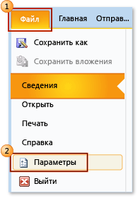
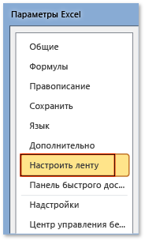

# Практическое руководство. Отображение вкладки разработчика на ленте
  Чтобы получить доступ к **разработчика** вкладку на ленте приложения Microsoft Office, необходимо настроить его, чтобы отобразить эту вкладку, так как он не отображается по умолчанию. Например, необходимо отобразить эту вкладку, если требуется добавить <xref:Microsoft.Office.Tools.Word.GroupContentControl> в настройку уровня документа для Word.  
  
> [!NOTE]  
>  Это руководство применимо только к приложениям Office 2010 или более поздней версии. Если вы хотите отобразить эту вкладку в системе Microsoft Office 2007, см. следующую версию этого раздела [как: Отображение вкладки разработчика на ленте](http://msdn.microsoft.com/library/bb608625(v=vs.90).aspx).  
  
 [!INCLUDE[appliesto_ribbon](../vsto/includes/appliesto-ribbon-md.md)]  
  
> [!NOTE]  
>  Не имеет доступа к **разработчика** вкладки.  
  
### Отображение вкладки "Разработчик"  
  
1.  Запустите любое приложение Office, указанное в этом разделе. В разделе **применяется к:** Примечание ранее в этом разделе.  
  
2.  На **файл** выберите **параметры** кнопки.  
  
     На следующем рисунке показан **файл** вкладку и **параметры** кнопки в Office 2010.  
  
       
  
     На следующем рисунке показан **файл** в Office 2013.  
  
       
  
     На следующем рисунке показан **параметры** кнопки в Office 2013.  
  
       
  
3.  В *ApplicationName***параметры** диалогового окна выберите **настроить ленту** кнопки.  
  
     На следующем рисунке показан **параметры** диалоговое окно и **настроить ленту** кнопки в Excel 2010. Расположение этой кнопки аналогично и во всех остальных приложениях, перечисленных в приведенном выше подразделе "Применимо к".  
  
       
  
4.  В списке основных вкладок выберите **разработчика** флажок.  
  
     На следующем рисунке показан **разработчика** флажок в Word 2010 и [!INCLUDE[Word_15_short](../vsto/includes/word-15-short-md.md)]. Расположение этого флажка аналогично и во всех остальных приложениях, перечисленных в приведенном выше подразделе "Применимо к".  
  
       
  
5.  Выберите **ОК** кнопку, чтобы закрыть **параметры** диалоговое окно.  
  
## См. также  
 [Настройка пользовательского интерфейса Office](../vsto/office-ui-customization.md)  
  
  