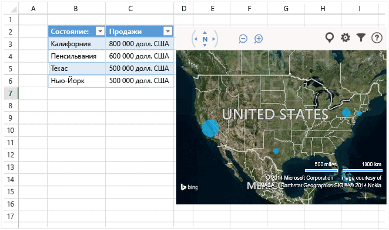
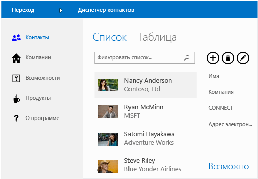

# Office and SharePoint Development in Visual Studio
  Вы можете расширить возможности Microsoft Office и SharePoint, создав облегченное приложение или надстройку, которые пользователи загружают из [Магазина Office](https://store.office.com/) или каталога организации, либо создав решение на основе .NET Framework, которое пользователи устанавливают на компьютерах.  
  
 Содержание раздела  
  
-   [Создание надстроек для Office и SharePoint](#Apps)  
  
-   [Создание надстройки VSTO](#Add-ins)  
  
-   [Создание решения SharePoint](#Solutions)  
  
##   Создание надстроек для Office и SharePoint  
 В Office 2013 и SharePoint 2013 появилась новая модель надстроек, которая помогает создавать, распространять и продавать надстройки, расширяющие возможности Office и SharePoint.  Эти надстройки могут выполняться в Office или SharePoint Online, и пользователи могут работать с ними на разных устройствах.  
  
 Узнайте, как использовать новую [модель надстроек Office](https://msdn.microsoft.com/library/office/jj220082.aspx) для расширения возможностей пользователей Office.  
  
 Эти надстройки требуют очень мало ресурсов по сравнению с традиционными надстройками и решениями VSTO. Их можно создавать с помощью почти любой технологии веб\-программирования, такой как HTML5, JavaScript, CSS3 и XML.  Для начала используйте инструменты разработчика Office для Visual Studio или облегченный набор веб\-средств разработки для Office 365 \(кодовое имя Napa\), который позволяет создавать проекты, писать код и запускать надстройки в браузере.  
  
   
  
 **Дополнительные сведения**  
  
|Целевой тип|См.|  
|-----------------|---------|  
|Дополнительные сведения о средствах разработки Napa для Office 365.|[Средства разработки Napa для Office 365](https://msdn.microsoft.com/library/dn974046.aspx)|  
  
### Создание надстройки Office  
 Чтобы расширить функциональные возможности Office, создайте надстройку Office. По сути, оно представляет собой веб\-страницу, размещенную в приложении Office, таком как Excel, Word, Outlook или PowerPoint. Ваше приложение может расширять функциональные возможности документов, таблиц, сообщений электронной почты, встреч, презентаций или проектов.  
  
 Вы можете продавать приложение в Магазине Office.[Магазин Office](https://store.office.com/) упрощает получение прибыли от надстроек, управление обновлениями и отслеживание телеметрических данных. Приложение также можно опубликовать для пользователей посредством каталога приложений в SharePoint или на сервере Exchange Server.  
  
 Следующее приложение для Office показывает данные листа на карте Bing.  
  
   
  
 **Дополнительные сведения**  
  
|Целевой тип|См.|  
|-----------------|---------|  
|Узнайте больше о надстройках Office, а затем создайте собственную надстройку.|[Надстройки Office](http://msdn.microsoft.com/office/dn448457)|  
|Сравните различные способы расширения возможностей Office и решите, следует ли использовать приложение или надстройку Office.|[Схема действий для надстроек Office, VSTO и VBA](http://blogs.msdn.com/b/officeapps/archive/2013/06/18/roadmap-for-apps-for-office-vsto-and-vba.aspx)|  
|Дополнительные сведения о средствах разработки Napa для Office 365.|[Средства разработки Napa для Office 365](https://msdn.microsoft.com/library/dn974046.aspx)|  
  
### Создание надстройки SharePoint  
 Чтобы расширить возможности SharePoint для пользователей, создайте надстройку SharePoint. Обычно они представляют собой небольшие, простые в использовании автономные приложения, решающие определенные задачи пользователей или бизнеса.  
  
 Вы можете продавать приложение для SharePoint через [Магазин Office](https://store.office.com/). Надстройку также можно опубликовать для пользователей через каталог надстроек в SharePoint.  Владельцы сайтов могут устанавливать, обновлять и удалять вашу надстройку на своих сайтах SharePoint, не прибегая к помощи администратора фермы серверов или семейства веб\-сайтов.  
  
 Вот пример приложения для SharePoint, которое помогает пользователям управлять деловыми контактами.  
  
   
  
 **Дополнительные сведения**  
  
|Целевой тип|См.|  
|-----------------|---------|  
|Узнайте больше о надстройках SharePoint, а затем создайте собственную надстройку.|[Надстройки SharePoint](https://msdn.microsoft.com/library/office/fp179930.aspx)|  
|Сравните надстройки SharePoint с традиционными решениями SharePoint.|[Сравнение надстроек SharePoint с решениями SharePoint](http://msdn.microsoft.com/library/office/jj163114.aspx)|  
|Решите, следует ли создать надстройку SharePoint или решение SharePoint.|[Выбор между надстройками SharePoint и решениями SharePoint](https://msdn.microsoft.com/library/office/jj163114.aspx)|  
|Дополнительные сведения о средствах разработки Napa для Office 365.|[Средства разработки Napa для Office 365](https://msdn.microsoft.com/library/dn974046.aspx)|  
  
##   Создание надстройки VSTO  
 Создайте надстройку, предназначенную для Office 2007 или Office 2010 либо реализующую возможности для Office 2013 и Office 2016, недоступные в надстройках Office. Надстройки VSTO выполняются только на настольных компьютерах. Пользователям необходимо устанавливать надстройки VSTO, поэтому они обычно сложнее в развертывании и поддержке.  Однако надстройку VSTO можно теснее интегрировать с Office. Например, она может добавлять вкладки и элементы управления на ленту Office и выполнять расширенные задачи автоматизации, такие как слияние документов или изменение диаграмм. Вы можете использовать платформу .NET Framework и языки программирования C\# и Visual Basic для взаимодействия с объектами Office.  
  
 Вот пример возможностей надстройки VSTO. Эта надстройка VSTO добавляет элементы управления ленты, настраиваемую область задач и диалоговое окно в PowerPoint.  
  
   
  
 **Дополнительные сведения**  
  
|Целевой тип|Чтение|  
|-----------------|------------|  
|Сравните различные способы расширения возможностей Office и решите, следует ли использовать надстройку VSTO или надстройку Office.|[Схема действий для надстроек Office, VSTO и VBA](http://blogs.msdn.com/b/officeapps/archive/2013/06/18/roadmap-for-apps-for-office-vsto-and-vba.aspx)|  
|Создание надстройки VSTO.|[Создание настройки VSTO с помощью Visual Studio](https://msdn.microsoft.com/library/jj620922.aspx)|  
  
##   Создание решения SharePoint  
 Создайте решение SharePoint, предназначенное для SharePoint Foundation 2010 и SharePoint Server 2010 либо реализующее возможности в SharePoint 2013 и SharePoint 2016, недоступные в надстройках SharePoint.  
  
 Для решений SharePoint требуется локальная ферма серверов SharePoint. Администраторы должны устанавливать их, а так как решения выполняются в SharePoint, они могут повлиять на производительность сервера. Однако решения обеспечивают более широкий доступ к объектам SharePoint. Кроме того, при создании решения SharePoint вы можете использовать платформу .NET Framework и языки программирования C\# и Visual Basic для взаимодействия с объектами SharePoint.  
  
 **Дополнительные сведения**  
  
|Целевой тип|См.|  
|-----------------|---------|  
|Сравните решения SharePoint с надстройками SharePoint.|[Сравнение надстроек SharePoint с решениями SharePoint](http://msdn.microsoft.com/library/office/jj163114.aspx)|  
|Создайте решение SharePoint.|[Создание решений SharePoint](../sharepoint/create-sharepoint-solutions.md)|  
  
  