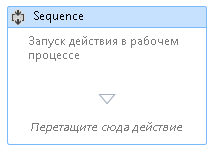

# Как добавлять комментарии в рабочий процесс в конструкторе рабочих процессов
Чтобы упростить создание более сложных рабочих процессов большего размера, [!INCLUDE[net_v45](../ide/includes/net_v45_md.md)] дает разработчикам возможность добавлять заметки к следующим типам элементов в конструкторе.  
  
-   <xref:System.Activities.Activity>  
  
-   <xref:System.Activities.Statements.State>  
  
-   <xref:System.Activities.Statements.Transition>  
  
-   Классы, производные от <xref:System.Activities.Statements.FlowNode>.  
  
-   <xref:System.Activities.Variable>  
  
-   <xref:System.Activities.Argument>  
  
> [!IMPORTANT]
>  Содержимое заметки сохраняется в виде обычного текста в файле XAML, связанном с рабочим процессом, и потенциально может быть прочитано другими. Избегайте добавлять в заметку конфиденциальные сведения.  
  
### Добавление заметки к действию в конструкторе  
  
1.  В конструкторе рабочих процессов щелкните правой кнопкой мыши элемент в конструктор рабочих процессов и выберите **заметки**, **добавить заметку**.  
  
2.  Добавьте текст заметки в предоставленное для этого место.  
  
3.  На элементе появится значок заметки. Если навести курсор мыши на значок заметки, отобразится текст заметки.  
  
       
  
### Отображение заметки в конструкторе действия  
  
1.  В конструкторе действия с заметкой, отображаемой за пределами действия, нажмите **ПИН-код** значок в декоративном элементе заметки.  
  
2.  Заметка будет отображаться в конструкторе действия. На снимке экрана ниже заметка «Запуск действия в рабочем процессе» отображается в конструкторе действия.  
  
       
  
3.  Для отображения заметки за пределами конструктора действий, наведите указатель мыши на область заметки в конструкторе действия и нажмите кнопку **открепить** значок  
  
       
  
### Отображение или скрытие всех заметок  
  
1.  Щелкните правой кнопкой мыши действие, которое имеет заметку. Выберите **заметки**, **Показать все заметки**.  
  
2.  Все заметки будут отображены в конструкторах действий.  
  
3.  Для отображения всех заметок вне конструкторов действий, щелкните правой кнопкой мыши действие и выберите **заметки**, **скрыть все заметки**.  
  
### Изменение или удаление заметки для действия  
  
1.  Щелкните правой кнопкой мыши действие, которое имеет заметку.  
  
2.  Выберите **заметки**, **изменить заметку** или **удалить заметку**.  
  
3.  Заметка будет открыта для редактирования или удалена.  
  
4.  Чтобы удалить все заметки одновременно, щелкните правой кнопкой мыши конструктор рабочих процессов и выберите **заметки**, **удалить все заметки**.  
  
### Добавление, изменение и удаление заметки для переменной или аргумента.  
  
1.  Щелкните правой кнопкой мыши переменную или аргумент, затем выберите «Добавить заметку».  
  
2.  Введите текст заметки. Переменная или аргумент будут отображаться со значком заметки.  
  
3.  Щелкните правой кнопкой мыши переменную или аргумент с заметкой. Выберите «Изменить заметку».  
  
4.  Заметка будет открыта для изменения.  
  
5.  Щелкните правой кнопкой мыши переменную или аргумент с заметкой. Выберите «Удалить заметку».  
  
6.  Заметка будет удалена.