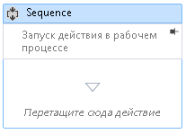

# Как добавлять комментарии в рабочий процесс в конструкторе рабочих процессов
Чтобы упростить создание более сложных рабочих процессов большего размера, [!INCLUDE[net_v45](../ide/includes/net_v45_md.md)] дает разработчикам возможность добавлять заметки к следующим типам элементов в конструкторе.  
  
-   <xref:System.Activities.Activity>  
  
-   <xref:System.Activities.Statements.State>  
  
-   <xref:System.Activities.Statements.Transition>  
  
-   Классы, являющиеся производными от <xref:System.Activities.Statements.FlowNode>.  
  
-   <xref:System.Activities.Variable>  
  
-   <xref:System.Activities.Argument>  
  
> [!IMPORTANT]
>  Содержимое заметки сохраняется в виде обычного текста в файле XAML, связанном с рабочим процессом, и потенциально могут быть прочитаны другими.Остерегайтесь добавлять конфиденциальные сведения в заметку.  
  
### Добавление заметки к действию в конструкторе  
  
1.  В конструкторе рабочих процессов щелкните правой кнопкой мыши элемент и выберите **Заметки**, **Добавить заметку**.  
  
2.  Добавьте текст заметки в открытое место.  
  
3.  На элементе будет отображен значок заметки.Если навести курсор мыши на значок заметки, будет отображен текст заметки.  
  
       
  
### Отображение заметки в конструкторе действий  
  
1.  В конструкторе действий с заметкой, отображаемой за пределами действия, щелкните значок **закрепления** в декоративном элементе заметки.  
  
2.  Заметка будет отображаться в конструкторе действий.В снимке экрана ниже заметка «Запуск действия в рабочем процессе» отображается в конструкторе действий.  
  
       
  
3.  Для отображения заметки за пределами конструктора действий наведите курсор на область заметки в конструкторе действия и щелкните значок **Открепить**  
  
       
  
### Отображение или скрытие всех заметок  
  
1.  Щелкните правой кнопкой мыши действие, которое имеет заметку.Выберите **Заметки**, **Показать все заметки**.  
  
2.  Все заметки будут отображены в конструкторах действия.  
  
3.  Для отображения всех заметок вне конструкторов действия щелкните правой кнопкой мыши действие и выберите **Заметки**, **Скрыть все заметки**.  
  
### Изменение или удаление заметки для действия  
  
1.  Щелкните правой кнопкой мыши действие, которое имеет заметку.  
  
2.  Выберите **Заметки**, **Изменить заметку** или **Удалить заметку**.  
  
3.  Заметка будет открыта для редактирования или удалена.  
  
4.  Чтобы удалить все заметки одновременно, щелкните правой кнопкой мыши конструктор рабочих процессов и выберите **Заметка**, **Удалить все заметки**.  
  
### Добавление, изменение и удаление заметки для переменной или аргумента.  
  
1.  Щелкните правой кнопкой мыши переменную или аргумент, затем выберите «Добавить заметку».  
  
2.  Введите текст заметки.Переменная или аргумент будет отображаться со значком заметки.  
  
3.  Щелкните правой кнопкой мыши переменную или аргумент с заметкой.Выберите **Изменить заметку**.  
  
4.  Заметка будет открыта для изменения.  
  
5.  Щелкните правой кнопкой мыши переменную или аргумент с заметкой.Выберите **Удалить заметку**.  
  
6.  Заметка будет удалена.